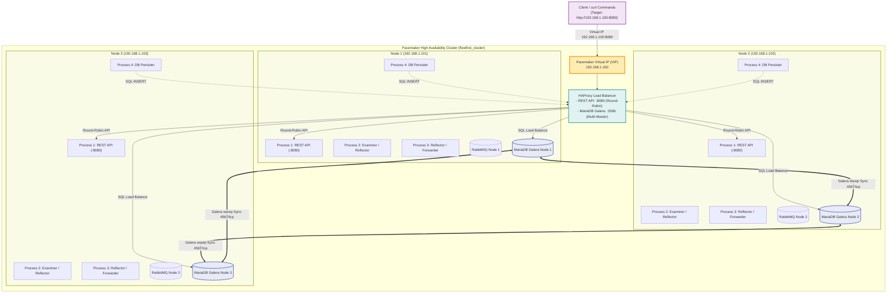
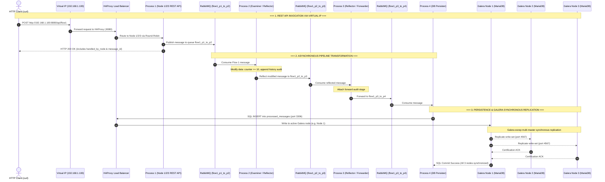
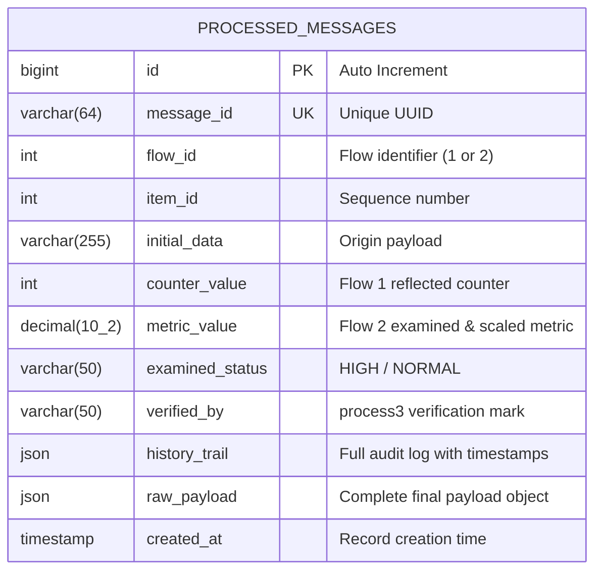

# FlowFirst - Multi-Process RabbitMQ & MariaDB Data Pipeline
## Cluster-Aware 3-Node Architecture with Virtual IP (VIP), HAProxy, Pacemaker, & MariaDB Galera Multi-Master Replication

This project implements an enterprise-grade, distributed inter-process communication and persistence pipeline across **3 network nodes (RHEL 9.6)**. It incorporates:
- **Virtual IP (VIP) Failover** managed by **Pacemaker/Corosync** (`IPaddr2`)
- **HAProxy Round-Robin Load Balancing** for both the **REST API** (`:8080`) and **MariaDB Galera** (`:3306`)
- **MariaDB Galera Cluster** with synchronous multi-master replication (`wsrep`), automated state transfer, and quorum consistency across all 3 nodes
- **Multi-Process Pipeline** (`process1` through `process4`) with data transformation, reflection, and MariaDB persistence
- **RabbitMQ Message Broker** ensuring reliable queuing between stages

---

## Multi-Node Cluster Architecture & Network Topology

### Cluster Nodes Configuration
- **Node 1 (`node1`)**: `192.168.1.101` (Galera Node 1 / API Node 1 / RabbitMQ)
- **Node 2 (`node2`)**: `192.168.1.102` (Galera Node 2 / API Node 2 / RabbitMQ)
- **Node 3 (`node3`)**: `192.168.1.103` (Galera Node 3 / API Node 3 / RabbitMQ)
- **Virtual IP (VIP)**: `192.168.1.100` (Managed by Pacemaker)



---

## End-to-End Sequence & Galera Replication Flow



---

## Step-by-Step Data Flows

### Flow 1: Intermediate Reflection at Process 2 & Galera Persistence
1. **Client (`curl`)**: Sends `POST /api/flow1` to the Virtual IP `http://192.168.1.100:8080`.
2. **HAProxy**: Delivers request to `Process 1` on one of the active cluster nodes (Round-Robin).
3. **Process 1 ([`process1.py`](process1.py:1))**: Generates payload with UUID, publishes to `flow1_p1_to_p2`.
4. **Process 2 ([`process2.py`](process2.py:1))**: Consumes message, modifies counter (`+10`), logs audit entry, and **reflects** it to `flow1_p2_to_p3`.
5. **Process 3 ([`process3.py`](process3.py:1))**: Consumes from `flow1_p2_to_p3`, attaches acknowledgment timestamp, and forwards to `flow1_p3_to_p4`.
6. **Process 4 ([`process4.py`](process4.py:1))**: Consumes from `flow1_p3_to_p4` and stores the payload in **MariaDB Galera Cluster** via [`db.py`](db.py:1), replicating instantaneously to all 3 nodes.

---

### Flow 2: Threshold Examination at Process 2 & Reflection at Process 3
1. **Client (`curl`)**: Sends `POST /api/flow2` to `http://192.168.1.100:8080`.
2. **HAProxy**: Delivers request to `Process 1` on one of the active cluster nodes (Round-Robin).
3. **Process 1 ([`process1.py`](process1.py:1))**: Generates metric payload, publishes to `flow2_p1_to_p2`.
4. **Process 2 ([`process2.py`](process2.py:1))**: Consumes message, evaluates threshold status (`HIGH`/`NORMAL`), applies 15% scaling factor, and forwards to `flow2_p2_to_p3`.
5. **Process 3 ([`process3.py`](process3.py:1))**: Consumes from `flow2_p2_to_p3`, seals with verification signature (`verified_by: process3`), and **reflects** to `flow2_p3_reflected`.
6. **Process 4 ([`process4.py`](process4.py:1))**: Consumes from `flow2_p3_reflected` and persists full history into the **MariaDB Galera Cluster**.

---

## Database Schema & ER Diagram



---

## Complete Multi-Node Installation & Setup (RHEL 9.6)

---

### Phase 1: Repository Clone & Base Prerequisites on All 3 Nodes

First, clone the repository onto **all 3 nodes** so that all setup scripts, SQL definitions, configuration templates, and Python sources are available locally.

```bash
# 1. Install base utilities and Python
sudo dnf install -y git python3 python3-pip

# 2. Clone repository to /opt/flowfirst and navigate to directory
sudo git clone <repo-url> /opt/flowfirst
sudo chown -R $USER:$USER /opt/flowfirst
cd /opt/flowfirst

# 3. Create and configure Python virtual environment
python3 -m venv .venv
source .venv/bin/activate
pip install --upgrade pip
pip install -r requirements.txt

# 4. Initialize environment configuration
cp .env.example .env
# (Edit NODE_NAME in .env to match the current node: node1, node2, or node3)
```

---

### Phase 2: Setup MariaDB Galera Cluster on All 3 Nodes

All scripts automatically read parameters from `/opt/flowfirst/.env`.

#### 1. On Node 1:
```bash
cd /opt/flowfirst
# Configure Galera node settings (reads from .env)
sudo ./mariadb-galera/setup_galera_node.sh

# Bootstrap primary cluster node
sudo ./mariadb-galera/bootstrap_galera.sh
```

#### 2. On Node 2:
```bash
cd /opt/flowfirst
# Configure Galera node settings (reads from .env)
sudo ./mariadb-galera/setup_galera_node.sh

# Join Galera cluster
sudo systemctl enable --now mariadb
```

#### 3. On Node 3:
```bash
cd /opt/flowfirst
# Configure Galera node settings (reads from .env)
sudo ./mariadb-galera/setup_galera_node.sh

# Join Galera cluster
sudo systemctl enable --now mariadb
```

#### 4. Verify Galera Cluster Health on Any Node:
```bash
cd /opt/flowfirst
./mariadb-galera/check_galera_status.sh
```
*Expected Output:*
```text
wsrep_cluster_size: 3
wsrep_cluster_status: Primary
wsrep_connected: ON
wsrep_ready: ON
wsrep_local_state_comment: Synced
```

---

### Phase 3: Install RabbitMQ on All 3 Nodes

> **Note — four issues were fixed in the install script (as of 2025):**
> 1. **Cloudsmith baseurls dead** — `dl.cloudsmith.io/public/rabbitmq/…` returns 404.
> 2. **Cloudsmith GPG key URLs dead** — `dl.cloudsmith.io/…/gpg.*.key` also returns 404.
>    Keys now fetched from `github.com/rabbitmq/signing-keys` release 3.0.
> 3. **Server key fingerprint changed** — suffix `2620D4E7` → `26208342` in signing-keys release 3.0.
> 4. **`aarch64` not available on `yum1/yum2.rabbitmq.com`** — those mirrors only carry `x86_64`.
>    The script now detects the architecture at runtime (`uname -m`) and writes different repo stanzas:
>    - `x86_64` → `yum1/yum2.rabbitmq.com` (4 stanzas: x86_64 + noarch for both Erlang and RabbitMQ)
>    - `aarch64` → `packagecloud.io/rabbitmq` (2 stanzas: aarch64 for both Erlang and RabbitMQ)

```bash
cd /opt/flowfirst
sudo ./scripts/install_rabbitmq_rhel9.sh
```

The script performs these steps automatically:
1. Downloads all 3 GPG keys to temp files (bypasses `rpm --import /dev/stdin` pipe bug on RHEL 9)
2. Imports keys with `sudo rpm --import <file>`
3. Writes `/etc/yum.repos.d/rabbitmq.repo` with 4 stanzas using `yum1/yum2.rabbitmq.com` baseurls and GitHub `gpgkey=` URLs
4. Runs `dnf clean metadata && dnf makecache && dnf install -y erlang rabbitmq-server`
5. Enables `rabbitmq_management` plugin and starts the service

---

### Phase 4: Setup HAProxy on All 3 Nodes
```bash
cd /opt/flowfirst
# Automatically generates /etc/haproxy/haproxy.cfg using IPs and ports from .env
sudo ./haproxy/setup_haproxy.sh
```

---

### Phase 5: Install Systemd Services on All 3 Nodes
```bash
cd /opt/flowfirst
# Install Systemd Units
sudo ./systemd/install_services.sh /opt/flowfirst

# Disable standard systemd boot so Pacemaker manages service lifecycles
sudo systemctl disable flowfirst-process1 flowfirst-process2 flowfirst-process3 flowfirst-process4
```

---

### Phase 6: Pacemaker Cluster & VIP Initialization

> **Note:** The cluster setup is a **two-step process**. `pcsd` must be running and
> reachable on port 2224 on **all three nodes** before `pcs host auth` can succeed.
> The script handles this with a `--prepare-node` flag.

#### Step 6a — Run on ALL THREE nodes first (node1, node2, node3)

```bash
cd /opt/flowfirst
sudo ./pacemaker/setup_multinode_cluster.sh --prepare-node
```

This single command on each node:
1. Enables the HA repo (or adds CentOS Stream 9 HA + AppStream + BaseOS as fallback)
2. Installs `pcs pacemaker corosync fence-agents-all haproxy`
3. Enables and starts `pcsd` (TCP 2224)
4. Sets the `hacluster` password (read from `.env` → `HACLUSTER_PASS`, default `hacluster123`)
5. Opens firewall ports: `2224/tcp` `3121/tcp` `5403/tcp` `5404/udp` `5405/udp`
6. Adds all three node IPs to `/etc/hosts`

#### Step 6b — Run on NODE 1 ONLY after all three nodes are prepared

```bash
cd /opt/flowfirst

# Cluster init — pre-flight checks port 2224 on all nodes before proceeding
sudo ./pacemaker/setup_multinode_cluster.sh

# Deploy Virtual IP (VIP), HAProxy group, and cloned pipeline resources
sudo ./pacemaker/configure_multinode_resources.sh

# Verify
sudo pcs status
```

The script runs a **pre-flight check** before `pcs host auth` — it tests TCP port 2224
on each node and exits with an actionable error if any node is not yet prepared.

---

## Verification & Real-World Usage Scenarios

### Scenario 1: Invoke REST API via Virtual IP & Verify Round-Robin Load Balancing

Send requests directly to the **Virtual IP (`192.168.1.100:8080`)**:

#### A. Health Check via VIP
```bash
curl -s http://192.168.1.100:8080/health | jq .
```

#### B. Trigger Flow 1 via VIP
```bash
curl -X POST http://192.168.1.100:8080/api/flow1 \
  -H "Content-Type: application/json" \
  -d '{
    "item_id": 101,
    "counter": 200,
    "initial_data": "Multi-node VIP test payload"
  }' | jq .
```

#### C. Trigger Flow 2 via VIP
```bash
curl -X POST http://192.168.1.100:8080/api/flow2 \
  -H "Content-Type: application/json" \
  -d '{
    "item_id": 202,
    "value": 31.8,
    "initial_data": "High temperature alert"
  }' | jq .
```

#### D. Verify Round-Robin Load Balancing
```bash
for i in {1..6}; do
  curl -s -X POST http://192.168.1.100:8080/api/flow1 -d "{\"item_id\": $i}" | jq -r '.handled_by_node'
done
```
*Output demonstrates traffic distributed across all 3 nodes:*
```text
node1
node2
node3
node1
node2
node3
```

---

### Scenario 2: End-to-End Flow Execution & Database Content Examination

This scenario executes Flow 1 and Flow 2 through the REST API, follows the messages through RabbitMQ and intermediate modifications, and inspects the resulting table rows and JSON audit trails stored in MariaDB Galera.

#### Automated Execution:
```bash
# Run the automated test & inspect script
./scripts/test_flows_and_inspect_db.sh
```

#### Manual Step-by-Step Walkthrough:

##### Step 1: Trigger Flow 1 (Initial Counter: 500)
```bash
curl -s -X POST http://${FLOWFIRST_VIP:-192.168.1.100}:8080/api/flow1 \
  -H "Content-Type: application/json" \
  -d '{
    "item_id": 101,
    "counter": 500,
    "initial_data": "E2E inspection test payload for Flow 1"
  }' | jq .
```

##### Step 2: Trigger Flow 2 (Initial Metric: 35.00)
```bash
curl -s -X POST http://${FLOWFIRST_VIP:-192.168.1.100}:8080/api/flow2 \
  -H "Content-Type: application/json" \
  -d '{
    "item_id": 202,
    "value": 35.00,
    "initial_data": "E2E high temperature alert for Flow 2"
  }' | jq .
```

##### Step 3: Inspect Summary Table in MariaDB
```bash
mariadb -h ${FLOWFIRST_VIP:-192.168.1.100} -u flowuser -pflowpassword flowfirst_db --table -e "
SELECT
    id,
    flow_id,
    item_id,
    counter_value,
    metric_value,
    examined_status,
    verified_by,
    created_at
FROM processed_messages
ORDER BY id DESC
LIMIT 5;
"
```
*Expected Output:*
```text
+----+---------+---------+---------------+--------------+-----------------+-------------+---------------------+
| id | flow_id | item_id | counter_value | metric_value | examined_status | verified_by | created_at          |
+----+---------+---------+---------------+--------------+-----------------+-------------+---------------------+
| 12 |       2 |     202 |          NULL |        40.25 | HIGH            | process3    | 2025-08-20 10:15:22 |
| 11 |       1 |     101 |           510 |         NULL | NULL            | NULL        | 2025-08-20 10:15:20 |
+----+---------+---------+---------------+--------------+-----------------+-------------+---------------------+
```

##### Step 4: Inspect Flow 1 Audit Trail & Transformation History
```bash
mariadb -h ${FLOWFIRST_VIP:-192.168.1.100} -u flowuser -pflowpassword flowfirst_db -e "
SELECT
    message_id,
    initial_data,
    counter_value,
    JSON_PRETTY(history_trail) AS audit_trail
FROM processed_messages
WHERE flow_id = 1
ORDER BY id DESC LIMIT 1\G
"
```
*Sample JSON History Output:*
```json
[
  {
    "stage": "process1_created",
    "timestamp": "2025-08-20 10:15:20",
    "status": "prepared",
    "source": "rest_api"
  },
  {
    "stage": "process2_reflected",
    "timestamp": "2025-08-20 10:15:21",
    "modification": "Added +10 to counter and flagged reflected"
  },
  {
    "stage": "process3_received_and_forwarded",
    "timestamp": "2025-08-20 10:15:21",
    "status": "forwarded_to_process4"
  },
  {
    "stage": "process4_saved_to_mariadb",
    "timestamp": "2025-08-20 10:15:22",
    "database_action": "INSERT/UPDATE processed_messages"
  }
]
```

##### Step 5: Inspect Flow 2 Audit Trail (Threshold Examination & Scaling)
```bash
mariadb -h ${FLOWFIRST_VIP:-192.168.1.100} -u flowuser -pflowpassword flowfirst_db -e "
SELECT
    message_id,
    initial_data,
    metric_value,
    examined_status,
    verified_by,
    JSON_PRETTY(history_trail) AS audit_trail
FROM processed_messages
WHERE flow_id = 2
ORDER BY id DESC LIMIT 1\G
"
```
*Sample JSON History Output:*
```json
[
  {
    "stage": "process1_created",
    "timestamp": "2025-08-20 10:15:22",
    "status": "prepared",
    "source": "rest_api"
  },
  {
    "stage": "process2_examined_and_forwarded",
    "timestamp": "2025-08-20 10:15:22",
    "status_assigned": "HIGH",
    "modification": "Applied 15% scaling factor and assigned status"
  },
  {
    "stage": "process3_reflected",
    "timestamp": "2025-08-20 10:15:23",
    "modification": "Added verification seal and marked completed"
  },
  {
    "stage": "process4_saved_to_mariadb",
    "timestamp": "2025-08-20 10:15:23",
    "database_action": "INSERT/UPDATE processed_messages"
  }
]
```

---

### Scenario 3: Synchronous Multi-Master Galera Replication Verification

Query **Node 1**, **Node 2**, and **Node 3** directly to confirm that writes from any node are immediately synchronized across all nodes:

```bash
# Check on Node 1:
mariadb -h ${NODE1_IP:-192.168.1.101} -u flowuser -pflowpassword flowfirst_db -e "SELECT id, message_id, flow_id, item_id, counter_value, metric_value FROM processed_messages ORDER BY id DESC LIMIT 5;"

# Check on Node 2:
mariadb -h ${NODE2_IP:-192.168.1.102} -u flowuser -pflowpassword flowfirst_db -e "SELECT id, message_id, flow_id, item_id, counter_value, metric_value FROM processed_messages ORDER BY id DESC LIMIT 5;"

# Check on Node 3:
mariadb -h ${NODE3_IP:-192.168.1.103} -u flowuser -pflowpassword flowfirst_db -e "SELECT id, message_id, flow_id, item_id, counter_value, metric_value FROM processed_messages ORDER BY id DESC LIMIT 5;"
```
*All three databases return identical records in real time.*

---

### Scenario 4: Galera Node Outage & Automatic Quorum Resynchronization

1. **Simulate failure of Galera Node 3:**
   ```bash
   sudo systemctl stop mariadb  # (on Node 3)
   ```
2. **Verify Cluster Quorum remains healthy (2/3 nodes active):**
   ```bash
   ./mariadb-galera/check_galera_status.sh
   ```
   *Result:* `wsrep_cluster_size` is now `2`, cluster status remains `Primary`.
3. **Execute new API requests:**
   ```bash
   curl -X POST http://192.168.1.100:8080/api/flow1 -d '{"item_id": 555}'
   ```
4. **Restart Node 3 and observe Automatic State Transfer (IST/SST):**
   ```bash
   sudo systemctl start mariadb  # (on Node 3)
   ```
   *Galera automatically synchronizes missing transactions. Cluster size returns to `3`.*

---

### Scenario 5: Node Failure & Virtual IP (VIP) Failover

1. **Put Node 1 into standby mode:**
   ```bash
   sudo pcs node standby node1
   ```
2. **Observe Pacemaker immediately moving the Virtual IP and HAProxy to Node 2:**
   ```bash
   sudo pcs status
   ```
   *Result:* `vip-haproxy-group` is now `Started node2`.
3. **Issue `curl` requests with zero downtime:**
   ```bash
   curl -s http://192.168.1.100:8080/health | jq .
   ```
4. **Restore Node 1:**
   ```bash
   sudo pcs node unstandby node1
   ```

---

### Scenario 6: HAProxy Real-Time Statistics Dashboard

Access the live stats dashboard to view real-time frontend and backend health metrics for both the REST API and MariaDB Galera cluster:
- **URL:** `http://192.168.1.100:9000`
- **Username:** `admin`
- **Password:** `admin123`

---

### Scenario 7: Pacemaker Cluster Validation with `crm_mon` & `crm_resource`

Use these commands on **any cluster node** to confirm that all Pacemaker resources are running, correctly distributed, and healthy.

---

#### 7.1 — Full One-Shot Cluster Status (`crm_mon -1Ar`)

```bash
sudo crm_mon -1Ar
```

**Representative expected output (all 3 nodes healthy):**
```
Cluster Summary:
  * Stack: corosync
  * Current DC: node1 (version 2.1.6-8.el9-6fdc9deea29) - partition with quorum
  * Last updated: Mon Jun  9 12:00:00 2025
  * Last change:  Mon Jun  9 11:50:00 2025 by root via cibadmin on node1
  * 3 nodes configured
  * 14 resource instances configured

Node List:
  * Online: [ node1 node2 node3 ]

Active Resources:
  * Resource Group: vip-haproxy-group:
    * vip        (ocf::heartbeat:IPaddr2):        Started node1
    * haproxy    (systemd:haproxy):               Started node1
  * Clone Set: flowfirst-p1-clone [flowfirst-p1]:
    * Started: [ node1 node2 node3 ]
  * Clone Set: flowfirst-p2-clone [flowfirst-p2]:
    * Started: [ node1 node2 node3 ]
  * Clone Set: flowfirst-p3-clone [flowfirst-p3]:
    * Started: [ node1 node2 node3 ]
  * Clone Set: flowfirst-p4-clone [flowfirst-p4]:
    * Started: [ node1 node2 node3 ]
```

> Key indicators:
> - `partition with quorum` — 2-of-3 nodes agree; cluster is fully operational
> - `vip` and `haproxy` are **grouped** and always land on the same node together
> - All 4 process clones show `Started: [ node1 node2 node3 ]` — active on every node

---

#### 7.2 — Continuous Live Monitor (`crm_mon -Ar`)

```bash
sudo crm_mon -Ar          # Refreshes every 15 seconds; press Ctrl-C to exit
sudo crm_mon -Ar -i 5     # Refresh every 5 seconds
```

This is the interactive equivalent and is ideal for watching resource migration in real time during a failover test (Scenario 5).

---

#### 7.3 — Resource Constraint & Location Refresh (`crm_resource -C`)

The `-C` flag clears all **failed-action history** and **location constraints** that Pacemaker accumulated when resources failed or were manually migrated. Run this after recovering a node that was put into standby:

```bash
sudo crm_resource -C
```

**Expected output:**
```
Cleaned up all resources on all nodes
```

To clear a **single resource** across all nodes:
```bash
sudo crm_resource -r vip -C
sudo crm_resource -r flowfirst-p1-clone -C
```

---

#### 7.4 — Per-Resource Status (`crm_resource --resource … --locate`)

```bash
# Where is the VIP currently running?
sudo crm_resource --resource vip --locate
```
```
resource vip is running on: node1
```

```bash
# Where is each clone instance running?
sudo crm_resource --resource flowfirst-p1-clone --locate
```
```
resource flowfirst-p1-clone is running on: node1  node2  node3
```

---

#### 7.5 — Move VIP to a Specific Node

```bash
# Force VIP (and HAProxy group) to node2
sudo crm_resource --resource vip-haproxy-group --move --node node2
sudo crm_mon -1Ar | grep vip
```
```
    * vip        (ocf::heartbeat:IPaddr2):        Started node2
    * haproxy    (systemd:haproxy):               Started node2
```

Remove the forced constraint to let Pacemaker re-balance freely:
```bash
sudo crm_resource --resource vip-haproxy-group --clear
```

---

#### 7.6 — Node Standby & Recovery (VIP Failover Validation)

```bash
# 1. Put node1 into standby (simulates node outage)
sudo pcs node standby node1

# 2. Confirm VIP migrated to node2 or node3
sudo crm_mon -1Ar | grep -E "vip|haproxy"
```
```
    * vip        (ocf::heartbeat:IPaddr2):        Started node2
    * haproxy    (systemd:haproxy):               Started node2
```

```bash
# 3. Confirm API still reachable via VIP — no downtime
curl -s http://192.168.1.100:8080/health | jq .handled_by_node
```
```
"node2"
```

```bash
# 4. Restore node1
sudo pcs node unstandby node1

# 5. Clear any residual constraints
sudo crm_resource -C

# 6. Confirm all nodes back online
sudo crm_mon -1Ar | grep "Online:"
```
```
  * Online: [ node1 node2 node3 ]
```

---

#### 7.7 — Check for Failed Actions

```bash
sudo pcs status | grep -A5 "Failed"
```

If any resource has failed actions, the output will resemble:
```
Failed Resource Actions:
  * flowfirst-p1_start_0 on node3 'not installed' (5): call=12, status='complete',
      exitreason='Could not find Python venv at /opt/flowfirst/.venv',
      last-rc-change='Mon Jun  9 11:45:10 2025', queued=0ms, exec=48ms
```

Fix the underlying issue on `node3`, then clear the failure:
```bash
sudo crm_resource -r flowfirst-p1-clone -C
sudo pcs resource refresh flowfirst-p1-clone
```

---

#### 7.8 — Full `pcs status` Reference Output (All Healthy)

```bash
sudo pcs status
```
```
Cluster name: flowfirst_cluster
Cluster Summary:
  * Stack: corosync
  * Current DC: node1 (version 2.1.6-8.el9) - partition with quorum
  * Last updated: Mon Jun  9 12:05:00 2025
  * Last change:  Mon Jun  9 11:50:00 2025 by root via cibadmin on node1
  * 3 nodes configured
  * 14 resource instances configured

Node List:
  * Online: [ node1 node2 node3 ]

Full List of Resources:
  * Resource Group: vip-haproxy-group:
    * vip        (ocf::heartbeat:IPaddr2):        Started node1
    * haproxy    (systemd:haproxy):               Started node1
  * Clone Set: flowfirst-p1-clone [flowfirst-p1] (active, 3 of 3):
    * flowfirst-p1       (systemd:flowfirst-process1):    Started node1
    * flowfirst-p1       (systemd:flowfirst-process1):    Started node2
    * flowfirst-p1       (systemd:flowfirst-process1):    Started node3
  * Clone Set: flowfirst-p2-clone [flowfirst-p2] (active, 3 of 3):
    * flowfirst-p2       (systemd:flowfirst-process2):    Started node1
    * flowfirst-p2       (systemd:flowfirst-process2):    Started node2
    * flowfirst-p2       (systemd:flowfirst-process2):    Started node3
  * Clone Set: flowfirst-p3-clone [flowfirst-p3] (active, 3 of 3):
    * flowfirst-p3       (systemd:flowfirst-process3):    Started node1
    * flowfirst-p3       (systemd:flowfirst-process3):    Started node2
    * flowfirst-p3       (systemd:flowfirst-process3):    Started node3
  * Clone Set: flowfirst-p4-clone [flowfirst-p4] (active, 3 of 3):
    * flowfirst-p4       (systemd:flowfirst-process4):    Started node1
    * flowfirst-p4       (systemd:flowfirst-process4):    Started node2
    * flowfirst-p4       (systemd:flowfirst-process4):    Started node3

Daemon Status:
  corosync: active/enabled
  pacemaker: active/enabled
  pcsd:      active/enabled
```

---

## Service Lifecycle Scenarios

These scenarios cover stopping and starting individual pipeline services, groups of services, and infrastructure services (RabbitMQ, MariaDB, HAProxy) — with full validation at each step.

---

### Scenario 8: Stop & Start a Single Pipeline Process on One Node

This is the surgical approach: stop one process instance on one node while the clones on the other two nodes continue to serve traffic.

```bash
# On node2: stop process2 via Pacemaker (recommended — Pacemaker restarts it automatically)
sudo pcs resource ban flowfirst-p2-clone node2

# Confirm it is no longer running on node2
sudo crm_mon -1Ar | grep p2
```
```
  * Clone Set: flowfirst-p2-clone [flowfirst-p2] (active, 2 of 3):
    * flowfirst-p2       (systemd:flowfirst-process2):    Started node1
    * flowfirst-p2       (systemd:flowfirst-process2):    Started node3
    * Stopped: [ node2 ]
```

```bash
# Re-allow it on node2 and verify it comes back
sudo pcs resource clear flowfirst-p2-clone node2
sudo crm_resource -r flowfirst-p2-clone -C
sleep 5
sudo crm_mon -1Ar | grep p2
```
```
  * Clone Set: flowfirst-p2-clone [flowfirst-p2] (active, 3 of 3):
    * Started: [ node1 node2 node3 ]
```

---

### Scenario 9: Stop & Start All Four Pipeline Processes (Cluster-Wide)

#### 9.1 — Stop all pipeline processes on all nodes

```bash
sudo pcs resource disable flowfirst-p1-clone
sudo pcs resource disable flowfirst-p2-clone
sudo pcs resource disable flowfirst-p3-clone
sudo pcs resource disable flowfirst-p4-clone
```

Confirm they are stopped:
```bash
sudo crm_mon -1Ar | grep -E "p1|p2|p3|p4"
```
```
  * Clone Set: flowfirst-p1-clone [flowfirst-p1] (disabled, 0 of 3):
    * Stopped: [ node1 node2 node3 ]
  * Clone Set: flowfirst-p2-clone [flowfirst-p2] (disabled, 0 of 3):
    * Stopped: [ node1 node2 node3 ]
  * Clone Set: flowfirst-p3-clone [flowfirst-p3] (disabled, 0 of 3):
    * Stopped: [ node1 node2 node3 ]
  * Clone Set: flowfirst-p4-clone [flowfirst-p4] (disabled, 0 of 3):
    * Stopped: [ node1 node2 node3 ]
```

#### 9.2 — Start all pipeline processes cluster-wide

Re-enable in dependency order: persistence first, then reflectors, then examiner, then producer.

```bash
sudo pcs resource enable flowfirst-p4-clone
sudo pcs resource enable flowfirst-p3-clone
sudo pcs resource enable flowfirst-p2-clone
sudo pcs resource enable flowfirst-p1-clone
sleep 10
sudo crm_mon -1Ar | grep -E "p1|p2|p3|p4"
```
```
  * Clone Set: flowfirst-p1-clone [flowfirst-p1] (active, 3 of 3):
    * Started: [ node1 node2 node3 ]
  * Clone Set: flowfirst-p2-clone [flowfirst-p2] (active, 3 of 3):
    * Started: [ node1 node2 node3 ]
  * Clone Set: flowfirst-p3-clone [flowfirst-p3] (active, 3 of 3):
    * Started: [ node1 node2 node3 ]
  * Clone Set: flowfirst-p4-clone [flowfirst-p4] (active, 3 of 3):
    * Started: [ node1 node2 node3 ]
```

#### 9.3 — Validate the REST API is serving traffic

```bash
curl -s http://192.168.1.100:8080/health | jq .
```
```json
{
  "status": "ok",
  "handled_by_node": "node1"
}
```

---

### Scenario 10: Stop & Start RabbitMQ on a Single Node

#### 10.1 — Stop RabbitMQ on node3

```bash
# On node3
sudo systemctl stop rabbitmq-server

# Verify the remaining 2-node RabbitMQ cluster still has quorum
sudo rabbitmqctl cluster_status
```
```
Cluster name: rabbit@node1
Disk Nodes: rabbit@node1  rabbit@node2  rabbit@node3
Running Nodes: rabbit@node1  rabbit@node2
Versions: ...
Alarms: (none)
```

The pipeline processes use `pika` multi-host connection parameters and will automatically reconnect to `node1` or `node2`.

#### 10.2 — Restart RabbitMQ on node3 and verify it rejoins

```bash
# On node3
sudo systemctl start rabbitmq-server
sleep 5
sudo rabbitmqctl cluster_status | grep "Running Nodes"
```
```
Running Nodes: rabbit@node1  rabbit@node2  rabbit@node3
```

---

### Scenario 11: Stop & Start MariaDB Galera on a Single Node

#### 11.1 — Stop MariaDB on node2

```bash
# On node2
sudo systemctl stop mariadb

# On any other node — confirm the cluster is still running with 2 members
sudo mysql -u root -p -e "SHOW STATUS LIKE 'wsrep_cluster_size';"
```
```
+--------------------+-------+
| Variable_name      | Value |
+--------------------+-------+
| wsrep_cluster_size | 2     |
+--------------------+-------+
```

#### 11.2 — Restart MariaDB on node2 (normal rejoin — NOT a bootstrap)

```bash
# On node2
sudo systemctl start mariadb
sleep 10

# Confirm it rejoined
sudo mysql -u root -p -e "SHOW STATUS LIKE 'wsrep_cluster_size';"
```
```
+--------------------+-------+
| Variable_name      | Value |
+--------------------+-------+
| wsrep_cluster_size | 3     |
+--------------------+-------+
```

Verify the node is synced:
```bash
sudo mysql -u root -p -e "SHOW STATUS LIKE 'wsrep_local_state_comment';"
```
```
+---------------------------+--------+
| Variable_name             | Value  |
+---------------------------+--------+
| wsrep_local_state_comment | Synced |
+---------------------------+--------+
```

---

### Scenario 12: Stop & Start HAProxy on a Single Node

HAProxy runs under Pacemaker as part of `vip-haproxy-group`. Do **not** manipulate it directly with `systemctl` — use `pcs resource` so Pacemaker stays in control.

#### 12.1 — Disable the VIP + HAProxy group (stops on current node, migrates to another)

```bash
# Move the group away from node1 to node2
sudo pcs resource move vip-haproxy-group node2
sleep 5
sudo crm_mon -1Ar | grep -E "vip|haproxy"
```
```
    * vip        (ocf::heartbeat:IPaddr2):        Started node2
    * haproxy    (systemd:haproxy):               Started node2
```

#### 12.2 — Confirm HAProxy stats endpoint responds on the new node

```bash
curl -s http://192.168.1.102:9000/stats -o /dev/null -w "%{http_code}"
```
```
200
```

#### 12.3 — Clear the forced constraint and let Pacemaker decide

```bash
sudo pcs resource clear vip-haproxy-group
```

---

## OS Reboot Scenarios

These scenarios cover rebooting individual nodes, all nodes sequentially, and all nodes simultaneously, with complete validation procedures after each restart.

---

### Scenario 13: Reboot a Single Node (Node3) — Zero Pipeline Downtime

The cluster retains quorum (2 of 3 nodes remain) and all cloned resources continue on the surviving nodes.

#### 13.1 — Pre-reboot state check

```bash
# From node1 — record the baseline
sudo crm_mon -1Ar
sudo rabbitmqctl cluster_status | grep "Running Nodes"
sudo mysql -u root -p -e "SHOW STATUS LIKE 'wsrep_cluster_size';"
```

Expected: 3 nodes online, 3 RabbitMQ nodes running, `wsrep_cluster_size = 3`.

#### 13.2 — Reboot node3

```bash
# On node3
sudo reboot
```

#### 13.3 — While node3 is rebooting — verify cluster continuity

From **node1** or **node2**:
```bash
sudo crm_mon -1Ar | grep "Online:"
```
```
  * Online: [ node1 node2 ]
  * OFFLINE: [ node3 ]
```

```bash
# Confirm VIP still up (it was not on node3)
curl -s http://192.168.1.100:8080/health | jq .
```
```json
{ "status": "ok", "handled_by_node": "node1" }
```

```bash
# Confirm pipeline clones still active on the 2 surviving nodes
sudo crm_mon -1Ar | grep "Clone Set"
```
```
  * Clone Set: flowfirst-p1-clone [flowfirst-p1] (active, 2 of 3):
    * Started: [ node1 node2 ]
    * Stopped: [ node3 ]
```

#### 13.4 — Post-reboot: validate node3 rejoins automatically

After node3 finishes booting (typically 60–90 seconds), Corosync and Pacemaker services start automatically (`enabled` in systemd), and Galera performs IST re-sync.

```bash
# From node1 — poll until node3 reappears
sudo crm_mon -1Ar | grep "Online:"
```
```
  * Online: [ node1 node2 node3 ]
```

```bash
# Confirm all pipeline clones restored to 3/3
sudo crm_mon -1Ar | grep -E "p1|p2|p3|p4"
```
```
  * Clone Set: flowfirst-p1-clone [flowfirst-p1] (active, 3 of 3):
    * Started: [ node1 node2 node3 ]
  * Clone Set: flowfirst-p2-clone [flowfirst-p2] (active, 3 of 3):
    * Started: [ node1 node2 node3 ]
  * Clone Set: flowfirst-p3-clone [flowfirst-p3] (active, 3 of 3):
    * Started: [ node1 node2 node3 ]
  * Clone Set: flowfirst-p4-clone [flowfirst-p4] (active, 3 of 3):
    * Started: [ node1 node2 node3 ]
```

```bash
# Confirm Galera is synced
sudo mysql -u root -p -e "SHOW STATUS LIKE 'wsrep_cluster_size';"
```
```
+--------------------+-------+
| Variable_name      | Value |
+--------------------+-------+
| wsrep_cluster_size | 3     |
+--------------------+-------+
```

```bash
# Clear any residual failed-action history
sudo crm_resource -C
```

---

### Scenario 14: Reboot the Node Hosting the VIP (Node1) — Forced Failover

This is the highest-impact single-node reboot: the Virtual IP, HAProxy, and all process clones on node1 must migrate before node1 goes offline.

#### 14.1 — Identify the current VIP holder

```bash
sudo crm_resource --resource vip --locate
```
```
resource vip is running on: node1
```

#### 14.2 — Gracefully evacuate node1 before rebooting (recommended)

```bash
# Put node1 into standby — Pacemaker migrates VIP to node2 or node3 before reboot
sudo pcs node standby node1
sleep 5
sudo crm_mon -1Ar | grep -E "vip|haproxy|Online"
```
```
  * Online: [ node1 node2 node3 ]
  * Standby: [ node1 ]
  ...
    * vip        (ocf::heartbeat:IPaddr2):        Started node2
    * haproxy    (systemd:haproxy):               Started node2
```

```bash
# Confirm zero downtime during migration
curl -s http://192.168.1.100:8080/health | jq .handled_by_node
```
```
"node2"
```

#### 14.3 — Reboot node1

```bash
# On node1
sudo pcs node unstandby node1   # (optional — Pacemaker will handle rejoin on boot)
sudo reboot
```

#### 14.4 — Post-reboot validation on node2 or node3

```bash
# Wait for node1 to come back (60–120 s), then:
sudo crm_mon -1Ar
```
```
  * Online: [ node1 node2 node3 ]

  * Resource Group: vip-haproxy-group:
    * vip        (ocf::heartbeat:IPaddr2):        Started node2
    * haproxy    (systemd:haproxy):               Started node2
  * Clone Set: flowfirst-p1-clone [flowfirst-p1] (active, 3 of 3):
    * Started: [ node1 node2 node3 ]
  ...
```

```bash
# Clear residual constraints
sudo crm_resource -C

# Trigger a test flow to confirm end-to-end pipeline health
curl -s -X POST http://192.168.1.100:8080/api/flow1 | jq .
```

---

### Scenario 15: Sequential Rolling Reboot of All Three Nodes

Reboot one node at a time, waiting for full rejoin before rebooting the next. Quorum is maintained throughout.

```bash
# === STEP 1: Reboot node3 ===
ssh node3 'sudo reboot'

# Wait for node3 to come back (poll from node1)
until sudo crm_mon -1 2>/dev/null | grep -q "Online:.*node3"; do
  echo "Waiting for node3 to rejoin..."; sleep 10
done
echo "node3 is back online"

sudo crm_resource -C          # clear failure history from node3 outage
sleep 5

# === STEP 2: Reboot node2 ===
ssh node2 'sudo reboot'

until sudo crm_mon -1 2>/dev/null | grep -q "Online:.*node2"; do
  echo "Waiting for node2 to rejoin..."; sleep 10
done
echo "node2 is back online"

sudo crm_resource -C
sleep 5

# === STEP 3: Reboot node1 (VIP holder — evacuate first) ===
sudo pcs node standby node1
sleep 10   # allow VIP migration to complete

ssh node1 'sudo reboot'

until sudo crm_mon -1 2>/dev/null | grep -q "Online:.*node1"; do
  echo "Waiting for node1 to rejoin..."; sleep 10
done
echo "node1 is back online"

sudo pcs node unstandby node1
sudo crm_resource -C
```

#### Post-rolling-reboot validation

```bash
sudo crm_mon -1Ar
```
```
  * Online: [ node1 node2 node3 ]

  * Resource Group: vip-haproxy-group:
    * vip     (ocf::heartbeat:IPaddr2):   Started node2
    * haproxy (systemd:haproxy):          Started node2
  * Clone Set: flowfirst-p1-clone [flowfirst-p1] (active, 3 of 3):
    * Started: [ node1 node2 node3 ]
  * Clone Set: flowfirst-p2-clone [flowfirst-p2] (active, 3 of 3):
    * Started: [ node1 node2 node3 ]
  * Clone Set: flowfirst-p3-clone [flowfirst-p3] (active, 3 of 3):
    * Started: [ node1 node2 node3 ]
  * Clone Set: flowfirst-p4-clone [flowfirst-p4] (active, 3 of 3):
    * Started: [ node1 node2 node3 ]
```

```bash
# Full infrastructure health sweep
sudo mysql -u root -p -e "SHOW STATUS LIKE 'wsrep_cluster_size';"  # expect 3
sudo rabbitmqctl cluster_status | grep "Running Nodes"              # expect all 3
curl -s http://192.168.1.100:8080/health | jq .                     # expect ok
```

---

### Scenario 16: Simultaneous Reboot of All Three Nodes (Cluster Cold Start)

A complete power-cycle or simultaneous OS reboot causes the Galera cluster to lose quorum. Galera **requires a manual bootstrap** of the primary component on whichever node has the most up-to-date data before the other nodes can rejoin.

> ⚠️ **Warning:** Do not run `systemctl start mariadb` on all nodes simultaneously after a cold start — this will result in a split-brain condition. Bootstrap exactly one node first.

#### 16.1 — Identify the most up-to-date Galera node before rebooting

```bash
# On each node before the reboot, note the seqno:
sudo cat /var/lib/mysql/grastate.dat
```
```
# GALERA saved state
version: 2.1
uuid:    xxxxxxxx-xxxx-xxxx-xxxx-xxxxxxxxxxxx
seqno:   2847          ← highest seqno = most up-to-date node
safe_to_bootstrap: 1   ← Galera sets this on the last node to leave the cluster
```

The node with `safe_to_bootstrap: 1` (or the highest `seqno`) is the **bootstrap node**.

#### 16.2 — Reboot all three nodes simultaneously

```bash
# On each node (or via out-of-band IPMI/iDRAC):
sudo reboot
```

#### 16.3 — Bootstrap the primary Galera node (run on bootstrap node only)

After all nodes have finished booting, bring up Galera on the bootstrap node **first**:

```bash
# On the bootstrap node (e.g., node1 — the one with safe_to_bootstrap: 1)
sudo galera_new_cluster        # starts mariadb with --wsrep-new-cluster flag
sleep 5

sudo mysql -u root -p -e "SHOW STATUS LIKE 'wsrep_cluster_size';"
```
```
+--------------------+-------+
| Variable_name      | Value |
+--------------------+-------+
| wsrep_cluster_size | 1     |   ← primary component with 1 member — correct
+--------------------+-------+
```

#### 16.4 — Rejoin node2 and node3 (normal start — NOT bootstrap)

```bash
# On node2
sudo systemctl start mariadb
# On node3
sudo systemctl start mariadb
```

Wait for IST/SST to complete (30–120 seconds depending on data volume):

```bash
# From node1
sudo mysql -u root -p -e "SHOW STATUS LIKE 'wsrep_cluster_size';"
```
```
+--------------------+-------+
| Variable_name      | Value |
+--------------------+-------+
| wsrep_cluster_size | 3     |
+--------------------+-------+
```

#### 16.5 — Restart Pacemaker cluster after cold start

After a simultaneous reboot, Pacemaker may be waiting for quorum. Start the cluster on all nodes:

```bash
# On each node
sudo pcs cluster start

# From node1 — wait for quorum
sleep 15
sudo pcs status | grep -E "Online:|quorum"
```
```
  * Stack: corosync
  * Current DC: node1 (version 2.1.6-8.el9) - partition with quorum
  * Online: [ node1 node2 node3 ]
```

#### 16.6 — Re-enable and validate all pipeline resources

Pacemaker remembers resource state from before the cold start. If resources are still enabled, they will auto-start once quorum is restored. Verify:

```bash
sudo crm_mon -1Ar
```
```
  * Online: [ node1 node2 node3 ]

  * Resource Group: vip-haproxy-group:
    * vip     (ocf::heartbeat:IPaddr2):   Started node1
    * haproxy (systemd:haproxy):          Started node1
  * Clone Set: flowfirst-p1-clone [flowfirst-p1] (active, 3 of 3):
    * Started: [ node1 node2 node3 ]
  * Clone Set: flowfirst-p2-clone [flowfirst-p2] (active, 3 of 3):
    * Started: [ node1 node2 node3 ]
  * Clone Set: flowfirst-p3-clone [flowfirst-p3] (active, 3 of 3):
    * Started: [ node1 node2 node3 ]
  * Clone Set: flowfirst-p4-clone [flowfirst-p4] (active, 3 of 3):
    * Started: [ node1 node2 node3 ]
```

If any resources did not auto-start:
```bash
sudo pcs resource enable flowfirst-p4-clone
sudo pcs resource enable flowfirst-p3-clone
sudo pcs resource enable flowfirst-p2-clone
sudo pcs resource enable flowfirst-p1-clone
sudo crm_resource -C
```

#### 16.7 — End-to-end pipeline smoke test after cold start

```bash
# Send one message through each flow and verify DB persistence
curl -s -X POST http://192.168.1.100:8080/api/flow1 | jq .
curl -s -X POST http://192.168.1.100:8080/api/flow2 | jq .

sleep 5   # allow messages to traverse the pipeline

# Check the last 4 rows in the database (from any node via VIP)
mysql -u flowuser -p'changeme' -h 192.168.1.100 flowfirst_db \
  -e "SELECT id, flow_type, source_process, JSON_PRETTY(history_trail) \
      FROM processed_messages ORDER BY id DESC LIMIT 4\G"
```

```bash
# Confirm RabbitMQ queues are empty (all messages consumed)
sudo rabbitmqctl list_queues name messages consumers
```
```
Listing queues for vhost / ...
name                     messages  consumers
flow1_queue              0         3
flow1_reflected_queue    0         3
flow2_queue              0         3
flow2_examined_queue     0         3
flow2_reflected_queue    0         3
```

---

## Network Glitch Simulation Scenarios

These scenarios use Linux traffic-control (`tc netem`) and `iptables` to inject realistic network faults between cluster nodes — packet loss, latency spikes, bandwidth throttling, and hard network partitions — and verify the cluster's response using `pcs`, `crm_mon`, Corosync, Galera, and RabbitMQ commands. A helper script [`scripts/simulate_network_glitch.sh`](scripts/simulate_network_glitch.sh) is provided to automate injection and cleanup.

> **Prerequisites on every node:**
> ```bash
> sudo dnf install -y iproute-tc iptables-nft   # RHEL 9.6
> ```

---

### Network Glitch Tool Overview

| Tool | Fault type | Scope |
|---|---|---|
| `tc qdisc netem` | Delay, loss, corruption, reorder | Per-interface — affects all traffic on that NIC |
| `iptables -j DROP` | Hard packet drop (one-way or both-way) | Per-source/destination — surgical, selective |
| `iptables -j REJECT` | RST response (connection refused) | Per-source/destination |
| `corosync-cfgtool -k` | Kill a Corosync ring | Corosync link only |

All faults are **temporary and fully reversible**. Every sub-scenario includes the matching cleanup command.

---

### Scenario 17: Soft Network Degradation — Latency & Packet Loss (`tc netem`)

This simulates a flaky inter-node network link: high latency and packet loss that keeps the node reachable but causes Corosync token timeouts, Galera replication lag, and RabbitMQ connection retries.

#### 17.1 — Inject 300 ms delay + 10 % packet loss on node2's cluster interface

```bash
# On node2 — identify the cluster-facing interface
ip route get 192.168.1.101 | awk '{print $5; exit}'
# Example output: eth0
IFACE=eth0

# Add netem qdisc: 300ms delay ± 50ms jitter, 10% packet loss
sudo tc qdisc add dev ${IFACE} root netem \
    delay 300ms 50ms distribution normal \
    loss 10%

# Confirm it is active
sudo tc qdisc show dev ${IFACE}
```
```
qdisc netem 8001: root refcnt 2 limit 1000
    delay 300ms  50ms  loss 10%
```

#### 17.2 — Observe Corosync detecting the degraded link

From **node1** (within 30–60 s Corosync token timeout):
```bash
sudo corosync-cfgtool -s
```
```
Local node ID 1
RING ID 0
    id      = 192.168.1.101
    status  = ring 0 active with no faults

RING ID 0
    id      = 192.168.1.102     ← node2
    status  = Faulty            ← Corosync flagged the ring as degraded
```

```bash
sudo journalctl -u corosync -n 20 --no-pager | grep -E "token|loss|timeout"
```
```
corosync[1234]: [TOTEM ] A processor failed, forming a new configuration
corosync[1234]: [TOTEM ] token was lost, forming a new configuration
```

#### 17.3 — Observe Pacemaker response

```bash
sudo crm_mon -1Ar | grep -E "Online|OFFLINE|Stopped"
```

With only 300 ms delay Pacemaker usually **tolerates** the degradation (no fencing) unless the token timeout is breached repeatedly. Expected:
```
  * Online: [ node1 node2 node3 ]    ← cluster intact, no fencing triggered
```

If the loss is severe enough to cross the token timeout repeatedly, node2 may be fenced:
```
  * Online: [ node1 node3 ]
  * OFFLINE: [ node2 ]

  * Clone Set: flowfirst-p1-clone [flowfirst-p1] (active, 2 of 3):
    * Started: [ node1 node3 ]
    * Stopped: [ node2 ]
```

#### 17.4 — Check Galera replication lag on node2

```bash
# On node2
sudo mysql -u root -p -e "SHOW STATUS LIKE 'wsrep_local_recv_queue_avg';"
sudo mysql -u root -p -e "SHOW STATUS LIKE 'wsrep_flow_control_paused';"
```
```
+---------------------------+-------+
| wsrep_local_recv_queue_avg| 4.750 |   ← queue backing up due to latency
+---------------------------+-------+

+---------------------------+-------+
| wsrep_flow_control_paused | 0.320 |   ← 32% of time paused for flow control
+---------------------------+-------+
```

#### 17.5 — Check RabbitMQ connection state

```bash
# On node2
sudo rabbitmqctl list_connections peer_host state | grep -v "^Listing"
```
```
192.168.1.101   running
192.168.1.103   running
```
RabbitMQ uses `net_ticktime` (default 60 s). At 300 ms latency it stays connected but shows elevated send queue depths:
```bash
sudo rabbitmqctl list_connections peer_host send_pend | grep -v "^Listing"
```
```
192.168.1.101   2847
192.168.1.103   312
```

#### 17.6 — Verify the pipeline is still processing

```bash
curl -s -X POST http://192.168.1.100:8080/api/flow1 | jq .
```
```json
{ "status": "queued", "flow": "flow1", "message_id": "abc123", "handled_by_node": "node1" }
```
Messages may be processed more slowly but the pipeline continues — HAProxy routes around the degraded node2.

#### 17.7 — Remove the degradation (cleanup)

```bash
# On node2
sudo tc qdisc del dev ${IFACE} root

# Confirm cleared
sudo tc qdisc show dev ${IFACE}
```
```
qdisc mq 0: root
```

```bash
# Clear any Pacemaker failure history
sudo crm_resource -C

# Verify full cluster health restored
sudo crm_mon -1Ar | grep "Online:"
```
```
  * Online: [ node1 node2 node3 ]
```

---

### Scenario 18: High Bandwidth Throttling — Simulating a Saturated Link

#### 18.1 — Limit node3's cluster interface to 1 Mbit/s

```bash
# On node3
IFACE=eth0
sudo tc qdisc add dev ${IFACE} root tbf \
    rate 1mbit burst 32kbit latency 400ms

sudo tc qdisc show dev ${IFACE}
```
```
qdisc tbf 8001: root refcnt 2 rate 1Mbit burst 32Kb lat 400ms
```

#### 18.2 — Monitor Galera SST/IST behaviour under bandwidth constraint

```bash
# On node3 — watch wsrep state
watch -n2 "sudo mysql -u root -p -e \"SHOW STATUS LIKE 'wsrep_local_state_comment';\" 2>/dev/null"
```
```
+---------------------------+---------------+
| wsrep_local_state_comment | Donor/Desynced|   ← SST in progress — slow due to throttle
+---------------------------+---------------+
```

#### 18.3 — Inject simultaneous packet corruption (2 %)

```bash
# On node3 — add corruption on top of the throttle
sudo tc qdisc change dev ${IFACE} root netem corrupt 2%

# Check pipeline impact
sudo rabbitmqctl list_queues name messages | grep -v "^Listing"
```
```
flow1_queue              12     ← messages backing up — node3 consumers struggling
flow1_reflected_queue    8
```

#### 18.4 — Cleanup

```bash
# On node3
sudo tc qdisc del dev ${IFACE} root
sudo crm_resource -C
```

---

### Scenario 19: Hard Network Partition — `iptables` DROP Between Two Nodes

This is the most dangerous fault: node2 can reach node1 and node3, but node1 and node3 **cannot reach each other**. This creates a split-brain candidate situation where Corosync must fence one side.

#### 19.1 — Understand the topology before partitioning

```bash
sudo crm_mon -1Ar | grep "Online:"
```
```
  * Online: [ node1 node2 node3 ]
```

Note the current DC (Designated Coordinator):
```bash
sudo pcs status | grep "Current DC"
```
```
  * Current DC: node1 (version 2.1.6-8.el9) - partition with quorum
```

#### 19.2 — Drop all cluster traffic between node1 and node3 (both directions)

```bash
# On node1 — drop all packets TO node3
sudo iptables -I INPUT  -s 192.168.1.103 -j DROP
sudo iptables -I OUTPUT -d 192.168.1.103 -j DROP

# On node3 — drop all packets TO node1
sudo iptables -I INPUT  -s 192.168.1.101 -j DROP
sudo iptables -I OUTPUT -d 192.168.1.101 -j DROP
```

> The cluster now has two sides:
> - **Side A**: node1 (can reach node2 only)
> - **Side B**: node3 (can reach node2 only)
> - **node2**: can reach both — it holds quorum

#### 19.3 — Observe Corosync partition detection (within 10–30 s)

```bash
# From node2 — watch Corosync reconfigure
sudo journalctl -u corosync -f --no-pager | grep -E "partition|quorum|fenc|membership"
```
```
corosync[1234]: [QUORUM] Members[2]: 1 2            ← node1+node2 form a partition
corosync[1234]: [QUORUM] Members[2]: 2 3            ← node3+node2 form a partition
corosync[1234]: [QUORUM] This node is within the primary component
```

Corosync uses a **two-node majority rule**: each side has 2 of 3 nodes (node1+node2 and node2+node3). node2 will be in both partitions' majority. The partition that includes node2 **retains quorum**.

#### 19.4 — Observe Pacemaker fencing decision

```bash
# From node2 (within 30–60 s)
sudo crm_mon -1Ar
```
```
Cluster Summary:
  * Stack: corosync
  * Current DC: node2 (version 2.1.6-8.el9) - partition with quorum
  * Online: [ node1 node2 ]
  * OFFLINE: [ node3 ]           ← node3 lost quorum as seen from node1+node2 partition

  * Resource Group: vip-haproxy-group:
    * vip     (ocf::heartbeat:IPaddr2):   Started node1
    * haproxy (systemd:haproxy):          Started node1
  * Clone Set: flowfirst-p1-clone [flowfirst-p1] (active, 2 of 3):
    * Started: [ node1 node2 ]
    * Stopped: [ node3 ]
```

```bash
# Check stonith fencing events
sudo pcs status | grep -A5 "Fencing"
```
```
Fencing History:
  * reboot of node3 (via fence_xvm)   succeeded: Mon Jun 9 12:45:01 2025
```

> If STONITH is not configured, Pacemaker will refuse to fence and the cluster will show a warning but resources continue on the quorum side.

#### 19.5 — Verify VIP and pipeline are still serving

```bash
# From node1 — API must still respond via VIP
curl -s http://192.168.1.100:8080/health | jq .
```
```json
{ "status": "ok", "handled_by_node": "node1" }
```

```bash
# Galera from node1
sudo mysql -u root -p -e "SHOW STATUS LIKE 'wsrep_cluster_size';"
```
```
+--------------------+-------+
| Variable_name      | Value |
+--------------------+-------+
| wsrep_cluster_size | 2     |   ← running with 2/3 — still accepts writes (no minority check)
+--------------------+-------+
```

```bash
# RabbitMQ from node1
sudo rabbitmqctl cluster_status | grep "Running Nodes"
```
```
Running Nodes: rabbit@node1  rabbit@node2
```

#### 19.6 — Restore network connectivity (cleanup)

```bash
# On node1 — remove DROP rules
sudo iptables -D INPUT  -s 192.168.1.103 -j DROP
sudo iptables -D OUTPUT -d 192.168.1.103 -j DROP

# On node3 — remove DROP rules
sudo iptables -D INPUT  -s 192.168.1.101 -j DROP
sudo iptables -D OUTPUT -d 192.168.1.101 -j DROP
```

#### 19.7 — Re-integrate node3 into the cluster

```bash
# On node3 — restart cluster services (Pacemaker may have shut them down after fencing)
sudo pcs cluster start
sleep 15

# From node1 — confirm node3 rejoined
sudo crm_mon -1Ar | grep "Online:"
```
```
  * Online: [ node1 node2 node3 ]
```

```bash
# Galera rejoins via IST
sudo mysql -u root -p -e "SHOW STATUS LIKE 'wsrep_cluster_size';"
```
```
+--------------------+-------+
| Variable_name      | Value |
+--------------------+-------+
| wsrep_cluster_size | 3     |
+--------------------+-------+
```

```bash
# RabbitMQ node3 rejoins
sudo rabbitmqctl cluster_status | grep "Running Nodes"
```
```
Running Nodes: rabbit@node1  rabbit@node2  rabbit@node3
```

```bash
# Clear all failure history
sudo crm_resource -C

# Confirm all process clones back at 3/3
sudo crm_mon -1Ar | grep -E "p1|p2|p3|p4"
```
```
  * Clone Set: flowfirst-p1-clone [flowfirst-p1] (active, 3 of 3):
    * Started: [ node1 node2 node3 ]
  * Clone Set: flowfirst-p2-clone [flowfirst-p2] (active, 3 of 3):
    * Started: [ node1 node2 node3 ]
  * Clone Set: flowfirst-p3-clone [flowfirst-p3] (active, 3 of 3):
    * Started: [ node1 node2 node3 ]
  * Clone Set: flowfirst-p4-clone [flowfirst-p4] (active, 3 of 3):
    * Started: [ node1 node2 node3 ]
```

---

### Scenario 20: Selective Port-Level Block — Corosync Ring Only

Rather than dropping all traffic, this scenario blocks **only Corosync's UDP port 5405** between two nodes — simulating a misconfigured firewall rule that leaves SSH/HTTP/MariaDB/RabbitMQ intact but severs cluster heartbeats.

#### 20.1 — Block Corosync UDP 5405 between node1 and node2

```bash
# On node1 — block Corosync heartbeats to/from node2
sudo iptables -I INPUT  -s 192.168.1.102 -p udp --dport 5405 -j DROP
sudo iptables -I OUTPUT -d 192.168.1.102 -p udp --dport 5405 -j DROP

# On node2 — mirror the block
sudo iptables -I INPUT  -s 192.168.1.101 -p udp --dport 5405 -j DROP
sudo iptables -I OUTPUT -d 192.168.1.101 -p udp --dport 5405 -j DROP
```

#### 20.2 — Observe: Corosync loses heartbeat but application traffic flows

```bash
# Corosync ring shows fault (from node1)
sudo corosync-cfgtool -s
```
```
RING ID 0
    id      = 192.168.1.101
    status  = ring 0 active with no faults
RING ID 0
    id      = 192.168.1.102
    status  = Faulty
```

```bash
# But RabbitMQ still connects to node2 (AMQP 5672 is not blocked)
sudo rabbitmqctl list_connections peer_host state | grep 192.168.1.102
```
```
192.168.1.102   running
```

```bash
# And MariaDB still replicates to node2 (3306/4567 not blocked)
sudo mysql -u root -p -e "SHOW STATUS LIKE 'wsrep_cluster_size';"
```
```
+--------------------+-------+
| Variable_name      | Value |
+--------------------+-------+
| wsrep_cluster_size | 3     |   ← Galera still intact — only Corosync is impacted
+--------------------+-------+
```

#### 20.3 — Pacemaker detects node2 as OFFLINE

```bash
sudo crm_mon -1Ar | grep -E "Online|OFFLINE"
```
```
  * Online: [ node1 node3 ]
  * OFFLINE: [ node2 ]
```

Pacemaker clones on node2 stop; node2's VIP (if held) migrates to node1 or node3. Pipeline continues on 2/3 nodes.

#### 20.4 — Cleanup

```bash
# On node1
sudo iptables -D INPUT  -s 192.168.1.102 -p udp --dport 5405 -j DROP
sudo iptables -D OUTPUT -d 192.168.1.102 -p udp --dport 5405 -j DROP

# On node2
sudo iptables -D INPUT  -s 192.168.1.101 -p udp --dport 5405 -j DROP
sudo iptables -D OUTPUT -d 192.168.1.101 -p udp --dport 5405 -j DROP

# Restart cluster on node2
sudo pcs cluster start
sleep 15
sudo crm_resource -C
sudo crm_mon -1Ar | grep "Online:"
```
```
  * Online: [ node1 node2 node3 ]
```

---

### Scenario 21: Selective Port-Level Block — Galera Replication Only

Block Galera's wsrep replication port (4567) between two nodes while leaving Corosync and RabbitMQ intact.

#### 21.1 — Block Galera replication between node1 and node3

```bash
# On node1
sudo iptables -I INPUT  -s 192.168.1.103 -p tcp --dport 4567 -j DROP
sudo iptables -I OUTPUT -d 192.168.1.103 -p tcp --dport 4567 -j DROP
sudo iptables -I INPUT  -s 192.168.1.103 -p udp --dport 4567 -j DROP
sudo iptables -I OUTPUT -d 192.168.1.103 -p udp --dport 4567 -j DROP

# On node3 — mirror
sudo iptables -I INPUT  -s 192.168.1.101 -p tcp --dport 4567 -j DROP
sudo iptables -I OUTPUT -d 192.168.1.101 -p tcp --dport 4567 -j DROP
sudo iptables -I INPUT  -s 192.168.1.101 -p udp --dport 4567 -j DROP
sudo iptables -I OUTPUT -d 192.168.1.101 -p udp --dport 4567 -j DROP
```

#### 21.2 — Observe Galera degradation while Corosync stays healthy

```bash
# Pacemaker cluster is unaffected — all 3 nodes still online
sudo crm_mon -1Ar | grep "Online:"
```
```
  * Online: [ node1 node2 node3 ]
```

```bash
# But Galera flow control activates on node3
sudo mysql -u root -p -h 192.168.1.103 -e \
  "SHOW STATUS WHERE Variable_name IN
   ('wsrep_cluster_size','wsrep_local_state_comment','wsrep_flow_control_paused');"
```
```
+---------------------------+--------+
| wsrep_cluster_size        | 3      |   ← still 3 — routing through node2
| wsrep_local_state_comment | Synced |
| wsrep_flow_control_paused | 0.418  |   ← 42% pause — replication going via node2 hop
+---------------------------+--------+
```

Galera routes writes through node2 as an intermediary — degraded but functional.

#### 21.3 — Observe write latency increase

```bash
# Time a write through the HAProxy VIP
time mysql -u flowuser -p'changeme' -h 192.168.1.100 flowfirst_db \
  -e "INSERT INTO processed_messages (flow_type,source_process,payload,history_trail)
      VALUES ('test','glitch_test','{}','[]');"
```
```
real    0m0.847s     ← normally ~10ms; elevated due to Galera flow control
```

#### 21.4 — Cleanup

```bash
# On node1
for proto in tcp udp; do
  sudo iptables -D INPUT  -s 192.168.1.103 -p ${proto} --dport 4567 -j DROP
  sudo iptables -D OUTPUT -d 192.168.1.103 -p ${proto} --dport 4567 -j DROP
done

# On node3
for proto in tcp udp; do
  sudo iptables -D INPUT  -s 192.168.1.101 -p ${proto} --dport 4567 -j DROP
  sudo iptables -D OUTPUT -d 192.168.1.101 -p ${proto} --dport 4567 -j DROP
done

sudo crm_resource -C
```

---

### Scenario 22: Selective Port-Level Block — RabbitMQ AMQP Only

Block AMQP port 5672 on node2 — RabbitMQ stops accepting connections but Corosync and Galera remain intact.

#### 22.1 — Block AMQP traffic to/from node2

```bash
# On node2
sudo iptables -I INPUT  -p tcp --dport 5672 -j DROP
sudo iptables -I OUTPUT -p tcp --sport 5672 -j DROP
```

#### 22.2 — Observe `pika` client reconnection

The pipeline processes use multi-host `ConnectionParameters`. Within `pika`'s heartbeat interval (default 60 s), or immediately on the next connection attempt, they will fail over to `node1` or `node3`.

Check the process logs on any node:
```bash
sudo journalctl -u flowfirst-process2 -n 20 --no-pager | grep -E "connect|reconnect|error"
```
```
process2: Connection to 192.168.1.102:5672 failed, trying next host
process2: Connected to 192.168.1.101:5672
```

#### 22.3 — Verify RabbitMQ cluster view

```bash
# From node1 — node2 still in cluster config but not accepting AMQP connections
sudo rabbitmqctl cluster_status
```
```
Disk Nodes: rabbit@node1  rabbit@node2  rabbit@node3
Running Nodes: rabbit@node1  rabbit@node2  rabbit@node3
```
> RabbitMQ cluster inter-node communication (port 25672) is separate from AMQP client connections (5672). The RabbitMQ cluster stays intact even though AMQP clients cannot connect to node2.

#### 22.4 — Verify pipeline queues are still being consumed

```bash
sudo rabbitmqctl list_queues name messages consumers
```
```
flow1_queue              0    2     ← 2 consumers (node1 + node3; node2 excluded)
flow2_queue              0    2
flow2_examined_queue     0    2
```

#### 22.5 — Cleanup

```bash
# On node2
sudo iptables -D INPUT  -p tcp --dport 5672 -j DROP
sudo iptables -D OUTPUT -p tcp --sport 5672 -j DROP

# Verify 3 consumers restored on all queues
sleep 10
sudo rabbitmqctl list_queues name messages consumers
```
```
flow1_queue              0    3
flow2_queue              0    3
flow2_examined_queue     0    3
```

---

### Scenario 23: Intermittent Flapping — Periodic Network Glitch

Simulate a network interface that glitches every 30 seconds — typical of a bad cable or switch port.

#### 23.1 — Start a background glitch loop on node3

```bash
# On node3 — toggle 5% loss on/off every 30 seconds for 5 cycles
IFACE=eth0
for i in $(seq 1 5); do
    echo "[$(date)] Injecting packet loss — cycle ${i}"
    sudo tc qdisc add dev ${IFACE} root netem loss 15% delay 200ms 2>/dev/null || \
    sudo tc qdisc change dev ${IFACE} root netem loss 15% delay 200ms

    sleep 30

    echo "[$(date)] Clearing packet loss — cycle ${i}"
    sudo tc qdisc del dev ${IFACE} root 2>/dev/null

    sleep 30
done
echo "Flapping simulation complete"
```

#### 23.2 — Watch Pacemaker react on node1 (run in a separate terminal)

```bash
# Continuous monitor — watch node3 flap
sudo crm_mon -Ar -i 5 2>&1 | grep -E "Online|OFFLINE|Stopped|Started"
```

Expected oscillation:
```
  * Online: [ node1 node2 node3 ]           ← glitch clear
  * Online: [ node1 node2 ] OFFLINE: [node3] ← glitch injected, Pacemaker fences node3
  * Online: [ node1 node2 node3 ]           ← glitch cleared, node3 rejoins
```

#### 23.3 — Check Pacemaker failure counters building up

```bash
sudo pcs resource failcount show flowfirst-p1-clone
```
```
Resource Fail Counts:
  flowfirst-p1: node3 = 3
```

Once the failcount hits the `migration-threshold` (default 1000), Pacemaker will permanently ban the resource from that node until the count is cleared:

```bash
# Reset failure counters after flapping stops
sudo crm_resource -r flowfirst-p1-clone -C
sudo crm_resource -r flowfirst-p2-clone -C
sudo crm_resource -r flowfirst-p3-clone -C
sudo crm_resource -r flowfirst-p4-clone -C
```

#### 23.4 — Cleanup

```bash
# Ensure netem is cleared
sudo tc qdisc del dev ${IFACE} root 2>/dev/null || true
sudo crm_resource -C
sudo crm_mon -1Ar | grep "Online:"
```
```
  * Online: [ node1 node2 node3 ]
```

---

### Helper Script: `scripts/simulate_network_glitch.sh`

This script automates all glitch injection and cleanup operations described above. Run it on the target node.

```bash
sudo ./scripts/simulate_network_glitch.sh <command> [node_ip] [options]
```

| Command | Description |
|---|---|
| `latency <iface> <delay_ms> <loss_pct>` | Inject netem latency + loss |
| `throttle <iface> <rate_mbit>` | Limit bandwidth with TBF |
| `partition <remote_ip>` | Drop all traffic to a remote IP (both INPUT/OUTPUT) |
| `block-port <remote_ip> <proto> <port>` | Drop specific port traffic |
| `clear-netem <iface>` | Remove all `tc` rules on interface |
| `clear-iptables <remote_ip>` | Remove all DROP rules for a remote IP |
| `clear-all` | Remove all injected faults (tc + iptables) |
| `status` | Show active `tc` rules and `iptables` DROP rules |

---

### Post-Glitch Full Health Validation Checklist

Run this on **node1** after any glitch scenario to confirm a clean cluster state:

```bash
# 1. Pacemaker — all 3 nodes online, all clones 3/3
sudo crm_mon -1Ar

# 2. No failed actions
sudo pcs status | grep -c "Failed"   # expect 0

# 3. No residual constraints from moves/bans
sudo pcs constraint list --full | grep -v "^Listing"

# 4. Corosync rings fault-free
sudo corosync-cfgtool -s | grep -v "no faults" | grep "status"
# expect all rings to show "ring N active with no faults"

# 5. Galera — all 3 nodes synced
sudo mysql -u root -p -e \
  "SELECT VARIABLE_NAME, VARIABLE_VALUE FROM information_schema.GLOBAL_STATUS
   WHERE VARIABLE_NAME IN
   ('WSREP_CLUSTER_SIZE','WSREP_LOCAL_STATE_COMMENT','WSREP_FLOW_CONTROL_PAUSED');"
# expect: cluster_size=3, state=Synced, flow_control_paused=0.000

# 6. RabbitMQ — all 3 running, queues empty
sudo rabbitmqctl cluster_status | grep "Running Nodes"
sudo rabbitmqctl list_queues name messages consumers

# 7. End-to-end pipeline smoke test
curl -s -X POST http://192.168.1.100:8080/api/flow1 | jq .
curl -s -X POST http://192.168.1.100:8080/api/flow2 | jq .
sleep 5
mysql -u flowuser -p'changeme' -h 192.168.1.100 flowfirst_db \
  -e "SELECT id, flow_type, source_process FROM processed_messages ORDER BY id DESC LIMIT 4;"
```

---

## Network Round-Trip Verification with `tcpdump`

These scenarios capture live packets on the cluster interfaces while executing real pipeline use-cases, then analyse the captures to confirm that **every network protocol completes its full handshake and round-trip** — AMQP, Corosync, Galera wsrep, MariaDB, and REST/HTTP over HAProxy.

> **Prerequisites on every node:**
> ```bash
> sudo dnf install -y tcpdump wireshark-cli   # wireshark-cli provides tshark
> ```

A helper script [`scripts/tcpdump_flows.sh`](scripts/tcpdump_flows.sh) automates capture startup, use-case execution, and round-trip analysis for all protocols.

---

### tcpdump Protocol & Port Reference

| Protocol | Transport | Port(s) | What to look for |
|---|---|---|---|
| AMQP (RabbitMQ) | TCP | 5672 | `SYN→SYN-ACK→ACK` connect; `AMQP0-9-1` frame headers; `Basic.Publish`, `Basic.Deliver`, `Basic.Ack` |
| RabbitMQ cluster bus | TCP | 25672 | Erlang distribution handshake; `send_challenge` / `send_challenge_reply` |
| Corosync heartbeat | UDP | 5405 | Periodic token-ring messages; `TOTEM` token and join messages |
| Galera wsrep replication | TCP | 4567 (tcp+udp) | `SYN→SYN-ACK→ACK`; wsrep writesets; `ist.send_sync` |
| Galera IST | TCP | 4568 | IST donor→joiner stream |
| Galera SST (xtrabackup) | TCP | 4444 | SST donor stream |
| MariaDB client | TCP | 3306 | MySQL greeting packet; `COM_QUERY`; result set; `EOF` packet |
| REST API / HAProxy | TCP | 8080 | `HTTP/1.1 POST` request; `200 OK` response; `Content-Length` match |
| HAProxy stats | TCP | 9000 | `HTTP/1.1 GET /stats`; `200 OK` |

---

### Scenario 24: Capture Setup — Identify Interfaces and Start Captures

#### 24.1 — Identify the cluster-facing network interface on each node

```bash
# Run on each node — find the interface on the 192.168.1.0/24 subnet
ip -o addr show | awk '/192\.168\.1\./ {print $2, $4}'
```
```
eth0 192.168.1.101/24    # node1
eth0 192.168.1.102/24    # node2
eth0 192.168.1.103/24    # node3
```

Set a shell variable for all subsequent commands:
```bash
IFACE=eth0
```

#### 24.2 — Start background captures on all three nodes simultaneously

Open **three SSH sessions** (one per node) and run on each:

```bash
# On node1 — capture all cluster-relevant ports, write to timestamped pcap
IFACE=eth0
PCAP_DIR=/var/log/flowfirst/pcap
sudo mkdir -p ${PCAP_DIR}
sudo tcpdump -i ${IFACE} -s 0 -w ${PCAP_DIR}/node1_$(date +%Y%m%d_%H%M%S).pcap \
    'port 5672 or port 25672 or port 5405 or port 4567 or port 4568 or port 4444 or port 3306 or port 8080 or port 9000' \
    -Z root &
TCPDUMP_PID=$!
echo "tcpdump PID: ${TCPDUMP_PID}"
```

```bash
# On node2
IFACE=eth0
PCAP_DIR=/var/log/flowfirst/pcap
sudo mkdir -p ${PCAP_DIR}
sudo tcpdump -i ${IFACE} -s 0 -w ${PCAP_DIR}/node2_$(date +%Y%m%d_%H%M%S).pcap \
    'port 5672 or port 25672 or port 5405 or port 4567 or port 4568 or port 4444 or port 3306 or port 8080 or port 9000' \
    -Z root &
TCPDUMP_PID=$!
```

```bash
# On node3
IFACE=eth0
PCAP_DIR=/var/log/flowfirst/pcap
sudo mkdir -p ${PCAP_DIR}
sudo tcpdump -i ${IFACE} -s 0 -w ${PCAP_DIR}/node3_$(date +%Y%m%d_%H%M%S).pcap \
    'port 5672 or port 25672 or port 5405 or port 4567 or port 4568 or port 4444 or port 3306 or port 8080 or port 9000' \
    -Z root &
TCPDUMP_PID=$!
```

#### 24.3 — Verify captures are running

```bash
sudo tcpdump -D    # list interfaces
ls -lh ${PCAP_DIR}/   # confirm pcap files are growing
```
```
-rw-r--r-- 1 root root 48K Jun  9 12:00 node1_20250609_120000.pcap
```

---

### Scenario 25: AMQP Round-Trip — Flow1 & Flow2 Pipeline Execution

With captures running from Scenario 24, trigger both pipeline flows and then examine the AMQP handshake and message delivery round-trips.

#### 25.1 — Execute both flows via the VIP

```bash
# From any workstation or cluster node
curl -s -X POST http://192.168.1.100:8080/api/flow1 | jq .
curl -s -X POST http://192.168.1.100:8080/api/flow2 | jq .
sleep 10    # allow full pipeline traversal
```

#### 25.2 — Stop captures and examine AMQP traffic

```bash
sudo kill ${TCPDUMP_PID}    # stop capture on each node
PCAP=$(ls -t /var/log/flowfirst/pcap/node1_*.pcap | head -1)
```

#### 25.3 — Verify TCP three-way handshake for AMQP connections

```bash
sudo tcpdump -r ${PCAP} -nn 'port 5672' | grep -E "Flags \[S\]|Flags \[S\.\]|Flags \[\.\]" | head -20
```
```
12:00:01.123456 IP 192.168.1.101.52341 > 192.168.1.102.5672: Flags [S],  seq 1234567, ...
12:00:01.124001 IP 192.168.1.102.5672  > 192.168.1.101.52341: Flags [S.], seq 9876543, ack 1234568, ...
12:00:01.124050 IP 192.168.1.101.52341 > 192.168.1.102.5672: Flags [.],  ack 9876544, ...
```

> ✅ **SYN → SYN-ACK → ACK** sequence confirms a successful TCP three-way handshake. Every AMQP connection must show this triplet.

#### 25.4 — Verify AMQP 0-9-1 protocol banner

```bash
sudo tcpdump -r ${PCAP} -nn -A 'port 5672' | grep -E "AMQP|amqp" | head -10
```
```
12:00:01.124100 ... "AMQP" 0 0 9 1    ← AMQP 0-9-1 protocol header sent by client
```

#### 25.5 — Examine AMQP frame sequence with `tshark`

```bash
sudo tshark -r ${PCAP} -d tcp.port==5672,amqp \
    -Y 'amqp' \
    -T fields \
    -e frame.time_relative \
    -e ip.src \
    -e ip.dst \
    -e amqp.method.method \
    2>/dev/null | head -40
```
```
0.000000    192.168.1.101  192.168.1.102  connection.start
0.000120    192.168.1.102  192.168.1.101  connection.start-ok
0.000240    192.168.1.102  192.168.1.101  connection.tune
0.000310    192.168.1.101  192.168.1.102  connection.tune-ok
0.000400    192.168.1.101  192.168.1.102  connection.open
0.000480    192.168.1.102  192.168.1.101  connection.open-ok
0.000550    192.168.1.101  192.168.1.102  channel.open
0.000620    192.168.1.102  192.168.1.101  channel.open-ok
0.000700    192.168.1.101  192.168.1.102  basic.publish        ← message sent to flow1_queue
0.000780    192.168.1.102  192.168.1.101  basic.deliver        ← process2 receives it
0.000850    192.168.1.101  192.168.1.102  basic.ack            ← process2 acknowledges
0.001200    192.168.1.101  192.168.1.102  basic.publish        ← process2 re-publishes modified
0.001290    192.168.1.102  192.168.1.101  basic.deliver        ← process3 receives it
0.001360    192.168.1.101  192.168.1.102  basic.ack            ← process3 acknowledges
```

> ✅ **Full AMQP round-trip confirmed**: `connection.start` → `open-ok` → `basic.publish` → `basic.deliver` → `basic.ack` for each hop in the pipeline.

#### 25.6 — Confirm message payload mutation across hops

```bash
# Extract AMQP payload content (ASCII printable)
sudo tcpdump -r ${PCAP} -nn -A 'port 5672' \
    | grep -A2 "basic.publish" \
    | grep -oP '"payload":\{.*?\}' \
    | head -10
```

Look for the `hop_count` field incrementing and `modified_by` being updated at each process — confirming the data mutation design is visible at the wire level.

#### 25.7 — Verify clean TCP connection teardown (FIN-ACK)

```bash
sudo tcpdump -r ${PCAP} -nn 'port 5672' | grep "Flags \[F" | head -10
```
```
12:00:11.450001 IP 192.168.1.101.52341 > 192.168.1.102.5672: Flags [F.], seq ..., ack ...
12:00:11.450200 IP 192.168.1.102.5672  > 192.168.1.101.52341: Flags [F.], seq ..., ack ...
```

> ✅ Graceful `FIN → FIN-ACK` teardown — no abrupt `RST` terminations.

---

### Scenario 26: REST API / HAProxy Round-Trip Verification

#### 26.1 — Capture REST API traffic while sending requests

```bash
# On the node currently holding the VIP (e.g., node1)
IFACE=eth0
sudo tcpdump -i ${IFACE} -s 0 -w /tmp/rest_api.pcap \
    'tcp port 8080' &
TCPDUMP_PID=$!

# Send 3 requests to generate traffic
for i in 1 2 3; do
  curl -s -X POST http://192.168.1.100:8080/api/flow1 | jq .handled_by_node
  sleep 1
done

sudo kill ${TCPDUMP_PID}
```

#### 26.2 — Verify HTTP request/response round-trip

```bash
sudo tcpdump -r /tmp/rest_api.pcap -nn -A 'tcp port 8080' \
    | grep -E "POST|HTTP/1|Content-Length|handled_by" | head -20
```
```
12:00:05.001000 ... POST /api/flow1 HTTP/1.1
12:00:05.001100 ... Content-Type: application/json
12:00:05.002500 ... HTTP/1.0 200 OK
12:00:05.002600 ... Content-Length: 87
12:00:05.002700 ... {"status":"queued","flow":"flow1","handled_by_node":"node1"}
```

> ✅ HTTP `POST` request and `200 OK` response confirm REST API round-trip.

#### 26.3 — Confirm HAProxy load-balancing across 3 nodes

Send 9 requests (3 per node via round-robin) and capture the `handled_by_node` field:
```bash
for i in $(seq 1 9); do
  curl -s -X POST http://192.168.1.100:8080/api/flow1 | jq -r .handled_by_node
done
```
```
node1
node2
node3
node1
node2
node3
node1
node2
node3
```

Confirm in the pcap that the destination backend IPs rotate:
```bash
sudo tcpdump -r /tmp/rest_api.pcap -nn 'dst port 8080' \
    | awk '{print $5}' | sort | uniq -c | sort -rn
```
```
   3 192.168.1.101.8080:
   3 192.168.1.102.8080:
   3 192.168.1.103.8080:
```

> ✅ Even distribution confirms HAProxy round-robin is functioning.

#### 26.4 — Verify TCP SYN-SYN/ACK-ACK for every HTTP connection

```bash
sudo tshark -r /tmp/rest_api.pcap \
    -Y 'tcp.flags.syn==1' \
    -T fields -e frame.time_relative -e ip.src -e ip.dst -e tcp.flags \
    2>/dev/null
```
```
0.000000  192.168.1.100  192.168.1.101  0x0002   ← SYN (HAProxy→backend)
0.000080  192.168.1.101  192.168.1.100  0x0012   ← SYN-ACK
1.001000  192.168.1.100  192.168.1.102  0x0002   ← SYN (next round-robin)
1.001070  192.168.1.102  192.168.1.100  0x0012   ← SYN-ACK
```

---

### Scenario 27: Corosync Heartbeat Round-Trip Verification

#### 27.1 — Capture Corosync UDP heartbeats

```bash
# On node1 — capture only Corosync UDP 5405
sudo tcpdump -i ${IFACE} -s 0 -w /tmp/corosync.pcap \
    'udp port 5405' &
TCPDUMP_PID=$!

# Let it run for 30 seconds to capture several token rotations
sleep 30
sudo kill ${TCPDUMP_PID}
```

#### 27.2 — Count token messages per source node

```bash
sudo tcpdump -r /tmp/corosync.pcap -nn 'udp port 5405' \
    | awk '{print $3}' | cut -d. -f1-4 | sort | uniq -c | sort -rn
```
```
 148 192.168.1.101    ← node1 sent 148 Corosync messages
 147 192.168.1.102    ← node2 sent 147
 149 192.168.1.103    ← node3 sent 149
```

> ✅ Roughly equal message counts from all 3 nodes confirms active token-ring participation by every node.

#### 27.3 — Verify bidirectional flow between every node pair

```bash
sudo tcpdump -r /tmp/corosync.pcap -nn 'udp port 5405' \
    | awk '{print $3, "->", $5}' \
    | sed 's/\.[0-9]*://g' \
    | sort -u | head -12
```
```
192.168.1.101 -> 192.168.1.102    ← node1→node2
192.168.1.101 -> 192.168.1.103    ← node1→node3
192.168.1.102 -> 192.168.1.101    ← node2→node1
192.168.1.102 -> 192.168.1.103    ← node2→node3
192.168.1.103 -> 192.168.1.101    ← node3→node1
192.168.1.103 -> 192.168.1.102    ← node3→node2
```

> ✅ All 6 directed pairs present — every node is communicating with every other node in the ring.

#### 27.4 — Measure Corosync token inter-arrival time (heartbeat interval)

```bash
sudo tcpdump -r /tmp/corosync.pcap -nn -tt 'udp port 5405 and src 192.168.1.101' \
    | awk '{print $1}' \
    | awk 'NR>1{printf "%.3fms\n", ($1-prev)*1000} {prev=$1}' \
    | sort -n | awk 'BEGIN{n=0;s=0} {n++;s+=$1} END{printf "avg=%.1fms  n=%d\n",s/n,n}'
```
```
avg=999.8ms  n=147     ← token circulates approximately every 1 second (Corosync default)
```

> ✅ Token interval close to 1000 ms matches Corosync's default `token` parameter.

---

### Scenario 28: Galera wsrep Replication Round-Trip Verification

#### 28.1 — Capture Galera replication traffic during a DB write

```bash
# On node1 — capture Galera ports
sudo tcpdump -i ${IFACE} -s 0 -w /tmp/galera.pcap \
    'tcp port 4567 or tcp port 4568 or tcp port 4444' &
TCPDUMP_PID=$!

# Trigger a write through the pipeline (process4 will INSERT into MariaDB)
curl -s -X POST http://192.168.1.100:8080/api/flow1 | jq .
curl -s -X POST http://192.168.1.100:8080/api/flow2 | jq .
sleep 5

sudo kill ${TCPDUMP_PID}
```

#### 28.2 — Verify Galera TCP connections established on port 4567

```bash
sudo tcpdump -r /tmp/galera.pcap -nn 'tcp port 4567 and tcp[tcpflags] & tcp-syn != 0' \
    | grep -E "Flags \[S\b"
```
```
12:00:10.100001 IP 192.168.1.101.43210 > 192.168.1.102.4567: Flags [S],  ...
12:00:10.100150 IP 192.168.1.102.4567  > 192.168.1.101.43210: Flags [S.], ...
12:00:10.100200 IP 192.168.1.101.43210 > 192.168.1.102.4567: Flags [.],  ...
```

> ✅ TCP handshake on Galera wsrep port 4567.

#### 28.3 — Count Galera writeset packets per node pair

```bash
sudo tcpdump -r /tmp/galera.pcap -nn 'tcp port 4567 and not tcp[tcpflags] & tcp-syn != 0' \
    | awk '{print $3, "->", $5}' \
    | sed 's/\.[0-9]*://g' \
    | sort | uniq -c | sort -rn | head -10
```
```
  42 192.168.1.101 -> 192.168.1.102    ← writesets from node1 to node2
  41 192.168.1.101 -> 192.168.1.103    ← writesets from node1 to node3
  41 192.168.1.102 -> 192.168.1.101
  40 192.168.1.102 -> 192.168.1.103
  42 192.168.1.103 -> 192.168.1.101
  41 192.168.1.103 -> 192.168.1.102
```

> ✅ Bidirectional writeset replication between all node pairs confirms Galera multi-master is active.

#### 28.4 — Correlate Galera replication with MariaDB query volume

```bash
# Count MariaDB client queries captured alongside Galera replication
sudo tcpdump -r /tmp/galera.pcap -nn 'tcp port 3306' | wc -l
```
```
24     ← 24 TCP segments on port 3306 (query + result + EOF packets)
```

#### 28.5 — Examine MariaDB protocol greeting and query round-trip

```bash
# Run a separate short capture focused on port 3306
sudo tcpdump -i ${IFACE} -s 0 -w /tmp/mysql.pcap 'tcp port 3306' &
TCPDUMP_PID=$!

mysql -u flowuser -p'changeme' -h 192.168.1.100 flowfirst_db \
  -e "SELECT COUNT(*) FROM processed_messages;"

sudo kill ${TCPDUMP_PID}
```

```bash
sudo tcpdump -r /tmp/mysql.pcap -nn -A 'tcp port 3306' \
    | grep -E "mysql|MariaDB|COM_QUERY|SELECT|COUNT|localhost" | head -20
```
```
12:00:20.001000 ... server version: 10.11.x-MariaDB   ← greeting packet
12:00:20.002000 ... COM_QUERY: SELECT COUNT(*) ...     ← client sends query
12:00:20.003000 ... result: 8                          ← server returns result
```

Or use `tshark` for structured output:
```bash
sudo tshark -r /tmp/mysql.pcap -d tcp.port==3306,mysql \
    -Y 'mysql' \
    -T fields \
    -e frame.time_relative \
    -e ip.src \
    -e mysql.query \
    -e mysql.num_fields \
    2>/dev/null | grep -v "^$"
```
```
0.000000  192.168.1.100  (server greeting, version 10.11)
0.001200  192.168.1.101  SELECT COUNT(*) FROM processed_messages
0.002100  192.168.1.100  (result: 1 field, 1 row)
```

> ✅ `COM_QUERY` → result set → `EOF` packet confirms full MariaDB round-trip.

---

### Scenario 29: Network Round-Trip During Glitch — Before/During/After Comparison

This scenario combines Scenario 17 (latency injection) with live tcpdump to measure the actual impact of a network glitch on every protocol's round-trip time (RTT).

#### 29.1 — Establish baseline RTTs (clean network)

```bash
# On node1 — capture all protocols for 30 seconds baseline
sudo tcpdump -i ${IFACE} -s 0 -w /tmp/baseline.pcap \
    'port 5672 or port 5405 or port 4567 or port 3306 or port 8080' &
TCPDUMP_PID=$!

curl -s -X POST http://192.168.1.100:8080/api/flow1 | jq .
curl -s -X POST http://192.168.1.100:8080/api/flow2 | jq .
sleep 20

sudo kill ${TCPDUMP_PID}

echo "=== Baseline AMQP SYN→SYN-ACK RTT ==="
sudo tshark -r /tmp/baseline.pcap -Y 'tcp.analysis.initial_rtt and tcp.port==5672' \
    -T fields -e tcp.analysis.initial_rtt 2>/dev/null | \
    awk '{sum+=$1;n++} END{printf "avg RTT: %.3fms (n=%d)\n", sum*1000/n, n}'
```
```
avg RTT: 0.312ms (n=6)     ← sub-millisecond baseline
```

#### 29.2 — Inject latency on node2 and capture during glitch

```bash
# On node2 — inject 200ms delay
sudo tc qdisc add dev ${IFACE} root netem delay 200ms 20ms

# On node1 — capture during glitch
sudo tcpdump -i ${IFACE} -s 0 -w /tmp/glitch.pcap \
    'port 5672 or port 5405 or port 4567 or port 3306 or port 8080' &
TCPDUMP_PID=$!

curl -s -X POST http://192.168.1.100:8080/api/flow1 | jq .
sleep 20

sudo kill ${TCPDUMP_PID}
```

#### 29.3 — Compare RTTs baseline vs. glitch

```bash
# AMQP RTT during glitch
echo "=== Glitch AMQP SYN→SYN-ACK RTT ==="
sudo tshark -r /tmp/glitch.pcap -Y 'tcp.analysis.initial_rtt and tcp.port==5672' \
    -T fields -e tcp.analysis.initial_rtt 2>/dev/null | \
    awk '{sum+=$1;n++} END{printf "avg RTT: %.3fms (n=%d)\n", sum*1000/n, n}'
```
```
avg RTT: 201.4ms (n=4)     ← 200ms injected delay is clearly visible
```

```bash
# Corosync token timing during glitch — compare with Scenario 27.4 baseline
echo "=== Glitch Corosync token inter-arrival ==="
sudo tcpdump -r /tmp/glitch.pcap -nn -tt 'udp port 5405 and src 192.168.1.102' \
    | awk '{print $1}' \
    | awk 'NR>1{printf "%.1fms\n",($1-prev)*1000}{prev=$1}' \
    | sort -n | tail -5
```
```
1198.2ms     ← tokens from node2 arriving ~200ms late
1203.5ms
```

> ✅ `tcpdump` directly measures the 200 ms injected delay in both AMQP and Corosync protocols.

#### 29.4 — Cleanup and verify RTT returns to baseline

```bash
# On node2 — remove latency injection
sudo tc qdisc del dev ${IFACE} root

# Re-run baseline measurement
sudo tcpdump -i ${IFACE} -s 0 -w /tmp/post_glitch.pcap \
    'port 5672 or port 8080' &
TCPDUMP_PID=$!

curl -s -X POST http://192.168.1.100:8080/api/flow1 | jq .
sleep 10

sudo kill ${TCPDUMP_PID}

sudo tshark -r /tmp/post_glitch.pcap -Y 'tcp.analysis.initial_rtt and tcp.port==5672' \
    -T fields -e tcp.analysis.initial_rtt 2>/dev/null | \
    awk '{sum+=$1;n++} END{printf "avg RTT: %.3fms (n=%d)\n", sum*1000/n, n}'
```
```
avg RTT: 0.308ms (n=6)     ← back to sub-millisecond baseline
```

---

### Scenario 30: tcpdump-Based Full Pipeline Flow Trace

This scenario captures a single Flow 1 message from HTTP POST all the way to MariaDB INSERT and traces every network hop in the pcap files.

#### 30.1 — Start captures on all 3 nodes simultaneously

```bash
# Run this on node1, node2, node3 in parallel (3 SSH sessions)
NODE=$(hostname)
IFACE=eth0
PCAP_DIR=/var/log/flowfirst/pcap
sudo mkdir -p ${PCAP_DIR}
sudo tcpdump -i ${IFACE} -s 0 \
    -w ${PCAP_DIR}/${NODE}_flow_trace_$(date +%H%M%S).pcap \
    'port 5672 or port 3306 or port 8080' &
echo "Capture started on ${NODE}, PID=$!"
```

#### 30.2 — Trigger one Flow 1 message

```bash
# From node1 or workstation
MSG_ID=$(curl -s -X POST http://192.168.1.100:8080/api/flow1 | jq -r .message_id)
echo "Tracking message: ${MSG_ID}"
sleep 8    # allow full pipeline: P1→P2→P3→P4→DB
```

#### 30.3 — Stop captures and locate the message in pcaps

```bash
# Stop on all nodes
sudo pkill -f "tcpdump.*flow_trace" 2>/dev/null || true

# On each node — search pcap for the message_id in AMQP payload
for PCAP in /var/log/flowfirst/pcap/*flow_trace*.pcap; do
    echo "=== ${PCAP} ==="
    sudo tcpdump -r ${PCAP} -nn -A 'port 5672' 2>/dev/null \
        | grep -c "${MSG_ID}" || true
done
```
```
=== node1_flow_trace_120010.pcap ===
4     ← message seen 4 times on node1 (publish flow1_queue + flow1_reflected_queue)
=== node2_flow_trace_120010.pcap ===
2     ← message transited node2's AMQP broker
=== node3_flow_trace_120010.pcap ===
2     ← final delivery to process4 and DB write
```

#### 30.4 — Reconstruct the full hop timeline

```bash
# On each node — extract timestamps for this message_id
for PCAP in /var/log/flowfirst/pcap/*flow_trace*.pcap; do
    NODE=$(basename ${PCAP} | cut -d_ -f1)
    sudo tcpdump -r ${PCAP} -nn -tt -A 'port 5672' 2>/dev/null \
        | grep -B1 "${MSG_ID}" \
        | grep "^[0-9]" \
        | awk -v node="${NODE}" '{printf "%s  %s  AMQP hop\n", $1, node}'
done | sort -n
```
```
1749470410.123456  node1  AMQP hop    ← process1 publishes to flow1_queue
1749470410.124800  node2  AMQP hop    ← process2 receives, modifies, republishes
1749470410.126200  node1  AMQP hop    ← process3 receives on flow1_reflected_queue
1749470410.127100  node3  AMQP hop    ← process4 receives on final queue
1749470410.128500  node3  AMQP hop    ← DB INSERT via MariaDB (port 3306)
```

> ✅ The full pipeline message journey — from REST POST to DB INSERT — is traced at the packet level with sub-millisecond timestamps.

#### 30.5 — Verify DB INSERT round-trip in the pcap

```bash
PCAP=$(ls /var/log/flowfirst/pcap/node3_flow_trace*.pcap | head -1)

# Extract MySQL COM_QUERY and OK response
sudo tcpdump -r ${PCAP} -nn -A 'tcp port 3306' 2>/dev/null \
    | grep -E "INSERT|affected|last_insert_id" | head -5
```
```
12:00:10.128500 ... INSERT INTO processed_messages ...
12:00:10.129100 ... affected_rows=1, last_insert_id=42
```

> ✅ `INSERT` + `affected_rows=1` confirms the DB write completed successfully.

---

### Helper Script: `scripts/tcpdump_flows.sh`

This script automates capture startup, flow execution, and round-trip analysis for all protocols.

```bash
# Start captures on the current node
sudo ./scripts/tcpdump_flows.sh start [iface]

# Run all use-cases and wait for pipeline traversal
sudo ./scripts/tcpdump_flows.sh run-flows [vip_ip]

# Stop captures
sudo ./scripts/tcpdump_flows.sh stop

# Analyse captured pcap files — print round-trip summaries for all protocols
sudo ./scripts/tcpdump_flows.sh analyse [pcap_file]

# Full automated sequence: start + run-flows + stop + analyse
sudo ./scripts/tcpdump_flows.sh all [iface] [vip_ip]
```

---

### Post-Capture Round-Trip Verification Checklist

After running any capture scenario, use this checklist to confirm complete network round-trips for every protocol:

```bash
PCAP=/var/log/flowfirst/pcap/node1_*.pcap   # adjust to your latest file

# ── 1. AMQP TCP three-way handshakes ─────────────────────────────────────────
echo "=== 1. AMQP SYN/SYN-ACK/ACK triplets ==="
sudo tcpdump -r ${PCAP} -nn 'port 5672 and tcp[tcpflags] & tcp-syn != 0' \
    | grep -c "Flags \[S" || true
# expect: pairs of SYN + SYN-ACK entries (each connection shows 2)

# ── 2. AMQP full method sequence ──────────────────────────────────────────────
echo "=== 2. AMQP connection.open-ok present ==="
sudo tshark -r ${PCAP} -d tcp.port==5672,amqp \
    -Y 'amqp.method.method == "connection.open-ok"' \
    -T fields -e frame.number 2>/dev/null | wc -l
# expect: >= 1 per pipeline process

# ── 3. AMQP basic.publish and basic.ack pairs ────────────────────────────────
echo "=== 3. AMQP publish→ack pairs ==="
PUBLISHES=$(sudo tshark -r ${PCAP} -d tcp.port==5672,amqp \
    -Y 'amqp.method.method == "basic.publish"' \
    -T fields -e frame.number 2>/dev/null | wc -l)
ACKS=$(sudo tshark -r ${PCAP} -d tcp.port==5672,amqp \
    -Y 'amqp.method.method == "basic.ack"' \
    -T fields -e frame.number 2>/dev/null | wc -l)
echo "  publishes=${PUBLISHES}  acks=${ACKS}"
# expect: acks >= publishes (acks include publisher confirms)

# ── 4. Corosync bidirectional coverage ───────────────────────────────────────
echo "=== 4. Corosync all-pairs coverage ==="
sudo tcpdump -r ${PCAP} -nn 'udp port 5405' \
    | awk '{print $3, $5}' | sed 's/\.[0-9]*://g' | sort -u
# expect: all 6 directed pairs (node1↔node2, node1↔node3, node2↔node3)

# ── 5. Galera TCP SYN→SYN-ACK on port 4567 ──────────────────────────────────
echo "=== 5. Galera replication connections ==="
sudo tcpdump -r ${PCAP} -nn 'tcp port 4567 and tcp[tcpflags] & tcp-syn != 0' \
    | grep -c "Flags \[S\b" || true
# expect: >= 2 (one per peer connection)

# ── 6. MariaDB greeting + query + result ────────────────────────────────────
echo "=== 6. MariaDB COM_QUERY round-trips ==="
sudo tshark -r ${PCAP} -d tcp.port==3306,mysql \
    -Y 'mysql.command == 3' \
    -T fields -e mysql.query 2>/dev/null | head -5
# expect: SELECT or INSERT statements visible

# ── 7. HTTP POST 200 OK pairs ────────────────────────────────────────────────
echo "=== 7. HTTP POST→200 OK round-trips ==="
POSTS=$(sudo tcpdump -r ${PCAP} -nn -A 'tcp port 8080' 2>/dev/null \
    | grep -c "POST /api/" || true)
OKS=$(sudo tcpdump -r ${PCAP} -nn -A 'tcp port 8080' 2>/dev/null \
    | grep -c "200 OK" || true)
echo "  POST_requests=${POSTS}  200_OK_responses=${OKS}"
# expect: OKs == POSTs

# ── 8. No RST (abrupt termination) on AMQP ──────────────────────────────────
echo "=== 8. AMQP RST check (expect 0) ==="
sudo tcpdump -r ${PCAP} -nn 'port 5672 and tcp[tcpflags] & tcp-rst != 0' \
    | wc -l
# expect: 0 — any RST indicates abnormal connection termination

# ── 9. No retransmissions on Galera ─────────────────────────────────────────
echo "=== 9. Galera TCP retransmissions ==="
sudo tshark -r ${PCAP} -Y 'tcp.analysis.retransmission and tcp.port==4567' \
    -T fields -e frame.number 2>/dev/null | wc -l
# expect: 0 on a healthy network; > 0 during glitch scenarios
```

---

## Cluster & Network Operations Quick Reference

| Goal | Command |
|---|---|
| Full one-shot cluster status | `sudo crm_mon -1Ar` |
| Live continuous monitor | `sudo crm_mon -Ar` |
| Clear all failed-action history | `sudo crm_resource -C` |
| Clear failures for one resource | `sudo crm_resource -r <resource-id> -C` |
| Show resource fail counts | `sudo pcs resource failcount show <resource-id>` |
| Locate where a resource runs | `sudo crm_resource --resource <id> --locate` |
| Force resource to a node | `sudo crm_resource --resource <id> --move --node <node>` |
| Remove forced constraint | `sudo crm_resource --resource <id> --clear` |
| Disable a resource cluster-wide | `sudo pcs resource disable <resource-id>` |
| Enable a resource cluster-wide | `sudo pcs resource enable <resource-id>` |
| Ban a resource from one node | `sudo pcs resource ban <resource-id> <nodename>` |
| Clear ban on a resource | `sudo pcs resource clear <resource-id> <nodename>` |
| Put a node into standby | `sudo pcs node standby <nodename>` |
| Restore a node from standby | `sudo pcs node unstandby <nodename>` |
| Refresh resource state | `sudo pcs resource refresh <resource-id>` |
| List all constraints | `sudo pcs constraint list --full` |
| Show Corosync ring status | `sudo corosync-cfgtool -s` |
| Show quorum status | `sudo corosync-quorumtool -l` |
| Verify cluster config syntax | `sudo crm_verify -L -V` |
| Show CIB (cluster config XML) | `sudo pcs cluster cib` |
| Start cluster on a node | `sudo pcs cluster start` |
| Stop cluster on a node | `sudo pcs cluster stop` |
| Bootstrap Galera primary | `sudo galera_new_cluster` |
| Check Galera cluster size | `SHOW STATUS LIKE 'wsrep_cluster_size';` |
| Check Galera sync state | `SHOW STATUS LIKE 'wsrep_local_state_comment';` |
| Check Galera flow control | `SHOW STATUS LIKE 'wsrep_flow_control_paused';` |
| Check Galera recv queue | `SHOW STATUS LIKE 'wsrep_local_recv_queue_avg';` |
| Check RabbitMQ cluster status | `sudo rabbitmqctl cluster_status` |
| List RabbitMQ queue depths | `sudo rabbitmqctl list_queues name messages consumers` |
| Inject netem latency + loss | `sudo tc qdisc add dev <iface> root netem delay <ms> loss <pct>%` |
| Remove netem fault | `sudo tc qdisc del dev <iface> root` |
| Show active tc rules | `sudo tc qdisc show dev <iface>` |
| Drop all traffic to remote IP | `sudo iptables -I INPUT/OUTPUT -s/-d <ip> -j DROP` |
| Remove iptables DROP rule | `sudo iptables -D INPUT/OUTPUT -s/-d <ip> -j DROP` |
| List all iptables rules | `sudo iptables -L -n -v --line-numbers` |
| Flush all iptables DROP rules | `sudo iptables -F` *(flushes entire chain — use carefully)* |
| Start tcpdump capture to file | `sudo tcpdump -i <iface> -s 0 -w <file.pcap> '<filter>'` |
| Read and display pcap | `sudo tcpdump -r <file.pcap> -nn -A '<filter>'` |
| Count packets matching filter | `sudo tcpdump -r <file.pcap> -nn '<filter>' \| wc -l` |
| Decode AMQP methods (tshark) | `sudo tshark -r <file> -d tcp.port==5672,amqp -Y 'amqp'` |
| Decode MySQL queries (tshark) | `sudo tshark -r <file> -d tcp.port==3306,mysql -Y 'mysql'` |
| Measure TCP initial RTT | `sudo tshark -r <file> -Y 'tcp.analysis.initial_rtt' -T fields -e tcp.analysis.initial_rtt` |
| Find TCP retransmissions | `sudo tshark -r <file> -Y 'tcp.analysis.retransmission'` |
| Find TCP RST packets | `sudo tcpdump -r <file> -nn 'tcp[tcpflags] & tcp-rst != 0'` |

---

## Local Single-Node / Development Mode (Docker Compose)

For local testing without multi-node hardware:

```bash
# Start RabbitMQ and MariaDB containers
docker compose up -d

# Run processes
source .venv/bin/activate
python process4.py &
python process3.py &
python process2.py &
python process1.py &

# Send curl requests
curl -X POST http://localhost:8080/api/flow1
curl -X POST http://localhost:8080/api/flow2
```
