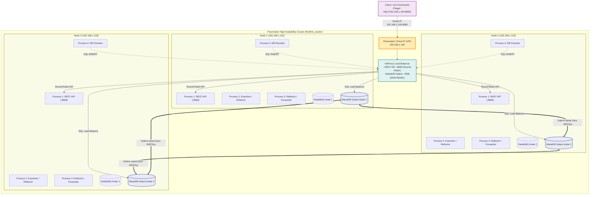
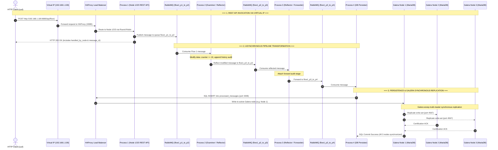
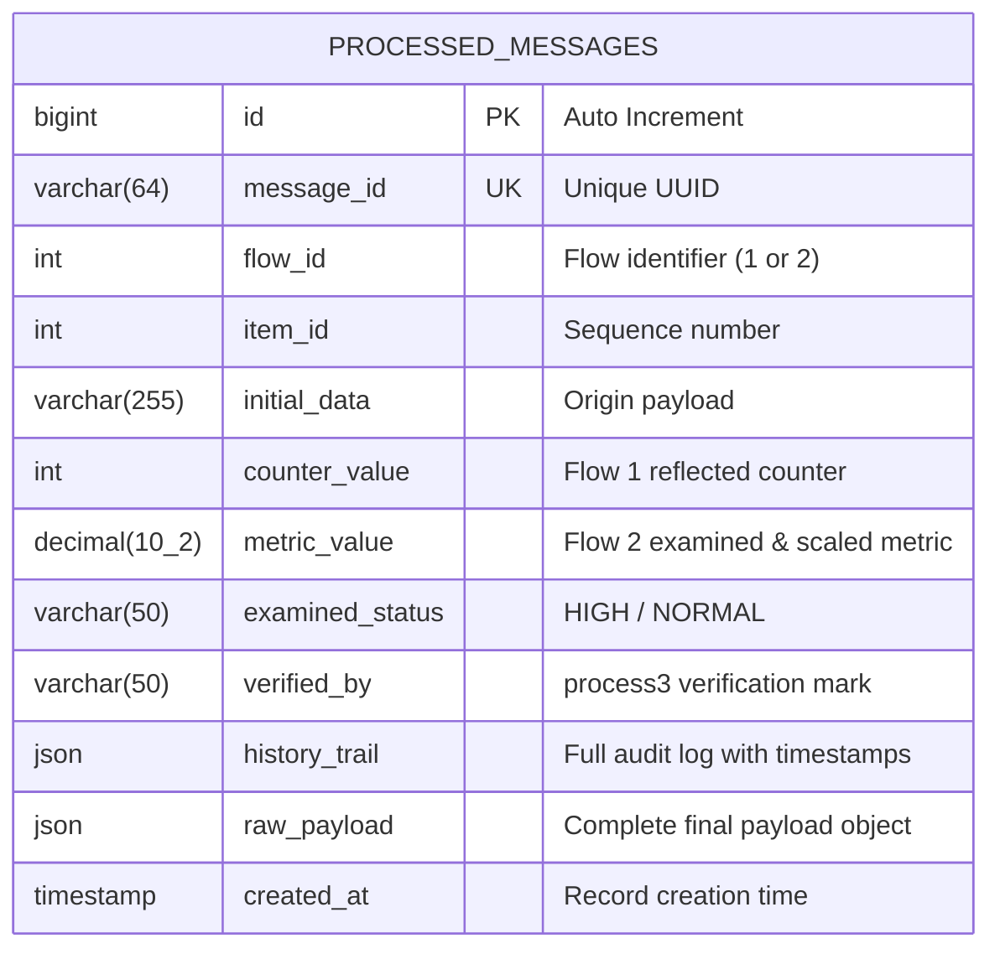

# FlowFirst - Multi-Process RabbitMQ & MariaDB Data Pipeline
## Cluster-Aware 3-Node Architecture with Virtual IP (VIP), HAProxy, Pacemaker, & MariaDB Galera Multi-Master Replication

This project implements an enterprise-grade, distributed inter-process communication and persistence pipeline across **3 network nodes (RHEL 9.6)**. It incorporates:
- **Virtual IP (VIP) Failover** managed by **Pacemaker/Corosync** (`IPaddr2`)
- **HAProxy Round-Robin Load Balancing** for both the **REST API** (`:8080`) and **MariaDB Galera** (`:3306`)
- **MariaDB Galera Cluster** with synchronous multi-master replication (`wsrep`), automated state transfer, and quorum consistency across all 3 nodes
- **Multi-Process Pipeline** (`process1` through `process4`) with data transformation, reflection, and MariaDB persistence
- **RabbitMQ Message Broker** ensuring reliable queuing between stages

---

## Multi-Node Cluster Architecture & Network Topology

### Cluster Nodes Configuration
- **Node 1 (`node1`)**: `192.168.1.101` (Galera Node 1 / API Node 1 / RabbitMQ)
- **Node 2 (`node2`)**: `192.168.1.102` (Galera Node 2 / API Node 2 / RabbitMQ)
- **Node 3 (`node3`)**: `192.168.1.103` (Galera Node 3 / API Node 3 / RabbitMQ)
- **Virtual IP (VIP)**: `192.168.1.100` (Managed by Pacemaker)



---

## End-to-End Sequence & Galera Replication Flow



---

## Step-by-Step Data Flows

### Flow 1: Intermediate Reflection at Process 2 & Galera Persistence
1. **Client (`curl`)**: Sends `POST /api/flow1` to the Virtual IP `http://192.168.1.100:8080`.
2. **HAProxy**: Delivers request to `Process 1` on one of the active cluster nodes (Round-Robin).
3. **Process 1 ([`process1.py`](process1.py:1))**: Generates payload with UUID, publishes to `flow1_p1_to_p2`.
4. **Process 2 ([`process2.py`](process2.py:1))**: Consumes message, modifies counter (`+10`), logs audit entry, and **reflects** it to `flow1_p2_to_p3`.
5. **Process 3 ([`process3.py`](process3.py:1))**: Consumes from `flow1_p2_to_p3`, attaches acknowledgment timestamp, and forwards to `flow1_p3_to_p4`.
6. **Process 4 ([`process4.py`](process4.py:1))**: Consumes from `flow1_p3_to_p4` and stores the payload in **MariaDB Galera Cluster** via [`db.py`](db.py:1), replicating instantaneously to all 3 nodes.

---

### Flow 2: Threshold Examination at Process 2 & Reflection at Process 3
1. **Client (`curl`)**: Sends `POST /api/flow2` to `http://192.168.1.100:8080`.
2. **HAProxy**: Delivers request to `Process 1` on one of the active cluster nodes (Round-Robin).
3. **Process 1 ([`process1.py`](process1.py:1))**: Generates metric payload, publishes to `flow2_p1_to_p2`.
4. **Process 2 ([`process2.py`](process2.py:1))**: Consumes message, evaluates threshold status (`HIGH`/`NORMAL`), applies 15% scaling factor, and forwards to `flow2_p2_to_p3`.
5. **Process 3 ([`process3.py`](process3.py:1))**: Consumes from `flow2_p2_to_p3`, seals with verification signature (`verified_by: process3`), and **reflects** to `flow2_p3_reflected`.
6. **Process 4 ([`process4.py`](process4.py:1))**: Consumes from `flow2_p3_reflected` and persists full history into the **MariaDB Galera Cluster**.

---

## Database Schema & ER Diagram



---

## Complete Multi-Node Installation & Setup (RHEL 9.6)

---

### Phase 1: Repository Clone & Base Prerequisites on All 3 Nodes

First, clone the repository onto **all 3 nodes** so that all setup scripts, SQL definitions, configuration templates, and Python sources are available locally.

```bash
# 1. Install base utilities and Python
sudo dnf install -y git python3 python3-pip

# 2. Clone repository to /opt/flowfirst and navigate to directory
sudo git clone <repo-url> /opt/flowfirst
sudo chown -R $USER:$USER /opt/flowfirst
cd /opt/flowfirst

# 3. Create and configure Python virtual environment
python3 -m venv .venv
source .venv/bin/activate
pip install --upgrade pip
pip install -r requirements.txt

# 4. Initialize environment configuration
cp .env.example .env
# (Edit NODE_NAME in .env to match the current node: node1, node2, or node3)
```

---

### Phase 2: Setup MariaDB Galera Cluster on All 3 Nodes

All scripts automatically read parameters from `/opt/flowfirst/.env`.

#### 1. On Node 1:
```bash
cd /opt/flowfirst
# Configure Galera node settings (reads from .env)
sudo ./mariadb-galera/setup_galera_node.sh

# Bootstrap primary cluster node
sudo ./mariadb-galera/bootstrap_galera.sh
```

#### 2. On Node 2:
```bash
cd /opt/flowfirst
# Configure Galera node settings (reads from .env)
sudo ./mariadb-galera/setup_galera_node.sh

# Join Galera cluster
sudo systemctl enable --now mariadb
```

#### 3. On Node 3:
```bash
cd /opt/flowfirst
# Configure Galera node settings (reads from .env)
sudo ./mariadb-galera/setup_galera_node.sh

# Join Galera cluster
sudo systemctl enable --now mariadb
```

#### 4. Verify Galera Cluster Health on Any Node:
```bash
cd /opt/flowfirst
./mariadb-galera/check_galera_status.sh
```
*Expected Output:*
```text
wsrep_cluster_size: 3
wsrep_cluster_status: Primary
wsrep_connected: ON
wsrep_ready: ON
wsrep_local_state_comment: Synced
```

---

### Phase 3: Install RabbitMQ on All 3 Nodes
```bash
cd /opt/flowfirst
sudo ./scripts/install_rabbitmq_rhel9.sh
```

---

### Phase 4: Setup HAProxy on All 3 Nodes
```bash
cd /opt/flowfirst
# Automatically generates /etc/haproxy/haproxy.cfg using IPs and ports from .env
sudo ./haproxy/setup_haproxy.sh
```

---

### Phase 5: Install Systemd Services on All 3 Nodes
```bash
cd /opt/flowfirst
# Install Systemd Units
sudo ./systemd/install_services.sh /opt/flowfirst

# Disable standard systemd boot so Pacemaker manages service lifecycles
sudo systemctl disable flowfirst-process1 flowfirst-process2 flowfirst-process3 flowfirst-process4
```

---

### Phase 6: Pacemaker Cluster & VIP Initialization (Run on Node 1 Only)

```bash
cd /opt/flowfirst

# 1. Initialize Corosync 3-node cluster using cluster definitions from .env
sudo ./pacemaker/setup_multinode_cluster.sh

# 2. Deploy Virtual IP (VIP), HAProxy group, and Cloned Pipeline Resources using VIP from .env
sudo ./pacemaker/configure_multinode_resources.sh

# 3. Check Pacemaker Status
sudo pcs status
```

---

## Verification & Real-World Usage Scenarios

### Scenario 1: Invoke REST API via Virtual IP & Verify Round-Robin Load Balancing

Send requests directly to the **Virtual IP (`192.168.1.100:8080`)**:

#### A. Health Check via VIP
```bash
curl -s http://192.168.1.100:8080/health | jq .
```

#### B. Trigger Flow 1 via VIP
```bash
curl -X POST http://192.168.1.100:8080/api/flow1 \
  -H "Content-Type: application/json" \
  -d '{
    "item_id": 101,
    "counter": 200,
    "initial_data": "Multi-node VIP test payload"
  }' | jq .
```

#### C. Trigger Flow 2 via VIP
```bash
curl -X POST http://192.168.1.100:8080/api/flow2 \
  -H "Content-Type: application/json" \
  -d '{
    "item_id": 202,
    "value": 31.8,
    "initial_data": "High temperature alert"
  }' | jq .
```

#### D. Verify Round-Robin Load Balancing
```bash
for i in {1..6}; do
  curl -s -X POST http://192.168.1.100:8080/api/flow1 -d "{\"item_id\": $i}" | jq -r '.handled_by_node'
done
```
*Output demonstrates traffic distributed across all 3 nodes:*
```text
node1
node2
node3
node1
node2
node3
```

---

### Scenario 2: End-to-End Flow Execution & Database Content Examination

This scenario executes Flow 1 and Flow 2 through the REST API, follows the messages through RabbitMQ and intermediate modifications, and inspects the resulting table rows and JSON audit trails stored in MariaDB Galera.

#### Automated Execution:
```bash
# Run the automated test & inspect script
./scripts/test_flows_and_inspect_db.sh
```

#### Manual Step-by-Step Walkthrough:

##### Step 1: Trigger Flow 1 (Initial Counter: 500)
```bash
curl -s -X POST http://${FLOWFIRST_VIP:-192.168.1.100}:8080/api/flow1 \
  -H "Content-Type: application/json" \
  -d '{
    "item_id": 101,
    "counter": 500,
    "initial_data": "E2E inspection test payload for Flow 1"
  }' | jq .
```

##### Step 2: Trigger Flow 2 (Initial Metric: 35.00)
```bash
curl -s -X POST http://${FLOWFIRST_VIP:-192.168.1.100}:8080/api/flow2 \
  -H "Content-Type: application/json" \
  -d '{
    "item_id": 202,
    "value": 35.00,
    "initial_data": "E2E high temperature alert for Flow 2"
  }' | jq .
```

##### Step 3: Inspect Summary Table in MariaDB
```bash
mariadb -h ${FLOWFIRST_VIP:-192.168.1.100} -u flowuser -pflowpassword flowfirst_db --table -e "
SELECT
    id,
    flow_id,
    item_id,
    counter_value,
    metric_value,
    examined_status,
    verified_by,
    created_at
FROM processed_messages
ORDER BY id DESC
LIMIT 5;
"
```
*Expected Output:*
```text
+----+---------+---------+---------------+--------------+-----------------+-------------+---------------------+
| id | flow_id | item_id | counter_value | metric_value | examined_status | verified_by | created_at          |
+----+---------+---------+---------------+--------------+-----------------+-------------+---------------------+
| 12 |       2 |     202 |          NULL |        40.25 | HIGH            | process3    | 2025-08-20 10:15:22 |
| 11 |       1 |     101 |           510 |         NULL | NULL            | NULL        | 2025-08-20 10:15:20 |
+----+---------+---------+---------------+--------------+-----------------+-------------+---------------------+
```

##### Step 4: Inspect Flow 1 Audit Trail & Transformation History
```bash
mariadb -h ${FLOWFIRST_VIP:-192.168.1.100} -u flowuser -pflowpassword flowfirst_db -e "
SELECT
    message_id,
    initial_data,
    counter_value,
    JSON_PRETTY(history_trail) AS audit_trail
FROM processed_messages
WHERE flow_id = 1
ORDER BY id DESC LIMIT 1\G
"
```
*Sample JSON History Output:*
```json
[
  {
    "stage": "process1_created",
    "timestamp": "2025-08-20 10:15:20",
    "status": "prepared",
    "source": "rest_api"
  },
  {
    "stage": "process2_reflected",
    "timestamp": "2025-08-20 10:15:21",
    "modification": "Added +10 to counter and flagged reflected"
  },
  {
    "stage": "process3_received_and_forwarded",
    "timestamp": "2025-08-20 10:15:21",
    "status": "forwarded_to_process4"
  },
  {
    "stage": "process4_saved_to_mariadb",
    "timestamp": "2025-08-20 10:15:22",
    "database_action": "INSERT/UPDATE processed_messages"
  }
]
```

##### Step 5: Inspect Flow 2 Audit Trail (Threshold Examination & Scaling)
```bash
mariadb -h ${FLOWFIRST_VIP:-192.168.1.100} -u flowuser -pflowpassword flowfirst_db -e "
SELECT
    message_id,
    initial_data,
    metric_value,
    examined_status,
    verified_by,
    JSON_PRETTY(history_trail) AS audit_trail
FROM processed_messages
WHERE flow_id = 2
ORDER BY id DESC LIMIT 1\G
"
```
*Sample JSON History Output:*
```json
[
  {
    "stage": "process1_created",
    "timestamp": "2025-08-20 10:15:22",
    "status": "prepared",
    "source": "rest_api"
  },
  {
    "stage": "process2_examined_and_forwarded",
    "timestamp": "2025-08-20 10:15:22",
    "status_assigned": "HIGH",
    "modification": "Applied 15% scaling factor and assigned status"
  },
  {
    "stage": "process3_reflected",
    "timestamp": "2025-08-20 10:15:23",
    "modification": "Added verification seal and marked completed"
  },
  {
    "stage": "process4_saved_to_mariadb",
    "timestamp": "2025-08-20 10:15:23",
    "database_action": "INSERT/UPDATE processed_messages"
  }
]
```

---

### Scenario 3: Synchronous Multi-Master Galera Replication Verification

Query **Node 1**, **Node 2**, and **Node 3** directly to confirm that writes from any node are immediately synchronized across all nodes:

```bash
# Check on Node 1:
mariadb -h ${NODE1_IP:-192.168.1.101} -u flowuser -pflowpassword flowfirst_db -e "SELECT id, message_id, flow_id, item_id, counter_value, metric_value FROM processed_messages ORDER BY id DESC LIMIT 5;"

# Check on Node 2:
mariadb -h ${NODE2_IP:-192.168.1.102} -u flowuser -pflowpassword flowfirst_db -e "SELECT id, message_id, flow_id, item_id, counter_value, metric_value FROM processed_messages ORDER BY id DESC LIMIT 5;"

# Check on Node 3:
mariadb -h ${NODE3_IP:-192.168.1.103} -u flowuser -pflowpassword flowfirst_db -e "SELECT id, message_id, flow_id, item_id, counter_value, metric_value FROM processed_messages ORDER BY id DESC LIMIT 5;"
```
*All three databases return identical records in real time.*

---

### Scenario 4: Galera Node Outage & Automatic Quorum Resynchronization

1. **Simulate failure of Galera Node 3:**
   ```bash
   sudo systemctl stop mariadb  # (on Node 3)
   ```
2. **Verify Cluster Quorum remains healthy (2/3 nodes active):**
   ```bash
   ./mariadb-galera/check_galera_status.sh
   ```
   *Result:* `wsrep_cluster_size` is now `2`, cluster status remains `Primary`.
3. **Execute new API requests:**
   ```bash
   curl -X POST http://192.168.1.100:8080/api/flow1 -d '{"item_id": 555}'
   ```
4. **Restart Node 3 and observe Automatic State Transfer (IST/SST):**
   ```bash
   sudo systemctl start mariadb  # (on Node 3)
   ```
   *Galera automatically synchronizes missing transactions. Cluster size returns to `3`.*

---

### Scenario 5: Node Failure & Virtual IP (VIP) Failover

1. **Put Node 1 into standby mode:**
   ```bash
   sudo pcs node standby node1
   ```
2. **Observe Pacemaker immediately moving the Virtual IP and HAProxy to Node 2:**
   ```bash
   sudo pcs status
   ```
   *Result:* `vip-haproxy-group` is now `Started node2`.
3. **Issue `curl` requests with zero downtime:**
   ```bash
   curl -s http://192.168.1.100:8080/health | jq .
   ```
4. **Restore Node 1:**
   ```bash
   sudo pcs node unstandby node1
   ```

---

### Scenario 6: HAProxy Real-Time Statistics Dashboard

Access the live stats dashboard to view real-time frontend and backend health metrics for both the REST API and MariaDB Galera cluster:
- **URL:** `http://192.168.1.100:9000`
- **Username:** `admin`
- **Password:** `admin123`

---

### Scenario 7: Pacemaker Cluster Validation with `crm_mon` & `crm_resource`

Use these commands on **any cluster node** to confirm that all Pacemaker resources are running, correctly distributed, and healthy.

---

#### 7.1 — Full One-Shot Cluster Status (`crm_mon -1Ar`)

```bash
sudo crm_mon -1Ar
```

**Representative expected output (all 3 nodes healthy):**
```
Cluster Summary:
  * Stack: corosync
  * Current DC: node1 (version 2.1.6-8.el9-6fdc9deea29) - partition with quorum
  * Last updated: Mon Jun  9 12:00:00 2025
  * Last change:  Mon Jun  9 11:50:00 2025 by root via cibadmin on node1
  * 3 nodes configured
  * 14 resource instances configured

Node List:
  * Online: [ node1 node2 node3 ]

Active Resources:
  * Resource Group: vip-haproxy-group:
    * vip        (ocf::heartbeat:IPaddr2):        Started node1
    * haproxy    (systemd:haproxy):               Started node1
  * Clone Set: flowfirst-p1-clone [flowfirst-p1]:
    * Started: [ node1 node2 node3 ]
  * Clone Set: flowfirst-p2-clone [flowfirst-p2]:
    * Started: [ node1 node2 node3 ]
  * Clone Set: flowfirst-p3-clone [flowfirst-p3]:
    * Started: [ node1 node2 node3 ]
  * Clone Set: flowfirst-p4-clone [flowfirst-p4]:
    * Started: [ node1 node2 node3 ]
```

> Key indicators:
> - `partition with quorum` — 2-of-3 nodes agree; cluster is fully operational
> - `vip` and `haproxy` are **grouped** and always land on the same node together
> - All 4 process clones show `Started: [ node1 node2 node3 ]` — active on every node

---

#### 7.2 — Continuous Live Monitor (`crm_mon -Ar`)

```bash
sudo crm_mon -Ar          # Refreshes every 15 seconds; press Ctrl-C to exit
sudo crm_mon -Ar -i 5     # Refresh every 5 seconds
```

This is the interactive equivalent and is ideal for watching resource migration in real time during a failover test (Scenario 5).

---

#### 7.3 — Resource Constraint & Location Refresh (`crm_resource -C`)

The `-C` flag clears all **failed-action history** and **location constraints** that Pacemaker accumulated when resources failed or were manually migrated. Run this after recovering a node that was put into standby:

```bash
sudo crm_resource -C
```

**Expected output:**
```
Cleaned up all resources on all nodes
```

To clear a **single resource** across all nodes:
```bash
sudo crm_resource -r vip -C
sudo crm_resource -r flowfirst-p1-clone -C
```

---

#### 7.4 — Per-Resource Status (`crm_resource --resource … --locate`)

```bash
# Where is the VIP currently running?
sudo crm_resource --resource vip --locate
```
```
resource vip is running on: node1
```

```bash
# Where is each clone instance running?
sudo crm_resource --resource flowfirst-p1-clone --locate
```
```
resource flowfirst-p1-clone is running on: node1  node2  node3
```

---

#### 7.5 — Move VIP to a Specific Node

```bash
# Force VIP (and HAProxy group) to node2
sudo crm_resource --resource vip-haproxy-group --move --node node2
sudo crm_mon -1Ar | grep vip
```
```
    * vip        (ocf::heartbeat:IPaddr2):        Started node2
    * haproxy    (systemd:haproxy):               Started node2
```

Remove the forced constraint to let Pacemaker re-balance freely:
```bash
sudo crm_resource --resource vip-haproxy-group --clear
```

---

#### 7.6 — Node Standby & Recovery (VIP Failover Validation)

```bash
# 1. Put node1 into standby (simulates node outage)
sudo pcs node standby node1

# 2. Confirm VIP migrated to node2 or node3
sudo crm_mon -1Ar | grep -E "vip|haproxy"
```
```
    * vip        (ocf::heartbeat:IPaddr2):        Started node2
    * haproxy    (systemd:haproxy):               Started node2
```

```bash
# 3. Confirm API still reachable via VIP — no downtime
curl -s http://192.168.1.100:8080/health | jq .handled_by_node
```
```
"node2"
```

```bash
# 4. Restore node1
sudo pcs node unstandby node1

# 5. Clear any residual constraints
sudo crm_resource -C

# 6. Confirm all nodes back online
sudo crm_mon -1Ar | grep "Online:"
```
```
  * Online: [ node1 node2 node3 ]
```

---

#### 7.7 — Check for Failed Actions

```bash
sudo pcs status | grep -A5 "Failed"
```

If any resource has failed actions, the output will resemble:
```
Failed Resource Actions:
  * flowfirst-p1_start_0 on node3 'not installed' (5): call=12, status='complete',
      exitreason='Could not find Python venv at /opt/flowfirst/.venv',
      last-rc-change='Mon Jun  9 11:45:10 2025', queued=0ms, exec=48ms
```

Fix the underlying issue on `node3`, then clear the failure:
```bash
sudo crm_resource -r flowfirst-p1-clone -C
sudo pcs resource refresh flowfirst-p1-clone
```

---

#### 7.8 — Full `pcs status` Reference Output (All Healthy)

```bash
sudo pcs status
```
```
Cluster name: flowfirst_cluster
Cluster Summary:
  * Stack: corosync
  * Current DC: node1 (version 2.1.6-8.el9) - partition with quorum
  * Last updated: Mon Jun  9 12:05:00 2025
  * Last change:  Mon Jun  9 11:50:00 2025 by root via cibadmin on node1
  * 3 nodes configured
  * 14 resource instances configured

Node List:
  * Online: [ node1 node2 node3 ]

Full List of Resources:
  * Resource Group: vip-haproxy-group:
    * vip        (ocf::heartbeat:IPaddr2):        Started node1
    * haproxy    (systemd:haproxy):               Started node1
  * Clone Set: flowfirst-p1-clone [flowfirst-p1] (active, 3 of 3):
    * flowfirst-p1       (systemd:flowfirst-process1):    Started node1
    * flowfirst-p1       (systemd:flowfirst-process1):    Started node2
    * flowfirst-p1       (systemd:flowfirst-process1):    Started node3
  * Clone Set: flowfirst-p2-clone [flowfirst-p2] (active, 3 of 3):
    * flowfirst-p2       (systemd:flowfirst-process2):    Started node1
    * flowfirst-p2       (systemd:flowfirst-process2):    Started node2
    * flowfirst-p2       (systemd:flowfirst-process2):    Started node3
  * Clone Set: flowfirst-p3-clone [flowfirst-p3] (active, 3 of 3):
    * flowfirst-p3       (systemd:flowfirst-process3):    Started node1
    * flowfirst-p3       (systemd:flowfirst-process3):    Started node2
    * flowfirst-p3       (systemd:flowfirst-process3):    Started node3
  * Clone Set: flowfirst-p4-clone [flowfirst-p4] (active, 3 of 3):
    * flowfirst-p4       (systemd:flowfirst-process4):    Started node1
    * flowfirst-p4       (systemd:flowfirst-process4):    Started node2
    * flowfirst-p4       (systemd:flowfirst-process4):    Started node3

Daemon Status:
  corosync: active/enabled
  pacemaker: active/enabled
  pcsd:      active/enabled
```

---

## Cluster Operations Quick Reference

| Goal | Command |
|---|---|
| Full one-shot cluster status | `sudo crm_mon -1Ar` |
| Live continuous monitor | `sudo crm_mon -Ar` |
| Clear all failed-action history | `sudo crm_resource -C` |
| Clear failures for one resource | `sudo crm_resource -r <resource-id> -C` |
| Locate where a resource runs | `sudo crm_resource --resource <id> --locate` |
| Force resource to a node | `sudo crm_resource --resource <id> --move --node <node>` |
| Remove forced constraint | `sudo crm_resource --resource <id> --clear` |
| Put a node into standby | `sudo pcs node standby <nodename>` |
| Restore a node from standby | `sudo pcs node unstandby <nodename>` |
| Refresh resource state | `sudo pcs resource refresh <resource-id>` |
| List all constraints | `sudo pcs constraint list --full` |
| Show Corosync ring status | `sudo corosync-cfgtool -s` |
| Show quorum status | `sudo corosync-quorumtool -l` |
| Verify cluster config syntax | `sudo crm_verify -L -V` |
| Show CIB (cluster config XML) | `sudo pcs cluster cib` |

---

## Local Single-Node / Development Mode (Docker Compose)

For local testing without multi-node hardware:

```bash
# Start RabbitMQ and MariaDB containers
docker compose up -d

# Run processes
source .venv/bin/activate
python process4.py &
python process3.py &
python process2.py &
python process1.py &

# Send curl requests
curl -X POST http://localhost:8080/api/flow1
curl -X POST http://localhost:8080/api/flow2
```
