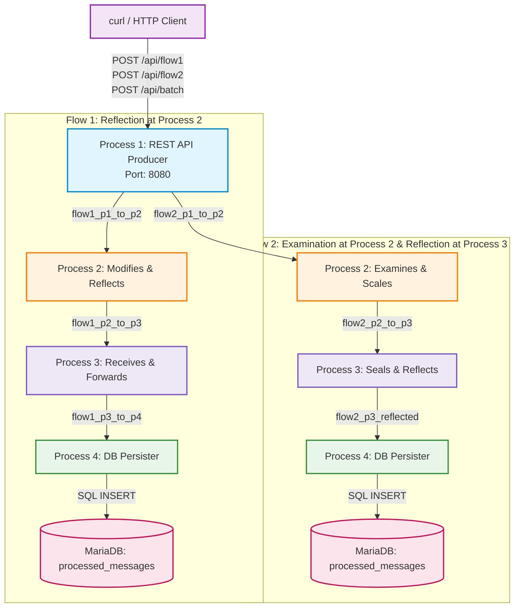
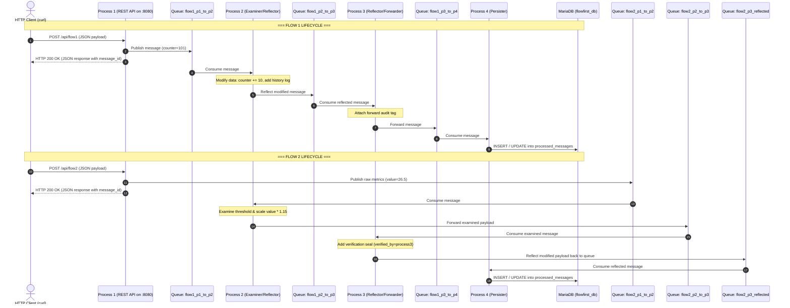
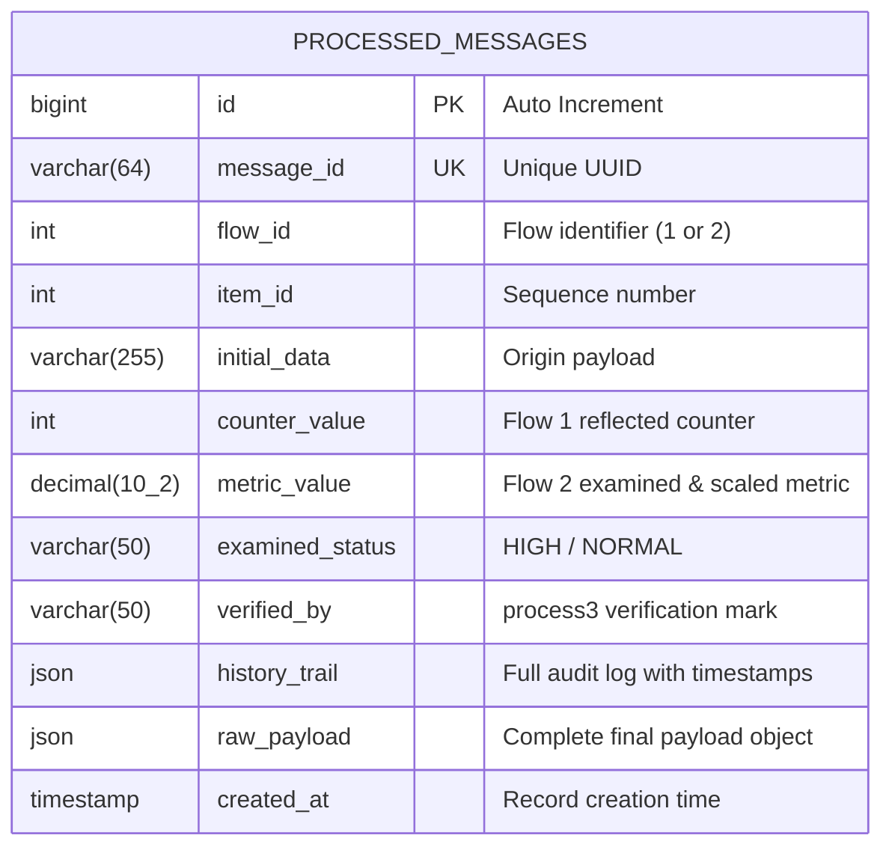

# FlowFirst - Multi-Process RabbitMQ & MariaDB Data Pipeline

This project implements an end-to-end distributed inter-process communication and persistence pipeline using **Python**, **RabbitMQ**, and **MariaDB** across two data flows with intermediate data mutation, reflection, and database storage.

---

## System Architecture & Data Flows

### High-Level Topology Diagram



---

### Sequence Diagram: Flow 1 vs Flow 2 Message Lifecycles



---

### Detailed Step Descriptions

#### Flow 1
1. **Process 1 ([`process1.py`](process1.py:1))**: Receives HTTP POST request (`/api/flow1`), creates payload, and publishes it to queue `flow1_p1_to_p2`.
2. **Process 2 ([`process2.py`](process2.py:1))**: Consumes message from `flow1_p1_to_p2`, modifies payload (`counter += 10`), and **reflects** it to queue `flow1_p2_to_p3`.
3. **Process 3 ([`process3.py`](process3.py:1))**: Consumes from `flow1_p2_to_p3`, attaches acknowledgment log, and forwards it to queue `flow1_p3_to_p4`.
4. **Process 4 ([`process4.py`](process4.py:1))**: Consumes from `flow1_p3_to_p4` and persists the entire record and audit trail into **MariaDB** table `processed_messages`.

---

#### Flow 2
1. **Process 1 ([`process1.py`](process1.py:1))**: Receives HTTP POST request (`/api/flow2`), creates metric payload, and publishes to queue `flow2_p1_to_p2`.
2. **Process 2 ([`process2.py`](process2.py:1))**: Consumes message, examines value threshold, applies a 15% scaling factor, and forwards to `flow2_p2_to_p3`.
3. **Process 3 ([`process3.py`](process3.py:1))**: Picks up message from `flow2_p2_to_p3`, enriches it with verification status (`verified_by: process3`), and **reflects** it to queue `flow2_p3_reflected`.
4. **Process 4 ([`process4.py`](process4.py:1))**: Consumes from `flow2_p3_reflected` and stores the final record and complete lifecycle history into **MariaDB**.

---

## MariaDB Database & Table Schema

### Entity Relationship Diagram



The database table definition (included in [`init_db.sql`](init_db.sql:1)):

```sql
CREATE DATABASE IF NOT EXISTS flowfirst_db CHARACTER SET utf8mb4 COLLATE utf8mb4_unicode_ci;

USE flowfirst_db;

CREATE TABLE IF NOT EXISTS processed_messages (
    id BIGINT AUTO_INCREMENT PRIMARY KEY,
    message_id VARCHAR(64) NOT NULL UNIQUE,
    flow_id INT NOT NULL,
    item_id INT NOT NULL,
    initial_data VARCHAR(255),
    counter_value INT NULL,
    metric_value DECIMAL(10, 2) NULL,
    examined_status VARCHAR(50) NULL,
    verified_by VARCHAR(50) NULL,
    history_trail JSON NOT NULL,
    raw_payload JSON NOT NULL,
    created_at TIMESTAMP DEFAULT CURRENT_TIMESTAMP,
    INDEX idx_flow_item (flow_id, item_id),
    INDEX idx_created_at (created_at)
) ENGINE=InnoDB DEFAULT CHARSET=utf8mb4;
```

---

## Infrastructure Setup

### Option 1: Using Docker Compose (Recommended)
Docker Compose spins up both RabbitMQ (with Management UI) and MariaDB 11.4 with automated schema initialization:

```bash
docker compose up -d
```
- **RabbitMQ AMQP:** `localhost:5672`
- **RabbitMQ Dashboard:** `http://localhost:15672` (User: `guest` / Pass: `guest`)
- **MariaDB Server:** `localhost:3306` (User: `flowuser` / Pass: `flowpassword` / DB: `flowfirst_db`)

---

### Option 2: Installation on RHEL 9.6 (Red Hat Enterprise Linux 9.6)

#### A. Install Docker & Docker Compose on RHEL 9.6
```bash
# 1. Remove conflicting packages
sudo dnf remove -y podman buildah

# 2. Add Docker repository
sudo dnf install -y dnf-plugins-core
sudo dnf config-manager --add-repo https://download.docker.com/linux/rhel/docker-ce.repo

# 3. Install Docker and Compose plugin
sudo dnf install -y docker-ce docker-ce-cli containerd.io docker-buildx-plugin docker-compose-plugin

# 4. Start Docker daemon
sudo systemctl enable --now docker
sudo usermod -aG docker $USER

# 5. Open firewall ports
sudo firewall-cmd --permanent --add-port={5672/tcp,15672/tcp,3306/tcp}
sudo firewall-cmd --reload

# 6. Start services
docker compose up -d
```

#### B. Native Installation on RHEL 9.6 (RPM / DNF)

##### 1. Install & Configure MariaDB on RHEL 9.6:
```bash
# Install MariaDB server
sudo dnf install -y mariadb-server mariadb

# Enable and start MariaDB service
sudo systemctl enable --now mariadb

# Secure installation (optional for production)
sudo mariadb-secure-installation

# Create user, database, and schema
sudo mariadb -u root << 'EOF'
CREATE DATABASE IF NOT EXISTS flowfirst_db CHARACTER SET utf8mb4 COLLATE utf8mb4_unicode_ci;
CREATE USER IF NOT EXISTS 'flowuser'@'%' IDENTIFIED BY 'flowpassword';
CREATE USER IF NOT EXISTS 'flowuser'@'localhost' IDENTIFIED BY 'flowpassword';
GRANT ALL PRIVILEGES ON flowfirst_db.* TO 'flowuser'@'%';
GRANT ALL PRIVILEGES ON flowfirst_db.* TO 'flowuser'@'localhost';
FLUSH PRIVILEGES;
EOF

# Run initialization script
sudo mariadb -u flowuser -pflowpassword flowfirst_db < init_db.sql
```

##### 2. Install & Configure RabbitMQ on RHEL 9.6:
```bash
# Import GPG keys
sudo rpm --import 'https://dl.cloudsmith.io/public/rabbitmq/rabbitmq-erlang/gpg.E495BB49CC4BBE5B.key'
sudo rpm --import 'https://dl.cloudsmith.io/public/rabbitmq/rabbitmq-server/gpg.9F4587F22620D4E7.key'

# Add yum repo definitions
sudo tee /etc/yum.repos.d/rabbitmq.repo << 'EOF'
[rabbitmq-erlang]
name=rabbitmq-erlang
baseurl=https://dl.cloudsmith.io/public/rabbitmq/rabbitmq-erlang/rpm/el/9/$basearch
repo_gpgcheck=1
enabled=1
gpgkey=https://dl.cloudsmith.io/public/rabbitmq/rabbitmq-erlang/gpg.E495BB49CC4BBE5B.key
gpgcheck=0
sslverify=1
sslcacert=/etc/pki/tls/certs/ca-bundle.crt
metadata_expire=300

[rabbitmq-server]
name=rabbitmq-server
baseurl=https://dl.cloudsmith.io/public/rabbitmq/rabbitmq-server/rpm/el/9/noarch
repo_gpgcheck=1
enabled=1
gpgkey=https://dl.cloudsmith.io/public/rabbitmq/rabbitmq-server/gpg.9F4587F22620D4E7.key
gpgcheck=0
sslverify=1
sslcacert=/etc/pki/tls/certs/ca-bundle.crt
metadata_expire=300
EOF

# Install packages & start service
sudo dnf update -y
sudo dnf install -y erlang rabbitmq-server
sudo rabbitmq-plugins enable rabbitmq_management
sudo systemctl enable --now rabbitmq-server

# Open firewall ports
sudo firewall-cmd --permanent --add-port=5672/tcp
sudo firewall-cmd --permanent --add-port=15672/tcp
sudo firewall-cmd --permanent --add-port=3306/tcp
sudo firewall-cmd --reload
```

---

## Python Virtual Environment & Dependencies

1. **Create and activate virtual environment:**
   ```bash
   python3 -m venv .venv
   source .venv/bin/activate
   ```

2. **Install Python packages:**
   ```bash
   pip install --upgrade pip
   pip install -r requirements.txt
   ```

3. **Configure Environment Variables (Optional):**
   ```bash
   cp .env.example .env
   ```

---

## Running as Linux Systemd Services (Production)

Each process is wrapped as a native Linux `systemd` service with automatic restarts, sandboxing, journal logging, and a unified target manager.

### Systemd Unit Files in [`systemd/`](systemd):
- [`systemd/flowfirst-process1.service`](systemd/flowfirst-process1.service:1): Process 1 (REST API Producer on `:8080`)
- [`systemd/flowfirst-process2.service`](systemd/flowfirst-process2.service:1): Process 2 (Examiner & Reflector)
- [`systemd/flowfirst-process3.service`](systemd/flowfirst-process3.service:1): Process 3 (Reflector & Forwarder)
- [`systemd/flowfirst-process4.service`](systemd/flowfirst-process4.service:1): Process 4 (MariaDB Persister & Sink)
- [`systemd/flowfirst.target`](systemd/flowfirst.target:1): Target unit to manage all 4 services together

### 1. Install & Deploy Services
Run the installer script (pass your workspace or deployment directory, default is `/opt/flowfirst` or current directory):
```bash
sudo ./systemd/install_services.sh $(pwd)
```

### 2. Service Management Commands

- **Start all 4 processes together:**
  ```bash
  sudo systemctl start flowfirst.target
  ```

- **Check status of all processes:**
  ```bash
  sudo systemctl status 'flowfirst-*'
  ```

- **Stop all 4 processes:**
  ```bash
  sudo systemctl stop flowfirst.target
  ```

- **Restart a specific process (e.g. Process 2):**
  ```bash
  sudo systemctl restart flowfirst-process2.service
  ```

- **Enable auto-start on system boot:**
  ```bash
  sudo systemctl enable flowfirst.target
  ```

- **View Live Logs via `journalctl`:**
  ```bash
  # Follow logs for all FlowFirst processes:
  sudo journalctl -u 'flowfirst-*' -f

  # Follow logs for Process 4 (DB Persister):
  sudo journalctl -u flowfirst-process4.service -f
  ```

---

## Running Manually in Foreground (Development)

Open **4 separate terminal windows** (with `.venv` activated in each) and run the processes in downstream-to-upstream order:

### Terminal 1: Process 4 (MariaDB Persister & Sink)
```bash
source .venv/bin/activate
python process4.py
```

### Terminal 2: Process 3 (Reflector & Forwarder)
```bash
source .venv/bin/activate
python process3.py
```

### Terminal 3: Process 2 (Examiner & Reflector)
```bash
source .venv/bin/activate
python process2.py
```

### Terminal 4: Process 1 (REST API Producer)
```bash
source .venv/bin/activate
python process1.py
```
*(Process 1 starts the HTTP REST server on `http://localhost:8080`)*

---

## REST API Usage with `curl`

Once Process 1 is running, you can trigger individual flows or batches of messages using `curl`:

### 1. Health Check
```bash
curl -s http://localhost:8080/health | jq .
```

### 2. Trigger Flow 1 (Default Payload)
Publishes to `flow1_p1_to_p2` -> Process 2 (+10) -> Process 3 -> Process 4 -> MariaDB:
```bash
curl -X POST http://localhost:8080/api/flow1
```

### 3. Trigger Flow 1 (Custom Parameters)
```bash
curl -X POST http://localhost:8080/api/flow1 \
  -H "Content-Type: application/json" \
  -d '{
    "item_id": 42,
    "counter": 500,
    "initial_data": "Custom Flow 1 payload from curl"
  }' | jq .
```

### 4. Trigger Flow 2 (Default Payload)
Publishes to `flow2_p1_to_p2` -> Process 2 (examines & scales *1.15) -> Process 3 (seals) -> Process 4 -> MariaDB:
```bash
curl -X POST http://localhost:8080/api/flow2
```

### 5. Trigger Flow 2 (Custom Parameters)
```bash
curl -X POST http://localhost:8080/api/flow2 \
  -H "Content-Type: application/json" \
  -d '{
    "item_id": 99,
    "value": 34.5,
    "initial_data": "High temperature sensor alert"
  }' | jq .
```

### 6. Trigger Batch Flow (Multiple Messages)
```bash
curl -X POST http://localhost:8080/api/batch \
  -H "Content-Type: application/json" \
  -d '{"count": 5}' | jq .
```

---

## Inspecting Database Records

Query the MariaDB database to verify stored messages and audit trails:

```bash
# Using Docker:
docker exec -it mariadb_flowfirst mariadb -u flowuser -pflowpassword -e "USE flowfirst_db; SELECT id, message_id, flow_id, item_id, counter_value, metric_value, examined_status, verified_by, created_at FROM processed_messages;"

# Or using local client:
mariadb -h localhost -P 3306 -u flowuser -pflowpassword flowfirst_db -e "SELECT * FROM processed_messages\G;"
```
