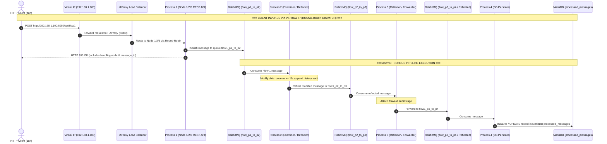
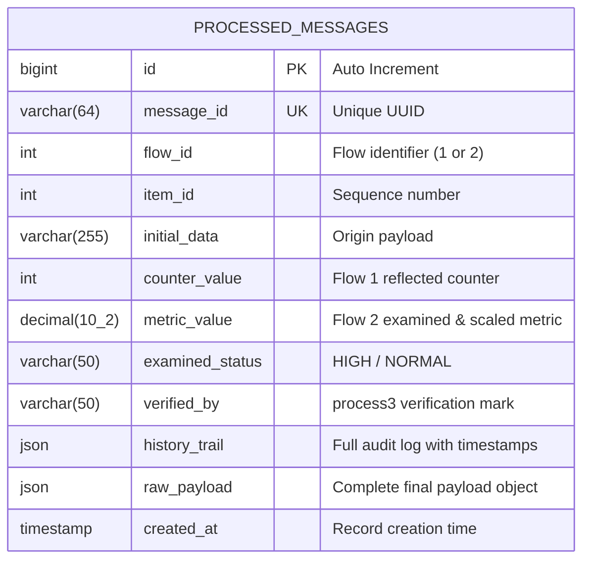

# FlowFirst - Multi-Process RabbitMQ & MariaDB Data Pipeline
## Cluster-Aware 3-Node Architecture with Virtual IP (VIP), HAProxy, and Pacemaker

This project implements an end-to-end, enterprise-grade distributed inter-process communication and persistence pipeline across **3 network nodes**. It incorporates **Virtual IP (VIP) failover** managed by **Pacemaker/Corosync**, **HAProxy round-robin load balancing**, an **HTTP REST API** for external `curl` invocations, **RabbitMQ message queuing**, and **MariaDB database persistence**.

---

## Multi-Node Cluster Architecture & Network Topology

### Minimum Hardware/Network Requirements
- **Node 1 (`node1`)**: `192.168.1.101` (RHEL 9.6)
- **Node 2 (`node2`)**: `192.168.1.102` (RHEL 9.6)
- **Node 3 (`node3`)**: `192.168.1.103` (RHEL 9.6)
- **Virtual IP (VIP)**: `192.168.1.100` (Managed by Pacemaker `IPaddr2` resource agent)

```mermaid
graph TD
    Client["Client / curl Commands<br/>(Target: http://192.168.1.100:8080)"] -->|Virtual IP 192.168.1.100:8080| VIP["Pacemaker Virtual IP (VIP)<br/>192.168.1.100"]

    subgraph Cluster ["Pacemaker Multi-Node High Availability Cluster"]
        VIP --> HAProxy["HAProxy Load Balancer<br/>(Round-Robin on :8080)"]

        subgraph Node1 ["Node 1 (192.168.1.101)"]
            P1_N1["Process 1: REST API (:8080)"]
            P2_N1["Process 2: Examiner / Reflector"]
            P3_N1["Process 3: Reflector / Forwarder"]
            P4_N1["Process 4: DB Persister"]
            RMQ_N1[("RabbitMQ Node 1")]
            DB_N1[("MariaDB Node 1")]
        end

        subgraph Node2 ["Node 2 (192.168.1.102)"]
            P1_N2["Process 1: REST API (:8080)"]
            P2_N2["Process 2: Examiner / Reflector"]
            P3_N2["Process 3: Reflector / Forwarder"]
            P4_N2["Process 4: DB Persister"]
            RMQ_N2[("RabbitMQ Node 2")]
            DB_N2[("MariaDB Node 2")]
        end

        subgraph Node3 ["Node 3 (192.168.1.103)"]
            P1_N3["Process 1: REST API (:8080)"]
            P2_N3["Process 2: Examiner / Reflector"]
            P3_N3["Process 3: Reflector / Forwarder"]
            P4_N3["Process 4: DB Persister"]
            RMQ_N3[("RabbitMQ Node 3")]
            DB_N3[("MariaDB Node 3")]
        end

        HAProxy -->|Round-Robin 1| P1_N1
        HAProxy -->|Round-Robin 2| P1_N2
        HAProxy -->|Round-Robin 3| P1_N3
    end

    style Client fill:#f3e5f5,stroke:#8e24aa,stroke-width:2px
    style VIP fill:#ffecb3,stroke:#ff8f00,stroke-width:3px
    style HAProxy fill:#e0f2f1,stroke:#00897b,stroke-width:2px
    style Node1 fill:#f9fbe7,stroke:#9e9d24,stroke-width:2px
    style Node2 fill:#f9fbe7,stroke:#9e9d24,stroke-width:2px
    style Node3 fill:#f9fbe7,stroke:#9e9d24,stroke-width:2px
```



---

## End-to-End Sequence & Data Flow



---

## Step-by-Step Data Flows

### Flow 1: Intermediate Reflection at Process 2 & DB Persistence
1. **Client (`curl`)**: Sends `POST /api/flow1` to the Virtual IP `http://192.168.1.100:8080`.
2. **HAProxy**: Delivers request to `Process 1` on one of the active cluster nodes (Round-Robin).
3. **Process 1 ([`process1.py`](process1.py:1))**: Generates payload with UUID, publishes to `flow1_p1_to_p2`.
4. **Process 2 ([`process2.py`](process2.py:1))**: Consumes message, modifies counter (`+10`), logs audit entry, and **reflects** it to `flow1_p2_to_p3`.
5. **Process 3 ([`process3.py`](process3.py:1))**: Consumes from `flow1_p2_to_p3`, attaches acknowledgment timestamp, and forwards to `flow1_p3_to_p4`.
6. **Process 4 ([`process4.py`](process4.py:1))**: Consumes from `flow1_p3_to_p4` and stores the payload in **MariaDB** table `processed_messages`.

---

### Flow 2: Threshold Examination at Process 2 & Reflection at Process 3
1. **Client (`curl`)**: Sends `POST /api/flow2` to `http://192.168.1.100:8080`.
2. **HAProxy**: Delivers request to `Process 1` on one of the active cluster nodes (Round-Robin).
3. **Process 1 ([`process1.py`](process1.py:1))**: Generates metric payload, publishes to `flow2_p1_to_p2`.
4. **Process 2 ([`process2.py`](process2.py:1))**: Consumes message, evaluates threshold status (`HIGH`/`NORMAL`), applies 15% scaling factor, and forwards to `flow2_p2_to_p3`.
5. **Process 3 ([`process3.py`](process3.py:1))**: Consumes from `flow2_p2_to_p3`, seals with verification signature (`verified_by: process3`), and **reflects** to `flow2_p3_reflected`.
6. **Process 4 ([`process4.py`](process4.py:1))**: Consumes from `flow2_p3_reflected` and persists full history into **MariaDB**.

---

## Database Entity Relationship Diagram



Database table schema (from [`init_db.sql`](init_db.sql:1)):
```sql
CREATE DATABASE IF NOT EXISTS flowfirst_db CHARACTER SET utf8mb4 COLLATE utf8mb4_unicode_ci;
USE flowfirst_db;

CREATE TABLE IF NOT EXISTS processed_messages (
    id BIGINT AUTO_INCREMENT PRIMARY KEY,
    message_id VARCHAR(64) NOT NULL UNIQUE,
    flow_id INT NOT NULL,
    item_id INT NOT NULL,
    initial_data VARCHAR(255),
    counter_value INT NULL,
    metric_value DECIMAL(10, 2) NULL,
    examined_status VARCHAR(50) NULL,
    verified_by VARCHAR(50) NULL,
    history_trail JSON NOT NULL,
    raw_payload JSON NOT NULL,
    created_at TIMESTAMP DEFAULT CURRENT_TIMESTAMP,
    INDEX idx_flow_item (flow_id, item_id),
    INDEX idx_created_at (created_at)
) ENGINE=InnoDB DEFAULT CHARSET=utf8mb4;
```

---

## Multi-Node Cluster Installation (RHEL 9.6)

Perform the following steps on **all 3 nodes** (`node1`, `node2`, `node3`):

### 1. Prerequisites & Packages Installation on All 3 Nodes
```bash
# Update repositories and install cluster tools, HAProxy, RabbitMQ, and MariaDB
sudo dnf install -y pcs pacemaker corosync fence-agents-all haproxy mariadb-server mariadb python3 python3-pip

# Start and enable pcsd
sudo systemctl enable --now pcsd
echo "hacluster:hacluster123" | sudo chpasswd

# Configure firewall for VIP, HAProxy, Pacemaker, RabbitMQ, and MariaDB
sudo firewall-cmd --permanent --add-service=high-availability
sudo firewall-cmd --permanent --add-port={8080/tcp,9000/tcp,5672/tcp,15672/tcp,3306/tcp}
sudo firewall-cmd --reload

# Allow HAProxy non-local IP binding (required for Virtual IP binding)
sudo sysctl -w net.ipv4.ip_nonlocal_bind=1
echo "net.ipv4.ip_nonlocal_bind=1" | sudo tee /etc/sysctl.d/99-haproxy-nonlocalbind.conf
```

### 2. Configure Python Virtual Environment on All 3 Nodes
```bash
git clone <repo-url> /opt/flowfirst
cd /opt/flowfirst
python3 -m venv .venv
source .venv/bin/activate
pip install --upgrade pip
pip install -r requirements.txt
cp .env.example .env
```

### 3. Deploy HAProxy Configuration on All 3 Nodes
```bash
# Arguments: <Node1_IP> <Node2_IP> <Node3_IP> <Virtual_IP>
sudo ./haproxy/setup_haproxy.sh 192.168.1.101 192.168.1.102 192.168.1.103 192.168.1.100
```

### 4. Install Systemd Services on All 3 Nodes
```bash
sudo ./systemd/install_services.sh /opt/flowfirst
# Disable systemd direct boot so Pacemaker controls them
sudo systemctl disable flowfirst-process1 flowfirst-process2 flowfirst-process3 flowfirst-process4
```

---

## Pacemaker 3-Node Cluster Initialization

Run the following commands **only on Node 1 (`node1`)**:

### 1. Create and Start the Corosync Cluster
```bash
sudo ./pacemaker/setup_multinode_cluster.sh flowfirst_cluster \
    node1 192.168.1.101 \
    node2 192.168.1.102 \
    node3 192.168.1.103
```

### 2. Configure Virtual IP, HAProxy, and Cloned Process Resources
```bash
# Arguments: <Virtual_IP> <Network_Interface> <CIDR_Netmask>
sudo ./pacemaker/configure_multinode_resources.sh 192.168.1.100 eth0 24
```

### 3. Verify Pacemaker Cluster Status
```bash
sudo pcs status
```
*Expected Status Output:*
```text
Cluster name: flowfirst_cluster
Cluster Summary:
  * Stack: corosync
  * Current DC: node1 (version 2.1.6) - partition with quorum
  * 3 nodes configured
  * 6 resource instances configured

Node List:
  * Online: [ node1 node2 node3 ]

Full List of Resources:
  * Resource Group: vip-haproxy-group:
    * flowfirst-vip	(ocf:heartbeat:IPaddr2):	Started node1
    * haproxy-res	(systemd:haproxy):	        Started node1
  * Clone Set: flowfirst-p4-res-clone [flowfirst-p4-res]:
    * Started: [ node1 node2 node3 ]
  * Clone Set: flowfirst-p3-res-clone [flowfirst-p3-res]:
    * Started: [ node1 node2 node3 ]
  * Clone Set: flowfirst-p2-res-clone [flowfirst-p2-res]:
    * Started: [ node1 node2 node3 ]
  * Clone Set: flowfirst-p1-res-clone [flowfirst-p1-res]:
    * Started: [ node1 node2 node3 ]
```

---

## Testing & Usage Scenarios

### Scenario 1: Invoke REST API via Virtual IP using `curl`

Send requests directly to the **Virtual IP (`192.168.1.100`)**. HAProxy will balance the requests across `node1`, `node2`, and `node3` in a round-robin manner:

#### A. Health Check via Virtual IP
```bash
curl -s http://192.168.1.100:8080/health | jq .
```
*Notice `node` in the response alternates between `node1`, `node2`, and `node3`.*

#### B. Trigger Flow 1 via Virtual IP
```bash
curl -X POST http://192.168.1.100:8080/api/flow1 \
  -H "Content-Type: application/json" \
  -d '{
    "item_id": 101,
    "counter": 200,
    "initial_data": "Multi-node VIP test payload"
  }' | jq .
```

#### C. Trigger Flow 2 via Virtual IP
```bash
curl -X POST http://192.168.1.100:8080/api/flow2 \
  -H "Content-Type: application/json" \
  -d '{
    "item_id": 202,
    "value": 31.8,
    "initial_data": "High temperature alert"
  }' | jq .
```

#### D. Trigger Batch Test (Verify Round-Robin Distribution)
```bash
for i in {1..6}; do
  curl -s -X POST http://192.168.1.100:8080/api/flow1 -d "{\"item_id\": $i}" | jq -r '.handled_by_node'
done
```
*Output will demonstrate round-robin distribution:*
```text
node1
node2
node3
node1
node2
node3
```

---

### Scenario 2: Node Failure & Virtual IP (VIP) Failover

1. **Simulate failure on Node 1 (Standby node1):**
   ```bash
   sudo pcs node standby node1
   ```
2. **Observe Pacemaker migrating the Virtual IP and HAProxy to Node 2:**
   ```bash
   sudo pcs status
   ```
   *Result:* `vip-haproxy-group` immediately starts on `node2`.
3. **Execute `curl` requests without downtime:**
   ```bash
   curl -s http://192.168.1.100:8080/health | jq .
   ```
   *Requests continue to be fulfilled seamlessly via `node2` and `node3`.*
4. **Bring Node 1 back online:**
   ```bash
   sudo pcs node unstandby node1
   ```

---

### Scenario 3: Process Failure & Automatic Recovery

1. **Simulate a crash of Process 2 on Node 2:**
   ```bash
   sudo pkill -9 -f "process2.py"
   ```
2. **Pacemaker detects failure during `op monitor` cycle:**
   - Pacemaker automatically detects process termination.
   - Restarts `flowfirst-p2-res` within seconds.
   - Logs the event to `corosync` / `pacemaker` journals.
3. **Check status & clean failcounts:**
   ```bash
   sudo pcs status
   sudo pcs resource cleanup flowfirst-p2-res-clone
   ```

---

### Scenario 4: HAProxy Live Statistics Dashboard

View real-time connection counters, backend server health, and round-robin traffic distribution:
- **URL:** `http://192.168.1.100:9000`
- **Username:** `admin`
- **Password:** `admin123`

---

### Scenario 5: Querying MariaDB Database Across the Cluster

Verify that messages processed across all nodes are stored in the database:

```bash
mariadb -h 192.168.1.100 -P 3306 -u flowuser -pflowpassword flowfirst_db -e \
  "SELECT id, message_id, flow_id, item_id, counter_value, metric_value, examined_status, verified_by, created_at FROM processed_messages ORDER BY id DESC LIMIT 10;"
```

---

## Local Single-Node / Development Mode (Docker Compose)

For local testing without multi-node hardware:

```bash
# Start RabbitMQ and MariaDB containers
docker compose up -d

# Run processes in background or foreground
source .venv/bin/activate
python process4.py &
python process3.py &
python process2.py &
python process1.py &

# Send curl requests
curl -X POST http://localhost:8080/api/flow1
curl -X POST http://localhost:8080/api/flow2
```
