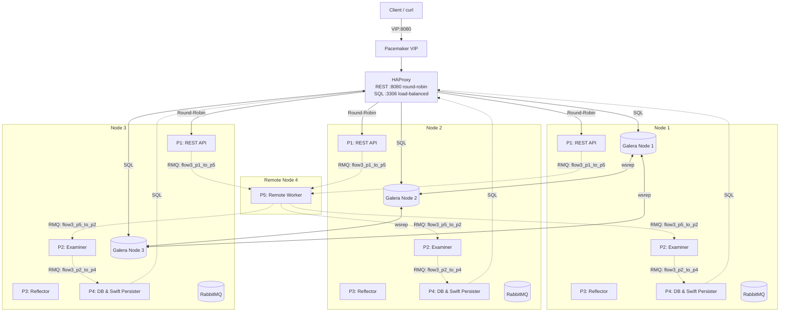
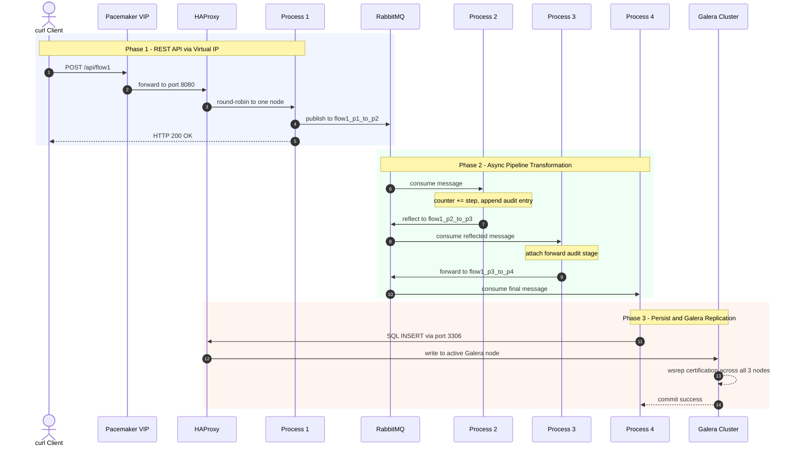

# FlowFirst: Enterprise Multi-Process Distributed Data Pipeline
## HA Architecture with Git, Python 3, Pip, Pyenv/Venv, Chrony, MariaDB/Galera Multi-Master, RabbitMQ, HAProxy, Pacemaker/Corosync, Virtual IP (VIP), Apache ZooKeeper, Systemd Services, Eventlet Greenthreads, OpenStack Swift & Remote Worker Node

This project implements an enterprise-grade, high-availability, distributed inter-process communication, object storage, and persistence pipeline across a 4-node topology (3-node core high-availability cluster + 1 remote worker node on RHEL 9.6). It incorporates:
- **Git, Python 3, Pip, & Pyenv/Virtualenv**: Version-controlled modular codebase running isolated Python virtual environments across all nodes
- **Chrony NTP Time Synchronisation**: Sub-millisecond cluster clock synchronisation for Galera writesets and Corosync consensus
- **Virtual IP (VIP) Failover & High Availability**: Managed by **Pacemaker / Corosync** (`IPaddr2`) with zero-downtime VIP migration
- **HAProxy Load Balancing**: Round-Robin Layer-7 load balancing for REST API (:8080), Layer-4 load balancing for MariaDB Galera (:3306), and RabbitMQ AMQP (:5672) with live statistics dashboard (:9000)
- **MariaDB Galera Multi-Master Cluster**: Synchronous multi-master replication (`wsrep`), automated Incremental (IST) / State Snapshot Transfers (SST), and quorum consistency across all core nodes
- **RabbitMQ Message Broker Pool**: Durable message queuing, automated reconnect greenthreads, and reliable cross-node message routing
- **Apache ZooKeeper**: Distributed coordinator for runtime leader election, live dynamic configuration hot-reloading (without process restart), worker service registry, and atomic deduplication barriers
- **Eventlet Greenthreads & Non-Blocking I/O**: High-concurrency cooperative multitasking, dedicated per-queue consumer greenpools, cooperative RMQ heartbeats, and live throughput metric collectors
- **OpenStack Swift Object Storage (`python-swiftclient`)**: Dual-persistence layer providing immutable object archiving and direct REST API retrieval
- **Systemd Service Architecture**: Managed systemd service units for `flowfirst-process1` through `flowfirst-process5` with automatic crash recovery
- **Distributed Multi-Process Pipeline (`process1` – `process5`)**:
  - **Process 1**: REST API producer & health gateway
  - **Process 2**: Message transformer, metric examiner & reflection forwarder
  - **Process 3**: Acknowledgment sealer & reflection forwarder
  - **Process 4**: Dual MariaDB & Swift persistence engine with ZooKeeper dedup protection
  - **Process 5**: Dedicated remote worker running on Remote Node 4 (`node4`) for cross-network asynchronous task execution and reflection

---

## Multi-Node Cluster Architecture & Network Topology

### Cluster Nodes Configuration
- **Node 1 (`node1`)**: `${NODE1_IP}` (Galera Node 1 / API Node 1 / RabbitMQ Broker / ZooKeeper Peer / HAProxy)
- **Node 2 (`node2`)**: `${NODE2_IP}` (Galera Node 2 / API Node 2 / RabbitMQ Broker / ZooKeeper Peer / HAProxy)
- **Node 3 (`node3`)**: `${NODE3_IP}` (Galera Node 3 / API Node 3 / RabbitMQ Broker / ZooKeeper Peer / HAProxy)
- **Virtual IP (VIP)**: `${FLOWFIRST_VIP}` (Managed by Pacemaker across Nodes 1–3)
- **Remote Node 4 (`node4`)**: `${NODE4_IP}` (Dedicated Remote Worker running **`process5` only**; acts strictly as a lightweight client connecting to the RabbitMQ pool, ZooKeeper ensemble, and Swift storage with no local broker/database daemons)



---

## End-to-End Sequence & Galera Replication Flow



---

## Step-by-Step Data Flows

### Flow 1: Intermediate Reflection at Process 2 & Galera Persistence
1. **Client (`curl`)**: Sends `POST /api/flow1` to the Virtual IP `http://${FLOWFIRST_VIP}:8080`.
2. **HAProxy**: Delivers request to `Process 1` on one of the active cluster nodes (Round-Robin).
3. **Process 1 ([`process1.py`](process1.py:1))**: Generates payload with UUID, publishes to `flow1_p1_to_p2`.
4. **Process 2 ([`process2.py`](process2.py:1))**: Consumes message, modifies counter (`+10`), logs audit entry, and **reflects** it to `flow1_p2_to_p3`.
5. **Process 3 ([`process3.py`](process3.py:1))**: Consumes from `flow1_p2_to_p3`, attaches acknowledgment timestamp, and forwards to `flow1_p3_to_p4`.
6. **Process 4 ([`process4.py`](process4.py:1))**: Consumes from `flow1_p3_to_p4` and stores the payload in both **MariaDB Galera Cluster** via [`db.py`](db.py:1) and **Swift Object Storage** via [`swift_storage.py`](swift_storage.py:1).

---

### Flow 2: Threshold Examination at Process 2 & Reflection at Process 3
1. **Client (`curl`)**: Sends `POST /api/flow2` to `http://${FLOWFIRST_VIP}:8080`.
2. **HAProxy**: Delivers request to `Process 1` on one of the active cluster nodes (Round-Robin).
3. **Process 1 ([`process1.py`](process1.py:1))**: Generates metric payload, publishes to `flow2_p1_to_p2`.
4. **Process 2 ([`process2.py`](process2.py:1))**: Consumes message, evaluates threshold status (`HIGH`/`NORMAL`), applies 15% scaling factor, and forwards to `flow2_p2_to_p3`.
5. **Process 3 ([`process3.py`](process3.py:1))**: Consumes from `flow2_p2_to_p3`, seals with verification signature (`verified_by: process3`), and **reflects** to `flow2_p3_reflected`.
6. **Process 4 ([`process4.py`](process4.py:1))**: Consumes from `flow2_p3_reflected` and persists full history into both the **MariaDB Galera Cluster** and **Swift Object Storage**.

---

### Flow 3: Remote Node 4 / Process 5 Pipeline & Persistence
1. **Client (`curl`)**: Sends `POST /api/flow3` to `http://${FLOWFIRST_VIP}:8080`.
2. **HAProxy**: Delivers request to `Process 1` on any of the first three nodes (Round-Robin).
3. **Process 1 ([`process1.py`](process1.py:1))**: Prepares data with UUID and initial metric, publishes to `flow3_p1_to_p5` via RabbitMQ pool.
4. **Process 5 ([`process5.py`](process5.py:1)) on Remote Node (`node4`)**: Consumes from `flow3_p1_to_p5`, modifies/computes remote transform value, logs audit trail, and **reflects** the modified data back to the RabbitMQ pool on `flow3_p5_to_p2`.
5. **Process 2 ([`process2.py`](process2.py:1)) on any of the first three nodes**: Consumes from `flow3_p5_to_p2`, verifies the remote transformation, appends audit trail, and publishes to `flow3_p2_to_p4` via RabbitMQ pool.
6. **Process 4 ([`process4.py`](process4.py:1)) on any of the first three nodes**: Consumes from `flow3_p2_to_p4` and stores the complete history and payload into both the **MariaDB Galera Cluster** via [`db.py`](db.py:1) and **Swift Object Storage** via [`swift_storage.py`](swift_storage.py:1).

---

## Database Schema & ER Diagram


---

## Quick Reference

### Installation Phases

| Phase | Runs on | Description | Key script / command |
|---|---|---|---|
| **0a** | All nodes (1–4) | Time synchronisation — install & configure Chrony | `dnf install -y chrony` → `chronyc makestep` |
| **0b** | All nodes (1–4) | Clone repo, create Python venv, copy `.env` | `git clone` → `python3 -m venv .venv` → `pip install -r requirements.txt` |
| **1** | Nodes 1–3 only | MariaDB Galera cluster setup (server) | `mariadb-galera/setup_galera_node.sh` |
| **1 bootstrap** | Node 1 only | Bootstrap the primary Galera node | `mariadb-galera/bootstrap_galera.sh` |
| **1b** | Nodes 1–3 only | ZooKeeper 3-node ensemble (servers) | `zookeeper/setup_zookeeper.sh` |
| **1c** | All nodes (1–4) | Raise OS file-descriptor limit for eventlet greenthreads | `ulimit -n 65536` + `/etc/security/limits.d/flowfirst.conf` |
| **2** | Nodes 1–3 only | RabbitMQ cluster & Erlang install (servers) | `scripts/install_rabbitmq_rhel9.sh` |
| **3** | Nodes 1–3 only | Identify cluster NIC, set `VIP_NIC` in `.env`, generate HAProxy config | `haproxy/setup_haproxy.sh` |
| **4** | Nodes 1–3 | Install systemd units for Process 1–4 & target (Pacemaker managed) | `systemd/install_services.sh /opt/flowfirst` |
| **4 (Remote)** | Node 4 only | Install & enable `flowfirst-process5.service` (runs Process 5 only) | `systemd/install_services.sh /opt/flowfirst --remote` |
| **5a** | Nodes 1–3 only | Prepare cluster nodes for Pacemaker (packages, `pcsd`, firewall, `/etc/hosts`) | `pacemaker/setup_multinode_cluster.sh --prepare-node` |
| **5b** | Node 1 only | Initialise cluster, authenticate nodes, deploy VIP + HAProxy + process clones | `pacemaker/setup_multinode_cluster.sh` → `pacemaker/configure_multinode_resources.sh` |
| **5c** | Node 1 only | Verify HAProxy is running under Pacemaker after cluster start | `pcs status` → `ss -tlnp \| grep haproxy` |

---

### Scenarios Quick Reference

| # | Title | Category | What it covers |
|---|---|---|---|
| [1](#scenario-1-invoke-rest-api-via-virtual-ip-verify-round-robin-load-balancing) | Invoke REST API via VIP & Verify Round-Robin | REST API | Health check, Flow 1 & Flow 2 curl, round-robin proof |
| [2](#scenario-2-end-to-end-flow-execution-database-content-examination) | End-to-End Flow Execution & DB Examination | Pipeline | Trigger both flows, inspect MariaDB audit trails |
| [3](#scenario-3-synchronous-multi-master-galera-replication-verification) | Synchronous Galera Replication Verification | Galera | Query all 3 nodes, confirm identical records |
| [4](#scenario-4-galera-node-outage-automatic-quorum-resynchronization) | Galera Node Outage & Quorum Resync | Galera | Stop one node, verify 2-node quorum, rejoin |
| [5](#scenario-5-galera-ist-incremental-state-transfer) | Galera IST — Incremental State Transfer | Galera | Trigger IST, watch `Joiner/Receiving IST` state |
| [6](#scenario-6-galera-sst-state-snapshot-transfer) | Galera SST — State Snapshot Transfer | Galera | Force SST, watch `Donor/Desynced`, confirm full copy |
| [7](#scenario-7-gcachesize-impact-on-ist-vs-sst) | `gcache.size` Impact on IST vs SST | Galera | Resize gcache, demonstrate IST/SST decision boundary |
| [8](#scenario-8-node-failure-virtual-ip-vip-failover) | Node Failure & VIP Failover | Pacemaker | `pcs node standby`, VIP migrates, zero downtime |
| [9](#scenario-9-haproxy-real-time-statistics-dashboard) | HAProxy Statistics Dashboard | HAProxy | Access live stats at `${FLOWFIRST_VIP}:${HAPROXY_STATS_PORT}` |
| [10](#scenario-10-pacemaker-cluster-validation-with-crm_mon-crm_resource) | Pacemaker Validation (`crm_mon`) | Pacemaker | Full status, locate VIP, move resource, standby/recover |
| [11](#scenario-11-stop-start-a-single-pipeline-process-on-one-node) | Stop & Start a Single Process (one node) | Service lifecycle | `pcs resource ban/clear` one clone on one node |
| [12](#scenario-12-stop-start-all-four-pipeline-processes-cluster-wide) | Stop & Start All Processes (cluster-wide) | Service lifecycle | Disable/enable all 4 clones, validate API |
| [13](#scenario-13-stop-start-rabbitmq-on-a-single-node) | Stop & Start RabbitMQ (one node) | Service lifecycle | Verify 2-node RMQ quorum, rejoin |
| [14](#scenario-14-stop-start-mariadb-galera-on-a-single-node) | Stop & Start MariaDB (one node) | Service lifecycle | Verify 2-node Galera, normal rejoin |
| [15](#scenario-15-stop-start-haproxy-on-a-single-node) | Stop & Start HAProxy (one node) | Service lifecycle | Move VIP group via `pcs resource move` |
| [16](#scenario-16-reboot-a-single-node-node3-zero-pipeline-downtime) | Reboot One Node — Zero Downtime | OS reboot | Node3 reboot, cluster continuity, auto-rejoin |
| [17](#scenario-17-reboot-the-node-hosting-the-vip-node1-forced-failover) | Reboot VIP-Holding Node — Forced Failover | OS reboot | Evacuate node1, reboot, confirm VIP migrated |
| [18](#scenario-18-sequential-rolling-reboot-of-all-three-nodes) | Sequential Rolling Reboot (all 3 nodes) | OS reboot | Reboot one at a time, quorum maintained throughout |
| [19](#scenario-19-simultaneous-reboot-of-all-three-nodes-cluster-cold-start) | Simultaneous Reboot — Cluster Cold Start | OS reboot | All 3 nodes down, Galera bootstrap, Pacemaker cold start |
| [20](#scenario-20-soft-network-degradation-latency-packet-loss-tc-netem) | Soft Network Degradation (latency + loss) | Network glitch | `tc netem` 300 ms + 10% loss, observe Corosync/Galera/RMQ |
| [21](#scenario-21-high-bandwidth-throttling-simulating-a-saturated-link) | High Bandwidth Throttling | Network glitch | 1 Mbit/s cap + 2% corruption, Galera IST behaviour |
| [22](#scenario-22-hard-network-partition-iptables-drop-between-two-nodes) | Hard Network Partition (`iptables` DROP) | Network glitch | Full 2-node split, fencing decision, VIP stays up |
| [23](#scenario-23-selective-port-level-block-corosync-ring-only) | Selective Block — Corosync Ring Only | Network glitch | Block UDP 5405, Pacemaker loses heartbeat, app flows |
| [24](#scenario-24-selective-port-level-block-galera-replication-only) | Selective Block — Galera Replication Only | Network glitch | Block TCP 4567, Galera degrades, Corosync stays healthy |
| [25](#scenario-25-selective-port-level-block-rabbitmq-amqp-only) | Selective Block — RabbitMQ AMQP Only | Network glitch | Block TCP 5672, pika reconnects to surviving node |
| [26](#scenario-26-intermittent-flapping-periodic-network-glitch) | Intermittent Flapping — Periodic Glitch | Network glitch | Background glitch loop, Pacemaker failure counters |
| [27](#scenario-27-capture-setup-identify-interfaces-and-start-captures) | Capture Setup — Identify Interfaces | tcpdump | Identify cluster NICs, start background `tcpdump` |
| [28](#scenario-28-amqp-round-trip-flow1-flow2-pipeline-execution) | AMQP Round-Trip — Flow 1 & Flow 2 | tcpdump | TCP handshake, AMQP frames, publish/deliver/ack |
| [29](#scenario-29-rest-api-haproxy-round-trip-verification) | REST API / HAProxy Round-Trip | tcpdump | POST→200 OK, HAProxy SYN→SYN-ACK round-trip |
| [30](#scenario-30-corosync-heartbeat-round-trip-verification) | Corosync Heartbeat Round-Trip | tcpdump | UDP 5405 heartbeat counts, all 6 node pairs |
| [31](#scenario-31-galera-wsrep-replication-round-trip-verification) | Galera wsrep Replication Round-Trip | tcpdump | TCP 4567 writesets, retransmission check |
| [32](#scenario-32-network-round-trip-during-glitch-beforeduringafter-comparison) | Round-Trip During Glitch — Before/During/After | tcpdump | RTT baseline vs. injected latency comparison |
| [33](#scenario-33-tcpdump-based-full-pipeline-flow-trace) | tcpdump-Based Full Pipeline Flow Trace | tcpdump | Trace one message hop-by-hop across all 3 pcap files |
| [34](#scenario-34-zookeeper-ensemble-health-leader-election-verification) | ZooKeeper Ensemble Health & Leader Election | ZooKeeper | `ruok`/`mntr`, confirm leader/follower states |
| [35](#scenario-35-live-config-change-via-zookeeper-no-restart-required) | Live Config Change via ZooKeeper | ZooKeeper | Update threshold/step at runtime, all nodes hot-reload |
| [36](#scenario-36-zookeeper-leader-failover-kill-the-elected-leader-node) | ZooKeeper Leader Failover | ZooKeeper | Stop leader node, watch next candidate elected |
| [37](#scenario-37-zookeeper-dedup-barrier-prevent-double-insert-on-failover) | ZooKeeper Dedup Barrier | ZooKeeper | Re-deliver message, confirm dedup znode blocks double-insert |
| [38](#scenario-38-zookeeper-service-registry-observe-live-process-registration) | ZooKeeper Service Registry | ZooKeeper | Ephemeral znodes, stop process, confirm auto-deregister |
| [39](#scenario-39-verify-greenthread-startup-pool-status) | Verify Greenthread Startup & Pool Status | Greenthreads | `GET /gt/status`, list named greenthreads, pool size |
| [40](#scenario-40-concurrent-batch-publishing-greenthread-parallelism-in-process-1) | Concurrent Batch Publishing | Greenthreads | `POST /api/batch`, concurrent GreenPool publish |
| [41](#scenario-41-per-queue-greenthread-independence-flow-1-blockage-does-not-stall-flow-2) | Per-Queue Greenthread Independence | Greenthreads | Slow one queue, confirm sibling greenthread unaffected |
| [42](#scenario-42-greenthread-auto-restart-on-rabbitmq-consumer-failure) | Greenthread Auto-Restart on RMQ Failure | Greenthreads | Kill RMQ connection, greenthread reconnects automatically |
| [43](#scenario-43-greenthread-metrics-reporter-throughput-monitoring) | Greenthread Metrics Reporter | Greenthreads | Read throughput counters from `/gt/status` and journal |
| [44](#scenario-44-remote-node4-process5-end-to-end-pipeline-execution-database-validation) | Remote Node 4 / Process 5 Pipeline Execution & DB Validation | Remote Worker | P1→P5 (Remote Node 4)→P2→P4, verify MariaDB audit trail & Swift object storage |

---

## Complete Multi-Node Installation & Setup (RHEL 9.6)

---

### Phase 0: Bootstrap — Time Sync, Repository Clone & Python Environment (All 3 Nodes)

> **Do this first on every node — before any service is installed.**
> Time must be synchronised first: `git clone`, `pip install`, and every subsequent
> script depend on a correct system clock. Chrony is installed without the repo
> because `dnf install chrony` needs no local files.

---

#### Phase 0a — Time Synchronisation — Install & Configure Chrony

> **Do this before cloning the repository or installing any packages.**
>
> RabbitMQ **will not start or join a cluster** if the system clock is not synchronised.
> Erlang's distribution protocol and cookie handshake are time-sensitive.
> A drift of more than a few seconds causes node rejection errors, silent queue
> disconnections, and Galera wsrep certification failures. Pacemaker fencing
> decisions can also race incorrectly on nodes with divergent clocks.

```bash
# chrony can be installed directly — no repo clone needed
sudo dnf install -y chrony
sudo systemctl enable --now chronyd
sudo chronyc makestep
```

To use a custom NTP server (recommended for air-gapped environments), run the full
setup script **after** the repo is cloned in Phase 0b:

```bash
# After Phase 0b — re-configure with a custom server if needed
cd /opt/flowfirst
# Pass your internal NTP server IP or use CHRONY_NTP_SERVER from .env:
sudo ./scripts/setup_chronyd.sh "${CHRONY_NTP_SERVER:-time.google.com}"
# Example with an explicit local NTP server IP:
# sudo ./scripts/setup_chronyd.sh <your-ntp-server-ip>
```

The full `setup_chronyd.sh` script performs these steps automatically:
1. Installs `chrony` via `dnf` (skips if already installed)
2. Writes a clean `/etc/chrony.conf` with the specified server + `pool.ntp.org` fallback
3. Enables and restarts `chronyd`
4. Forces an immediate time step with `chronyc makestep` (no waiting for gradual slew)
5. Prints `chronyc tracking` and `chronyc sources` output

**Verify sync on every node before continuing to Phase 0b:**

```bash
chronyc tracking
# Key fields to check:
#   Reference ID  — should show NTP server IP, not 7F7F0101 (local fallback)
#   System time   — offset should be < 0.1 seconds
#   Leap status   — must say "Normal"

# Quick one-liner for all three nodes:
for node in ${NODE1_IP} ${NODE2_IP} ${NODE3_IP}; do
    echo "=== ${node} ==="
    ssh "${node}" "chronyc tracking | grep -E 'Reference|System time|Leap'"
done
```

#### Optional: `CHRONY_NTP_SERVER` in `.env`

If all three nodes use the same internal NTP server, add this to `/opt/flowfirst/.env`
so `setup_chronyd.sh` picks it up automatically without a command-line argument:

```ini
# Set to your internal NTP server IP (leave blank to use pool.ntp.org)
CHRONY_NTP_SERVER=<your-ntp-server-ip>
```

#### Chrony Troubleshooting Reference

**Problem: `Leap status: Not synchronised`**

The daemon is running but cannot reach any NTP server yet. Common on fresh installs.

```bash
# Check which servers are being contacted
chronyc sources -v

# If all show "?" (no response), verify connectivity:
ping pool.ntp.org

# Force a manual query to a specific server:
chronyc -a 'server pool.ntp.org iburst'

# Wait up to 60 seconds, then recheck:
sleep 30 && chronyc tracking | grep "Leap status"
```

**Problem: `Reference ID: 7F7F0101` (local fallback)**

chronyd is not reaching any external server and has fallen back to its own internal clock.
This is **not** synchronised to real time.

```bash
# Confirm firewall allows outbound UDP 123
sudo firewall-cmd --list-all | grep 123

# Open it if missing:
sudo firewall-cmd --permanent --add-service=ntp
sudo firewall-cmd --reload

# Restart and recheck:
sudo systemctl restart chronyd
sleep 10 && chronyc tracking
```

**Problem: chronyd running but RabbitMQ still rejects cluster join**

After fixing the clock, restart Erlang's epmd and RabbitMQ so the new system time
is reflected in the Erlang runtime:

```bash
sudo systemctl stop rabbitmq-server
sudo epmd -kill 2>/dev/null || true
sudo systemctl start rabbitmq-server
sudo rabbitmqctl cluster_status
```

---

#### Phase 0b — Clone the Repository & Set Up the Python Environment

```bash
# 1. Install base utilities and Python
sudo dnf install -y git python3 python3-pip

# 2. Clone repository to /opt/flowfirst
sudo git clone <repo-url> /opt/flowfirst
sudo chown -R $USER:$USER /opt/flowfirst
cd /opt/flowfirst

# 3. Create and activate Python virtual environment
python3 -m venv .venv
source .venv/bin/activate
pip install --upgrade pip
pip install -r requirements.txt

# 4. Initialise environment configuration
cp .env.example .env
```

Then **edit `.env`** on each node. The rules are simple:

> **Only two variables differ between nodes. Everything else is identical.**

#### Per-node variables (change these on each node)

| Variable | node1 | node2 | node3 | What it means |
|---|---|---|---|---|
| `NODE_NAME` | `node1` | `node2` | `node3` | The hostname **of this node** — must match `/etc/hostname` and the name passed to `pcs cluster setup` |
| `CURRENT_NODE_IP` | `${NODE1_IP}` | `${NODE2_IP}` | `${NODE3_IP}` | The cluster-interface IP **of this node** — used by Galera's `wsrep_node_address` and Corosync bind address |

#### Shared variables (identical on all three nodes)

| Variable | Value | Notes |
|---|---|---|
| `CLUSTER_NAME` | `flowfirst_cluster` | Same on every node |
| `NODE1_IP` | `${NODE1_IP}` | **Always the IP of node1**, regardless of which node the file is on |
| `NODE2_IP` | `${NODE2_IP}` | **Always the IP of node2** |
| `NODE3_IP` | `${NODE3_IP}` | **Always the IP of node3** |
| `FLOWFIRST_VIP` | `${FLOWFIRST_VIP}` | Pacemaker Virtual IP — same on all nodes |
| `RABBITMQ_HOST` | `${FLOWFIRST_VIP}` | **Set to the VIP IP.** This is only a single-host fallback; in normal cluster operation `config.py` never reads it — it builds a full three-node host list from `NODE1_IP`…`NODE3_IP` automatically. |
| `RABBITMQ_HOSTS` | *(leave blank)* | **Leave empty.** `config.py` builds `${NODE1_IP}:5672,${NODE2_IP}:5672,${NODE3_IP}:5672` at runtime from `NODE*_IP`. |
| `RABBITMQ_PORT` | `5672` | Literal integer |
| `MARIADB_HOST` | `${FLOWFIRST_VIP}` | **Set to the VIP IP** — routes through HAProxy to the Galera cluster |
| `MARIADB_HOSTS` | *(leave blank)* | **Leave empty.** `config.py` builds `${NODE1_IP},${NODE2_IP},${NODE3_IP}` at runtime. |
| `MARIADB_PORT` | `3306` | Literal integer |

#### Concrete `.env` for each node

**node1** (`/opt/flowfirst/.env`):
```
NODE_NAME=node1
CURRENT_NODE_IP=192.168.1.101
# everything else identical — see .env.example
```

**node2** (`/opt/flowfirst/.env`):
```
NODE_NAME=node2
CURRENT_NODE_IP=192.168.1.102
# everything else identical — see .env.example
```

**node3** (`/opt/flowfirst/.env`):
```
NODE_NAME=node3
CURRENT_NODE_IP=192.168.1.103
# everything else identical — see .env.example
```

> **⚠️ `python-dotenv` does not expand `${VAR}` references**
>
> Shell interpolation like `RABBITMQ_HOST=${FLOWFIRST_VIP}` is read as the
> **literal string** `${FLOWFIRST_VIP}` by Python. This causes
> `int("${RABBITMQ_PORT}")` → `ValueError: invalid literal for int()`.
>
> **Rule:** every value in `.env` must be a plain literal — no `$VAR` or
> `${VAR}` anywhere. `config.py` guards against this with `_int_env` /
> `_str_env` helpers that warn and fall back to defaults, but the `.env`
> file is always the right place to fix it.

---

### Phase 1: Setup MariaDB Galera Cluster on All 3 Nodes

All scripts automatically read parameters from `/opt/flowfirst/.env`.

#### 1. On Node 1:
```bash
cd /opt/flowfirst
# Configure Galera node settings (reads from .env)
sudo ./mariadb-galera/setup_galera_node.sh

# Bootstrap primary cluster node
sudo ./mariadb-galera/bootstrap_galera.sh
```

#### 2. On Node 2:
```bash
cd /opt/flowfirst
# Configure Galera node settings (reads from .env)
sudo ./mariadb-galera/setup_galera_node.sh

# Join Galera cluster
sudo systemctl enable --now mariadb
```

#### 3. On Node 3:
```bash
cd /opt/flowfirst
# Configure Galera node settings (reads from .env)
sudo ./mariadb-galera/setup_galera_node.sh

# Join Galera cluster
sudo systemctl enable --now mariadb
```

#### 4. Verify Galera Cluster Health on Any Node:
```bash
cd /opt/flowfirst
./mariadb-galera/check_galera_status.sh
```
*Expected Output:*
```text
wsrep_cluster_size: 3
wsrep_cluster_status: Primary
wsrep_connected: ON
wsrep_ready: ON
wsrep_local_state_comment: Synced
```

---

### Phase 1b: Install ZooKeeper Ensemble on All 3 Nodes

> **Install ZooKeeper after Galera and before RabbitMQ.**
> ZooKeeper must be running and in quorum before the pipeline processes start —
> they use it for leader election on startup.

```bash
cd /opt/flowfirst
sudo ./zookeeper/setup_zookeeper.sh
```

The script performs these steps automatically on each node:
1. Installs Java 17 (`java-17-openjdk-headless`) if not already present
2. Downloads Apache ZooKeeper `ZK_VERSION` (default `3.9.2`) from `downloads.apache.org`
3. Creates a dedicated `zookeeper` system user and `/var/lib/zookeeper/data`, `/var/log/zookeeper` directories
4. Writes `myid` from `CURRENT_NODE_IP` matched against `NODE1_IP`/`NODE2_IP`/`NODE3_IP` in `.env`
5. Writes `zoo.cfg` with the full 3-node ensemble and auto-purge settings
6. Installs and enables `zookeeper.service` as a systemd unit
7. Opens firewall ports `2181/tcp` (client), `2888/tcp` (peer), `3888/tcp` (election)
8. Starts ZooKeeper and checks for `imok` response

**Step 1 — Verify the ensemble has quorum across all nodes:**

Run on **each node** to verify basic health and check its server state:

```bash
# Each node should respond "imok"
echo ruok | nc 127.0.0.1 2181

# Check this node's state (one node in the ensemble will be leader, two will be followers)
echo mntr | nc 127.0.0.1 2181 | grep zk_server_state
# Output on one node:   zk_server_state    leader
# Output on other two:  zk_server_state    follower
```

**Step 2 — Verify quorum and full ensemble status (run ONLY on the node where `zk_server_state` is `leader`):**

> **Important:** `zk_synced_followers` is exposed **only by the elected ZooKeeper leader node**.
> Running `echo mntr | grep zk_synced_followers` on a follower node will return empty because followers do not track synced followers.
> Identify which node reported `zk_server_state leader` in Step 1, log in to that node (or query it remotely), and run:

```bash
# Run ON THE LEADER NODE to confirm quorum size (synced followers must be 2 for a 3-node ensemble):
echo mntr | nc 127.0.0.1 2181 | grep zk_synced_followers
# Expected output on leader: zk_synced_followers   2

# Check the state of all 3 nodes from the leader:
for node in ${NODE1_IP} ${NODE2_IP} ${NODE3_IP}; do
    echo -n "${node}: "
    echo mntr | nc -w2 "${node}" 2181 | grep zk_server_state || echo "unreachable"
done
```

#### ZooKeeper `.env` variables

| Variable | Default | Description |
|---|---|---|
| `ZK_VERSION` | `3.9.2` | ZooKeeper release to download |
| `ZK_CLIENT_PORT` | `2181` | Port clients (kazoo) connect to |
| `ZK_PEER_PORT` | `2888` | Inter-node replication port |
| `ZK_ELECTION_PORT` | `3888` | Leader election port |
| `ZK_HEAP_MB` | `256` | JVM heap size (MB) |
| `ZK_TIMEOUT` | `10` | Kazoo session timeout (seconds) |
| `ZK_DEDUP_TTL_MS` | `300000` | How long Process 4 dedup znodes live (ms) |
| `ZK_HOSTS` | *(auto)* | Leave blank — `config.py` builds from `NODE*_IP` |

#### ZooKeeper znode tree

> **Note on timing:** The `/flowfirst` znode hierarchy is **not** created by `setup_zookeeper.sh`.
> It is lazily initialised by the Python pipeline (`zk.py`) the **very first time any FlowFirst process (`process1` – `process4`) connects to ZooKeeper** (in Phase 5 / Scenario 1).
>
> If you connect with `zkCli.sh` immediately after installing ZooKeeper in Phase 1b, `/flowfirst` does not exist yet (`ls /` will only show `[zookeeper]`). This is expected.

The full znode tree populated once the pipeline processes start:

```
/flowfirst
├── election/
│   ├── process1/     ← ephemeral sequential election candidates
│   ├── process2/
│   ├── process3/
│   └── process4/
├── config/           ← persistent, hot-reloadable runtime config
│   ├── flow2_high_threshold    (default: "30.0")
│   ├── flow1_counter_step      (default: "10")
│   └── flow2_scale_factor      (default: "1.15")
├── registry/         ← ephemeral service registration (auto-removed on crash)
│   ├── process1/
│   │   └── node1     {"node":"node1","pid":1234,"started_at":"..."}
│   ├── process2/
│   ├── process3/
│   └── process4/
├── dedup/            ← ephemeral dedup barrier (Process 4 double-insert prevention)
│   └── <message_id>  ← created on first processing, auto-expires after ZK_DEDUP_TTL_MS
└── health/           ← pipeline health dashboard
    ├── process1/
    │   └── node1     {"state":"leader","updated_at":"...","pid":1234}
    ├── process2/
    ├── process3/
    └── process4/
```

#### Inspect the znode tree with zkCli

**Option A — Check ZooKeeper connectivity right now (Phase 1b):**

```bash
# Connect to the local ZooKeeper node
/opt/zookeeper/bin/zkCli.sh -server 127.0.0.1:2181

# Inside zkCli (fresh install before pipeline start):
ls /
# Output: [zookeeper]  (this confirms ZooKeeper is healthy and responding)

quit
```

**Option B — Inspect `/flowfirst` znodes (run AFTER pipeline processes start in Phase 5 / Scenario 1):**

```bash
# Connect to the ZooKeeper ensemble
/opt/zookeeper/bin/zkCli.sh -server 127.0.0.1:2181

# Inside zkCli (once processes are running):
ls /
# Output: [flowfirst, zookeeper]

ls /flowfirst
# Output: [config, dedup, election, health, registry]

ls /flowfirst/election/process1
get /flowfirst/config/flow2_high_threshold
ls /flowfirst/registry/process1
get /flowfirst/registry/process1/node1
ls /flowfirst/health/process1
get /flowfirst/health/process1/node1
quit
```

*(Optional) Pre-seed `/flowfirst` znodes now before starting the pipeline:*

If you want to manually create and seed the base znodes and default config before starting the pipeline:

```bash
cd /opt/flowfirst
source .venv/bin/activate
python3 -c "import zk; zk.get_client(); print('Base znodes and default config seeded successfully.')"
```

#### ZooKeeper Troubleshooting Reference

**Problem: `Connection refused` on port 2181**

ZooKeeper needs a quorum (2 of 3 nodes) to serve clients.
If only one node is up, clients cannot connect.

```bash
# Check the service on each node
sudo systemctl status zookeeper

# Confirm the ensemble config is correct
grep "server\." /opt/zookeeper/conf/zoo.cfg

# Check ZooKeeper logs
sudo journalctl -u zookeeper -n 50 --no-pager
```

**Problem: `myid` mismatch — ZooKeeper starts but never joins ensemble**

```bash
cat /var/lib/zookeeper/data/myid
# Must be 1, 2, or 3 matching the server.X line in zoo.cfg
# Re-run setup if wrong:
sudo ./zookeeper/setup_zookeeper.sh
```

**Problem: Java not found or wrong version**

```bash
java -version
# Must be 11, 17, or 21. Install if missing:
sudo dnf install -y java-17-openjdk-headless
```

---

### Phase 1c: Install Greenthread (eventlet) Dependencies on All 3 Nodes

> **Install after ZooKeeper (Phase 1b) and before RabbitMQ (Phase 2).**
> `eventlet` monkey-patches the Python stdlib so all I/O — pika, kazoo, pymysql,
> and the HTTP server — becomes co-operatively concurrent within a single OS process.

The `eventlet` and `dnspython` packages are installed automatically when you run
`pip install -r requirements.txt` in Phase 0b. This phase covers the OS-level
file descriptor limit that eventlet needs and verifies the installation.

#### 1c-a — Raise the OS file descriptor limit (all nodes)

Greenthreads use OS sockets and file handles.  Each process can run up to
`GT_POOL_SIZE` (default 1000) concurrent greenthreads; each needs a file descriptor.
The default RHEL 9 limit of 1024 is too low.

```bash
# Raise the system-wide limit permanently
echo "flowuser soft nofile 65536" | sudo tee -a /etc/security/limits.d/flowfirst.conf
echo "flowuser hard nofile 65536" | sudo tee -a /etc/security/limits.d/flowfirst.conf

# Also set it for the current session to take effect immediately
ulimit -n 65536

# Verify
ulimit -n
# Expected: 65536
```

The systemd service units already include `LimitNOFILE=65536` so this is handled
automatically when processes run under Pacemaker.

#### 1c-b — Verify eventlet is installed correctly

```bash
cd /opt/flowfirst
source .venv/bin/activate

# Confirm version
python -c "import eventlet; print('eventlet', eventlet.__version__)"
# Expected: eventlet 0.37.x (or later)

# Confirm monkey-patch works with pika
python -c "
import eventlet
eventlet.monkey_patch()
import pika
print('monkey-patch OK — pika imported after patch')
"

# Confirm gt.py loads cleanly
python -c "import gt; gt.monkey_patch(); print('gt.py OK, pool size:', gt.GT_POOL_SIZE)"
```

#### Greenthread `.env` variables

| Variable | Default | Description |
|---|---|---|
| `GT_POOL_SIZE` | `1000` | Max concurrent greenthreads per process |
| `GT_WORKER_CONCURRENCY` | `4` | Concurrent HTTP handlers in Process 1 |
| `GT_METRICS_INTERVAL_S` | `60` | Seconds between throughput log lines |
| `GT_DEDUP_REAP_INTERVAL_S` | `600` | Seconds between ZK dedup znode reap runs |

#### Greenthread layout per process

| Process | Greenthreads | Purpose |
|---|---|---|
| **P1** | `p1_http_server` | eventlet GreenPool HTTP server (concurrent requests) |
| | `p1_rmq_heartbeat` | keeps publish connection alive (process_data_events) |
| | `p1_zk_health` | periodic ZooKeeper health reporter |
| | `process1_metrics` | throughput counter logger |
| **P2** | `p2_flow1_consumer` | dedicated pika consumer for `flow1_p1_to_p2` (own conn) |
| | `p2_flow2_consumer` | dedicated pika consumer for `flow2_p1_to_p2` (own conn) |
| | `p2_zk_health` | ZooKeeper health reporter |
| | `process2_metrics` | throughput counter logger |
| **P3** | `p3_flow1_consumer` | dedicated consumer for `flow1_p2_to_p3` (own conn) |
| | `p3_flow2_consumer` | dedicated consumer for `flow2_p2_to_p3` (own conn) |
| | `p3_zk_health` | ZooKeeper health reporter |
| | `process3_metrics` | throughput counter logger |
| **P4** | `p4_flow1_consumer` | dedicated consumer for `flow1_p3_to_p4` (own conn) |
| | `p4_flow2_consumer` | dedicated consumer for `flow2_p3_reflected` (own conn) |
| | `p4_zk_health` | ZooKeeper health reporter |
| | `p4_dedup_reaper` | periodic ZK dedup znode cleanup |
| | `process4_metrics` | throughput counter logger |

> **Why a separate pika connection per greenthread?**
> `pika.BlockingConnection` and its channels are not thread-safe (or greenthread-safe).
> Each greenthread that consumes or publishes must own its own connection object.
> This is the standard pattern for pika with any concurrency model.

---

### Phase 2: Install RabbitMQ on All 3 Nodes

> **Prerequisite:** Phase 0b (chrony time sync) must be complete on all nodes before running this.
> The install script checks `chronyd` status at startup and prints a 10-second warning
> if the clock is not synchronised — press **Ctrl-C** and run `setup_chronyd.sh` first.

> **Note — four issues were fixed in the install script (as of 2025):**
> 1. **Cloudsmith baseurls dead** — `dl.cloudsmith.io/public/rabbitmq/…` returns 404.
> 2. **Cloudsmith GPG key URLs dead** — `dl.cloudsmith.io/…/gpg.*.key` also returns 404.
>    Keys now fetched from `github.com/rabbitmq/signing-keys` release 3.0.
> 3. **Server key fingerprint changed** — suffix `2620D4E7` → `26208342` in signing-keys release 3.0.
> 4. **`aarch64` not available on `yum1/yum2.rabbitmq.com`** — those mirrors only carry `x86_64`.
>    The script now detects the architecture at runtime (`uname -m`) and writes different repo stanzas:
>    - `x86_64` → `yum1/yum2.rabbitmq.com` (4 stanzas: x86_64 + noarch for both Erlang and RabbitMQ)
>    - `aarch64` → `packagecloud.io/rabbitmq` (2 stanzas: aarch64 for both Erlang and RabbitMQ)

```bash
cd /opt/flowfirst
sudo ./scripts/install_rabbitmq_rhel9.sh
```

The script performs these steps automatically:
1. **Pre-flight clock check** — warns and pauses 10 s if `chronyd` is not synchronised
2. Downloads all 3 GPG keys to temp files (bypasses `rpm --import /dev/stdin` pipe bug on RHEL 9)
3. Imports keys with `sudo rpm --import <file>`
4. Writes `/etc/yum.repos.d/rabbitmq.repo` with 4 stanzas using `yum1/yum2.rabbitmq.com` baseurls and GitHub `gpgkey=` URLs
5. Runs `dnf clean metadata && dnf makecache && dnf install -y erlang rabbitmq-server`
6. Enables `rabbitmq_management` plugin and starts the service

---

### Phase 3: Identify Your Cluster NIC & Set `VIP_NIC` on Each Node

> **Critical — do this before running `setup_haproxy.sh` or `configure_multinode_resources.sh`.**
> RHEL 9 uses *predictable NIC names* (`ens3`, `ens192`, `enp0s3`) — NOT `eth0`.
> `VIP_NIC` must be the physical cluster interface name on **each individual node**.
> It may differ across nodes if hardware varies.

#### 3a — Discover the correct NIC name on each node

```bash
# Option 1: auto-detect via routing table (recommended)
ip route get ${FLOWFIRST_VIP} | awk '{print $5; exit}'
# Example output:  ens3

# Option 2: list all non-loopback interfaces
ip -o link show | awk -F': ' '{print $2}' | grep -v lo
# Example output:
#   ens3
#   ens192

# Option 3: show interface with IP
ip -4 addr show | grep -v lo
```

#### 3b — Set `VIP_NIC` in `.env` on each node

Edit `/opt/flowfirst/.env` and set `VIP_NIC` to the name found above.
The value may be different on each node:

```ini
# On node1 (e.g. KVM guest with virtio NIC)
VIP_NIC=ens3

# On node2 (e.g. physical server with Broadcom NIC)
VIP_NIC=enp0s3

# On node3 (e.g. VMware guest)
VIP_NIC=ens192
```

#### 3c — Run HAProxy setup on all 3 nodes

```bash
cd /opt/flowfirst
# Generates /etc/haproxy/haproxy.cfg from .env, sets ip_nonlocal_bind, SELinux boolean
sudo ./haproxy/setup_haproxy.sh
```

#### 3d — Verify HAProxy configuration syntax only

> **Do NOT start `haproxy.service` manually.** HAProxy is managed exclusively by
> Pacemaker as part of `vip-haproxy-group`. Starting it directly here will conflict
> with Pacemaker's resource management once the cluster is initialised.
> The only check needed at this stage is that the generated config file is valid.

```bash
# Validate config syntax — no service start
sudo haproxy -c -f /etc/haproxy/haproxy.cfg

# Confirm TCP frontends bind to the VIP, not wildcard
grep "bind" /etc/haproxy/haproxy.cfg
# Expected:
#   bind *:8080               ← REST API
#   bind *:9000               ← stats
#   bind ${FLOWFIRST_VIP}:3306   ← MariaDB (VIP only — no port conflict)
#   bind ${FLOWFIRST_VIP}:5672   ← RabbitMQ (VIP only — no port conflict)
```

HAProxy will be started automatically by Pacemaker in Phase 5 when the VIP is
assigned. Verify it is running at that point — see **Step 5c** below.

---

#### HAProxy Troubleshooting Reference

Five distinct root causes produce `haproxy.service: start job failed`. Each has a different fix:

---

**Failure 1 — Wrong `VIP_NIC` name**

Symptom:
```
[ALERT] cannot find interface ens999 (bind ... dev ens999)
```

Fix:
```bash
# Find the correct name
ip -o link show | awk -F': ' '{print $2}' | grep -v lo

# Update .env on this node
sed -i "s/^VIP_NIC=.*/VIP_NIC=ens3/" /opt/flowfirst/.env

# Re-run haproxy setup
sudo ./haproxy/setup_haproxy.sh
```

---

**Failure 2 — `ip_nonlocal_bind` not set (VIP not yet active)**

HAProxy binds to the VIP address before Pacemaker has assigned it to any node. The kernel rejects binding to an IP that does not currently exist on any interface.

Symptom:
```
[ALERT] cannot bind socket [192.168.1.100:8080]
```

Fix (the setup script already does this, but if running manually):
```bash
# Enable immediately
sudo sysctl -w net.ipv4.ip_nonlocal_bind=1

# Persist across reboots
echo "net.ipv4.ip_nonlocal_bind = 1" | sudo tee /etc/sysctl.d/99-haproxy-nonlocal.conf
sudo sysctl -p /etc/sysctl.d/99-haproxy-nonlocal.conf

# Restart HAProxy
sudo systemctl restart haproxy
```

Verify:
```bash
sysctl net.ipv4.ip_nonlocal_bind
# Expected: net.ipv4.ip_nonlocal_bind = 1
```

---

**Failure 3 — SELinux blocking HAProxy port binding or shared memory (`/dev/shm`) access**

RHEL 9 ships with SELinux in `Enforcing` mode. Without the `haproxy_connect_any` and `daemons_enable_cluster_mode` booleans, HAProxy cannot bind to custom ports such as `8080`, `3306`, or `9000`, and may encounter denials mapping shared memory files (`/dev/shm`).

Symptom — check the audit log:
```bash
sudo ausearch -m avc -ts recent | grep haproxy
# Example 1:
#   avc:  denied { name_bind } for  comm="haproxy" ... tcontext=system_u:object_r:http_cache_port_t:s0
# Example 2:
#   avc:  denied { map } for  comm="haproxy" path="/dev/shm/..." dev="tmpfs" tcontext=system_u:object_r:tmpfs_t:s0
```

Fix (the setup script already does this, but if needed manually):
```bash
# Allow HAProxy to connect/bind to custom ports and operate in cluster/shared memory environments
sudo setsebool -P haproxy_connect_any 1
sudo setsebool -P daemons_enable_cluster_mode 1

# If a custom policy module is required for strict /dev/shm file mapping:
sudo ausearch -c 'haproxy' --raw | audit2allow -M haproxy_shm
sudo semodule -i haproxy_shm.pp

# Confirm booleans
getsebool haproxy_connect_any daemons_enable_cluster_mode
# Expected:
#   haproxy_connect_any --> on
#   daemons_enable_cluster_mode --> on
```

---

**Failure 4 — `option forwardfor` in TCP frontends**

`forwardfor` is an HTTP-only directive. Placing it in the `defaults` block causes
HAProxy to reject the config when any TCP frontend or backend inherits it.

Symptom:
```
[WARNING] config : 'option forwardfor' ignored for frontend mariadb_galera_front
           as it requires HTTP mode.
[WARNING] config : 'option forwardfor' ignored for backend mariadb_galera_back
           as it requires HTTP mode.
```

Fix (already corrected in `haproxy.cfg.template`):
`forwardfor` must be removed from `defaults` and placed only inside the HTTP
frontend (`flowfirst_api_front`) and HTTP backend (`flowfirst_api_back`).
Re-run setup to regenerate the config:

```bash
cd /opt/flowfirst
sudo ./haproxy/setup_haproxy.sh
```

---

**Failure 5 — Port Collision between HAProxy and Backend Services**

When HAProxy and backend services run on the same node, port separation prevents any `[Errno 98] Address already in use` collisions:
- **HAProxy REST API Frontend**: Listens on port `8080`, load-balancing requests across backend Process 1 nodes.
- **Process 1 REST API Backend**: Listens on dedicated backend port `8082` (`API_BACKEND_PORT=8082`), avoiding any collision with HAProxy (`8080`) or ZooKeeper AdminServer (`8081`).
- **MariaDB Galera Load Balancer**: HAProxy frontend listens on dedicated LB port `3307` (`MARIADB_LB_PORT=3307`) and load-balances across node daemons on port `3306`.
- **RabbitMQ AMQP Load Balancer**: HAProxy frontend listens on dedicated LB port `5673` (`RABBITMQ_LB_PORT=5673`) and load-balances across node daemons on port `5672`.

Symptom:
```
[ALERT] : Starting frontend flowfirst_api_front: cannot bind socket
          [0.0.0.0:8080]: Address already in use
# or in Process 1 startup:
OSError: [Errno 98] Address already in use
```

Fix:
1. Process 1 binds to `API_BACKEND_PORT=8082` while HAProxy binds to `API_PORT=8080` and routes to `node:8082`.
2. Ensure no manually launched Python processes (`python process1.py`) or unmanaged systemd instances are holding port 8082 before Pacemaker starts `flowfirst-p1-res-clone`:
   ```bash
   # Kill manual instances across nodes:
   sudo pkill -f 'python.*process1\.py' || true
   sudo systemctl stop flowfirst-process1 || true
   ```

```bash
cd /opt/flowfirst
sudo ./haproxy/setup_haproxy.sh

# Confirm the configuration
grep "bind" /etc/haproxy/haproxy.cfg
# Expected:
#   bind *:8080                  ← REST API Frontend
#   bind 0.0.0.0:9000            ← Stats dashboard
#   bind *:3307                  ← MariaDB LB Frontend
#   bind *:5673                  ← RabbitMQ LB Frontend
```

---

**Failure 6 — `backend 'static' has no server available!` / Default RHEL `/etc/haproxy/haproxy.cfg` Active**

When HAProxy is installed on RHEL 9 via `dnf install haproxy`, it creates a default configuration file containing a sample `frontend main`, `backend static`, and `backend app`. The sample `backend static` has no defined servers, causing HAProxy startup failure or warnings.

Symptom:
```
backend 'static' has no server available!
```

Root Cause:
The FlowFirst setup script `./haproxy/setup_haproxy.sh` has not yet been executed (or was executed before `.env` was created), leaving the default RHEL configuration in `/etc/haproxy/haproxy.cfg`.

Fix:
Generate the FlowFirst HAProxy configuration from template:

```bash
cd /opt/flowfirst
sudo ./haproxy/setup_haproxy.sh

# Verify that 'static' is gone and FlowFirst frontends/backends are present:
grep -E "frontend|backend" /etc/haproxy/haproxy.cfg
# Expected output:
#   frontend flowfirst_api_front
#   backend flowfirst_api_back
#   frontend mariadb_galera_front
#   backend mariadb_galera_back
#   frontend rabbitmq_amqp_front
#   backend rabbitmq_amqp_back
```

---

**Quick all-in-one HAProxy pre-start check** (run after Phase 3, before Phase 5):

```bash
# 1. Kernel flag
sysctl net.ipv4.ip_nonlocal_bind

# 2. SELinux boolean
getsebool haproxy_connect_any

# 3. NIC exists
ip link show "$(grep ^VIP_NIC /opt/flowfirst/.env | cut -d= -f2)"

# 4. Config syntax
sudo haproxy -c -f /etc/haproxy/haproxy.cfg
```

> **Do not run `systemctl status haproxy` or `systemctl start haproxy` here.**
> HAProxy service status is only meaningful after Pacemaker brings it up in Phase 5.
> See **Step 5c** for the post-Pacemaker HAProxy verification.

---

### Phase 4: Install Systemd Services

#### Step 4a — Core Cluster Nodes (node1, node2, node3)
Install unit files for Processes 1–4 and disable direct systemd boot so Pacemaker manages process lifecycles:

```bash
cd /opt/flowfirst
# Install systemd units for cluster processes (Process 1 to 4)
sudo ./systemd/install_services.sh /opt/flowfirst

# Disable standard systemd boot so Pacemaker manages service lifecycles
sudo systemctl disable flowfirst-process1 flowfirst-process2 flowfirst-process3 flowfirst-process4
```

#### Step 4b — Remote Node 4 (`node4` only)
On Remote Node 4, **only Process 5** is installed and enabled. No server daemons (ZooKeeper server, RabbitMQ server, Galera server, HAProxy, or Pacemaker) run on Node 4; Process 5 acts strictly as a Python client (`pika`, `kazoo`, `python-swiftclient`):

```bash
cd /opt/flowfirst
# Install ONLY Process 5 service on the remote node
sudo ./systemd/install_services.sh /opt/flowfirst --remote

# Enable and start Process 5 on Remote Node 4
sudo systemctl enable --now flowfirst-process5
sudo systemctl status flowfirst-process5
```

---

### Phase 5: Pacemaker Cluster & VIP Initialization

> **Note:** The cluster setup is a **two-step process**. `pcsd` must be running and
> reachable on port 2224 on **all three nodes** before `pcs host auth` can succeed.
> The script handles this with a `--prepare-node` flag.

#### Step 5a — Run on ALL THREE nodes first (node1, node2, node3)

```bash
cd /opt/flowfirst
sudo ./pacemaker/setup_multinode_cluster.sh --prepare-node
```

This single command on each node:
1. Enables the HA repo (or adds CentOS Stream 9 HA + AppStream + BaseOS as fallback)
2. Installs `pcs pacemaker corosync fence-agents-all haproxy`
3. Automatically generates the FlowFirst `/etc/haproxy/haproxy.cfg` from `.env` (preventing default RHEL `backend 'static'` errors)
4. Enables and starts `pcsd` (TCP 2224)
4. Sets the `hacluster` password (read from `.env` → `HACLUSTER_PASS`, default `hacluster123`)
5. Opens firewall ports: `2224/tcp` `3121/tcp` `5403/tcp` `5404/udp` `5405/udp`
6. Adds all three node IPs to `/etc/hosts`

#### Step 5b — Run on NODE 1 ONLY after all three nodes are prepared

```bash
cd /opt/flowfirst

# Cluster init — pre-flight checks port 2224 on all nodes before proceeding
sudo ./pacemaker/setup_multinode_cluster.sh

# Deploy Virtual IP (VIP), HAProxy group, and cloned pipeline resources
sudo ./pacemaker/configure_multinode_resources.sh

# Verify cluster and all resources are started
sudo pcs status
```

The script runs a **pre-flight check** before `pcs host auth` — it tests TCP port 2224
on each node and exits with an actionable error if any node is not yet prepared.

#### Step 5c — Verify HAProxy is running under Pacemaker

Once `pcs status` shows all resources started, confirm HAProxy came up correctly
under Pacemaker's control on the node that holds the VIP:

```bash
# Confirm Pacemaker started haproxy-res as part of vip-haproxy-group
sudo pcs status | grep -A5 "vip-haproxy-group"
# Expected: haproxy-res Started on one node alongside flowfirst-vip

# Confirm HAProxy process is running
sudo systemctl status haproxy --no-pager

# Confirm HAProxy is listening on the expected ports
sudo ss -tlnp | grep haproxy
# Expected lines:
#   0.0.0.0:8080    ← REST API frontend
#   0.0.0.0:9000    ← stats dashboard
#   ${FLOWFIRST_VIP}:3306  ← MariaDB (VIP only, on the node holding the VIP)
#   ${FLOWFIRST_VIP}:5672  ← RabbitMQ (VIP only)

# Confirm stats page is reachable via the VIP
curl -s -u "${HAPROXY_STATS_USER}:${HAPROXY_STATS_PASS}" http://${FLOWFIRST_VIP}:${HAPROXY_STATS_PORT:-9000}/stats | grep -c "pxname"
# Expected: non-zero (one line per backend server)

# Review HAProxy logs if anything looks wrong
sudo journalctl -u haproxy -n 30 --no-pager
```

---

## Verification & Real-World Usage Scenarios

> **All commands in this section use shell variables that are defined in your `.env` file.**
> Source your `.env` once in the shell where you run these commands:
>
> ```bash
> cd /opt/flowfirst
> set -a && source .env && set +a
>
> # Confirm the key variables are loaded:
> echo "VIP=${FLOWFIRST_VIP}  NODE1=${NODE1_IP}  NODE2=${NODE2_IP}  NODE3=${NODE3_IP}"
> ```
>
> Every `${FLOWFIRST_VIP}`, `${NODE1_IP}`, `${NODE2_IP}`, `${NODE3_IP}`,
> `${MARIADB_USER}`, `${MARIADB_PASSWORD}`, `${MARIADB_DB}` reference below
> resolves from that single `.env` — **no IP addresses are hardcoded**.

### Scenario 1: Invoke REST API via Virtual IP & Verify Round-Robin Load Balancing

Send requests directly to the **Virtual IP (`${FLOWFIRST_VIP}:${API_PORT:-8080}`)**:

#### A. Health Check via VIP
```bash
curl -s http://${FLOWFIRST_VIP}:8080/health | jq .
```

#### B. Trigger Flow 1 via VIP
```bash
curl -X POST http://${FLOWFIRST_VIP}:8080/api/flow1 \
  -H "Content-Type: application/json" \
  -d '{
    "item_id": 101,
    "counter": 200,
    "initial_data": "Multi-node VIP test payload"
  }' | jq .
```

#### C. Trigger Flow 2 via VIP
```bash
curl -X POST http://${FLOWFIRST_VIP}:8080/api/flow2 \
  -H "Content-Type: application/json" \
  -d '{
    "item_id": 202,
    "value": 31.8,
    "initial_data": "High temperature alert"
  }' | jq .
```

#### D. Verify Round-Robin Load Balancing
```bash
for i in {1..6}; do
  curl -s -X POST http://${FLOWFIRST_VIP}:8080/api/flow1 -d "{\"item_id\": $i}" | jq -r '.handled_by_node'
done
```
*Output demonstrates traffic distributed across all 3 nodes:*
```text
node1
node2
node3
node1
node2
node3
```

---

### Scenario 2: End-to-End Flow Execution & Database Content Examination

This scenario executes Flow 1 and Flow 2 through the REST API, follows the messages through RabbitMQ and intermediate modifications, and inspects the resulting table rows and JSON audit trails stored in MariaDB Galera.

#### Automated Execution:
```bash
# Run the automated test & inspect script
./scripts/test_flows_and_inspect_db.sh
```

#### Manual Step-by-Step Walkthrough:

##### Step 1: Trigger Flow 1 (Initial Counter: 500)
```bash
curl -s -X POST http://${FLOWFIRST_VIP}:8080/api/flow1 \
  -H "Content-Type: application/json" \
  -d '{
    "item_id": 101,
    "counter": 500,
    "initial_data": "E2E inspection test payload for Flow 1"
  }' | jq .
```

##### Step 2: Trigger Flow 2 (Initial Metric: 35.00)
```bash
curl -s -X POST http://${FLOWFIRST_VIP}:8080/api/flow2 \
  -H "Content-Type: application/json" \
  -d '{
    "item_id": 202,
    "value": 35.00,
    "initial_data": "E2E high temperature alert for Flow 2"
  }' | jq .
```

##### Step 3: Inspect Summary Table in MariaDB
```bash
mariadb -h ${FLOWFIRST_VIP} -u ${MARIADB_USER} -p"${MARIADB_PASSWORD}" ${MARIADB_DB} --table -e "
SELECT
    id,
    flow_id,
    item_id,
    counter_value,
    metric_value,
    examined_status,
    verified_by,
    created_at
FROM processed_messages
ORDER BY id DESC
LIMIT 5;
"
```
*Expected Output:*
```text
+----+---------+---------+---------------+--------------+-----------------+-------------+---------------------+
| id | flow_id | item_id | counter_value | metric_value | examined_status | verified_by | created_at          |
+----+---------+---------+---------------+--------------+-----------------+-------------+---------------------+
| 12 |       2 |     202 |          NULL |        40.25 | HIGH            | process3    | 2025-08-20 10:15:22 |
| 11 |       1 |     101 |           510 |         NULL | NULL            | NULL        | 2025-08-20 10:15:20 |
+----+---------+---------+---------------+--------------+-----------------+-------------+---------------------+
```

##### Step 4: Inspect Flow 1 Audit Trail & Transformation History
```bash
mariadb -h ${FLOWFIRST_VIP} -u ${MARIADB_USER} -p"${MARIADB_PASSWORD}" ${MARIADB_DB} -e "
SELECT
    message_id,
    initial_data,
    counter_value,
    JSON_PRETTY(history_trail) AS audit_trail
FROM processed_messages
WHERE flow_id = 1
ORDER BY id DESC LIMIT 1\G
"
```
*Sample JSON History Output:*
```json
[
  {
    "stage": "process1_created",
    "timestamp": "2025-08-20 10:15:20",
    "status": "prepared",
    "source": "rest_api"
  },
  {
    "stage": "process2_reflected",
    "timestamp": "2025-08-20 10:15:21",
    "modification": "Added +10 to counter and flagged reflected"
  },
  {
    "stage": "process3_received_and_forwarded",
    "timestamp": "2025-08-20 10:15:21",
    "status": "forwarded_to_process4"
  },
  {
    "stage": "process4_saved_to_mariadb",
    "timestamp": "2025-08-20 10:15:22",
    "database_action": "INSERT/UPDATE processed_messages"
  }
]
```

##### Step 5: Inspect Flow 2 Audit Trail (Threshold Examination & Scaling)
```bash
mariadb -h ${FLOWFIRST_VIP} -u ${MARIADB_USER} -p"${MARIADB_PASSWORD}" ${MARIADB_DB} -e "
SELECT
    message_id,
    initial_data,
    metric_value,
    examined_status,
    verified_by,
    JSON_PRETTY(history_trail) AS audit_trail
FROM processed_messages
WHERE flow_id = 2
ORDER BY id DESC LIMIT 1\G
"
```
*Sample JSON History Output:*
```json
[
  {
    "stage": "process1_created",
    "timestamp": "2025-08-20 10:15:22",
    "status": "prepared",
    "source": "rest_api"
  },
  {
    "stage": "process2_examined_and_forwarded",
    "timestamp": "2025-08-20 10:15:22",
    "status_assigned": "HIGH",
    "modification": "Applied 15% scaling factor and assigned status"
  },
  {
    "stage": "process3_reflected",
    "timestamp": "2025-08-20 10:15:23",
    "modification": "Added verification seal and marked completed"
  },
  {
    "stage": "process4_saved_to_mariadb",
    "timestamp": "2025-08-20 10:15:23",
    "database_action": "INSERT/UPDATE processed_messages"
  }
]
```

---

### Scenario 3: Synchronous Multi-Master Galera Replication Verification

Query **Node 1**, **Node 2**, and **Node 3** directly to confirm that writes from any node are immediately synchronized across all nodes:

```bash
# Check on Node 1:
mariadb -h ${NODE1_IP} -u ${MARIADB_USER} -p"${MARIADB_PASSWORD}" ${MARIADB_DB} -e "SELECT id, message_id, flow_id, item_id, counter_value, metric_value FROM processed_messages ORDER BY id DESC LIMIT 5;"

# Check on Node 2:
mariadb -h ${NODE2_IP} -u ${MARIADB_USER} -p"${MARIADB_PASSWORD}" ${MARIADB_DB} -e "SELECT id, message_id, flow_id, item_id, counter_value, metric_value FROM processed_messages ORDER BY id DESC LIMIT 5;"

# Check on Node 3:
mariadb -h ${NODE3_IP} -u ${MARIADB_USER} -p"${MARIADB_PASSWORD}" ${MARIADB_DB} -e "SELECT id, message_id, flow_id, item_id, counter_value, metric_value FROM processed_messages ORDER BY id DESC LIMIT 5;"
```
*All three databases return identical records in real time.*

---

### Scenario 4: Galera Node Outage & Automatic Quorum Resynchronization

1. **Simulate failure of Galera Node 3:**
   ```bash
   sudo systemctl stop mariadb  # (on Node 3)
   ```
2. **Verify Cluster Quorum remains healthy (2/3 nodes active):**
   ```bash
   ./mariadb-galera/check_galera_status.sh
   ```
   *Result:* `wsrep_cluster_size` is now `2`, cluster status remains `Primary`.
3. **Execute new API requests:**
   ```bash
   curl -X POST http://${FLOWFIRST_VIP}:8080/api/flow1 -d '{"item_id": 555}'
   ```
4. **Restart Node 3 and observe Automatic State Transfer (IST/SST):**
   ```bash
   sudo systemctl start mariadb  # (on Node 3)
   ```
   *Galera automatically synchronizes missing transactions. Cluster size returns to `3`.*

---

### Scenario 5: Galera IST — Incremental State Transfer

#### What IST is and when it is used

IST (Incremental State Transfer) is the **fast path** Galera uses to re-sync a rejoining node. Instead of copying the entire dataset, the donor streams only the **write-sets the joiner missed** directly from its in-memory/disk **gcache ring buffer**.

IST is chosen automatically when **both** conditions are true:
1. The joiner's last committed transaction (`wsrep_last_committed`) is still inside the donor's gcache window — i.e., the donor has retained all write-sets since the joiner fell behind.
2. The joiner presents its `seqno` to the donor during the joining handshake and the donor can satisfy it.

If either condition fails, Galera falls back to SST.

```
gcache ring buffer on donor:
  [seqno 100]─────[seqno 850]────►[seqno 1000]  (current)
               ▲
         joiner last seqno = 850
         gap = 150 write-sets  ← fits in gcache → IST
```

#### 5.1 — Confirm gcache.size in the running cluster

```bash
# On any node
sudo mysql -u root -p -e "SHOW VARIABLES LIKE 'wsrep_provider_options'\G" \
  | grep gcache.size
```
```
wsrep_provider_options: ... gcache.size = 536870912; ...   ← 512 MB
```

#### 5.2 — Trigger a short outage and force IST

```bash
# Step 1: Stop node3
sudo systemctl stop mariadb   # on node3

# Step 2: Generate a small amount of write traffic (stays inside gcache window)
for i in $(seq 1 20); do
  curl -s -X POST http://${FLOWFIRST_VIP}:8080/api/flow1 > /dev/null
done
sleep 3

# Step 3: Check node3's last seqno before restart
sudo cat /var/lib/mysql/grastate.dat   # on node3
```
```
seqno:   892     ← last committed before outage
```

```bash
# Step 4: Check donor's current seqno
sudo mysql -u root -p -e "SHOW STATUS LIKE 'wsrep_last_committed';"
```
```
+---------------------+-------+
| Variable_name       | Value |
+---------------------+-------+
| wsrep_last_committed| 912   |   ← gap = 20 write-sets — well inside 512 MB gcache
+---------------------+-------+
```

#### 5.3 — Restart node3 and watch IST execute

```bash
# On node3
sudo systemctl start mariadb

# On node1 — watch the state progression in real time
sudo watch -n1 "mysql -u root -p -e \
  \"SHOW STATUS WHERE Variable_name IN \
  ('wsrep_local_state_comment','wsrep_cluster_size','wsrep_last_committed');\" 2>/dev/null"
```

Expected state progression on node3:
```
wsrep_local_state_comment: Joiner/Waiting       ← requesting IST from donor
wsrep_local_state_comment: Joiner/Receiving IST ← receiving write-sets
wsrep_local_state_comment: Joined               ← replay complete
wsrep_local_state_comment: Synced               ← fully caught up, rejoined cluster
```

Confirm IST (not SST) was used — IST leaves no SST lock files and the donor **stays `Synced`** throughout:
```bash
# On the donor node (node1 or node2) — state must never leave Synced during IST
sudo mysql -u root -p -e "SHOW STATUS LIKE 'wsrep_local_state_comment';"
```
```
+---------------------------+--------+
| wsrep_local_state_comment | Synced |   ← donor was never paused — IST confirmed
+---------------------------+--------+
```

```bash
# Confirm cluster back to 3 members
sudo mysql -u root -p -e "SHOW STATUS LIKE 'wsrep_cluster_size';"
```
```
+--------------------+-------+
| Variable_name      | Value |
+--------------------+-------+
| wsrep_cluster_size | 3     |
+--------------------+-------+
```

Also verify in the MariaDB error log:
```bash
sudo grep -i "IST\|incremental" /var/log/mariadb/mariadb.log | tail -5
```
```
[Note] WSREP: Prepared IST receiver for seqno 892-912
[Note] WSREP: 0.0 (node3): State transfer from 0.0 (node1) complete
[Note] WSREP: Received IST: 20 write-sets
[Note] WSREP: IST received
```

---

### Scenario 6: Galera SST — State Snapshot Transfer

#### What SST is and when it is used

SST (State Snapshot Transfer) is the **slow path** — a full copy of the entire dataset from donor to joiner. Galera uses it when:
1. The joiner has been offline so long that its `seqno` has **fallen outside the donor's gcache window** (the write-sets it missed have been overwritten in gcache).
2. The joiner has `seqno: -1` in `grastate.dat` (unclean shutdown / corrupted state).
3. The joiner is a **brand new node** with no data at all.

During SST with `wsrep_sst_method=rsync` (the default), the **donor is desynced** from the cluster for the duration of the copy. With `wsrep_sst_method=mariabackup` the donor stays online.

```
gcache ring buffer on donor:
  [seqno 1]────────────────────►[seqno 1000]  (current)
  ▲ gcache overwritten
  joiner last seqno = 200  ← outside gcache window → SST required
```

#### 6.1 — Set wsrep_sst_method (choose rsync or mariabackup)

**rsync** (default — no extra packages required):
```bash
# /etc/my.cnf.d/galera.cnf on all nodes
wsrep_sst_method=rsync
```

**mariabackup** (non-blocking donor — recommended for production):
```bash
# Install the package first on all nodes
sudo dnf install -y mariadb-backup

# /etc/my.cnf.d/galera.cnf on all nodes
wsrep_sst_method=mariabackup
```

After changing `wsrep_sst_method`, restart MariaDB on all nodes **one at a time** (rolling restart — never all simultaneously):
```bash
sudo systemctl restart mariadb   # on node3 first, then node2, then node1
```

#### 6.2 — Force SST by making the joiner fall outside the gcache window

To reliably trigger SST (rather than IST), set `gcache.size` to a very small value **before** the outage so the cache fills quickly:

```bash
# On all nodes — temporarily shrink gcache to force SST
sudo mysql -u root -p -e "
  SET GLOBAL wsrep_provider_options='gcache.size=1M';
"
# Note: gcache.size is applied at startup; live SET GLOBAL may not take effect
# on all Galera versions. Edit galera.cnf and restart for a guaranteed change.
```

Or simply leave node3 offline long enough for heavy write traffic to fill and overwrite the gcache. Then:

```bash
# Confirm node3 is now outside the gcache window
sudo mysql -u root -p -e "SHOW STATUS LIKE 'wsrep_last_committed';"   # on node1
```
```
wsrep_last_committed: 15420    ← node3 last seqno was 892 — gap far exceeds 1M gcache
```

```bash
# Mark node3's state as requiring SST (clear seqno)
sudo systemctl stop mariadb   # on node3
sudo sed -i 's/^seqno:.*/seqno:   -1/' /var/lib/mysql/grastate.dat   # on node3
sudo cat /var/lib/mysql/grastate.dat
```
```
seqno:   -1      ← forces Galera to request SST on next start
safe_to_bootstrap: 0
```

#### 6.3 — Start node3 and observe SST

```bash
sudo systemctl start mariadb   # on node3
```

Watch state on node3:
```bash
sudo watch -n1 "mysql -u root -p -e \
  \"SHOW STATUS WHERE Variable_name IN \
  ('wsrep_local_state_comment','wsrep_cluster_size');\" 2>/dev/null"
```
```
wsrep_local_state_comment: Joiner/Waiting          ← requesting SST
wsrep_local_state_comment: Joiner/Receiving SST    ← full copy in progress (slow)
wsrep_local_state_comment: Joined                  ← SST received, applying write-sets
wsrep_local_state_comment: Synced                  ← rejoined
```

Watch the donor during SST — with `rsync` it will show `Donor/Desynced`:
```bash
# On node1 (donor)
sudo watch -n1 "mysql -u root -p -e \
  \"SHOW STATUS LIKE 'wsrep_local_state_comment';\" 2>/dev/null"
```
```
wsrep_local_state_comment: Donor/Desynced   ← donor is paused (rsync SST)
```

With `mariabackup`:
```bash
wsrep_local_state_comment: Synced   ← donor stays online (mariabackup SST)
```

Confirm SST in the error log:
```bash
sudo grep -i "SST\|snapshot" /var/log/mariadb/mariadb.log | tail -10
```
```
[Note] WSREP: State transfer required: own seqno -1
[Note] WSREP: Initiating SST (rsync) from node1
[Note] WSREP: SST complete, seqno: 15420
[Note] WSREP: 0.0 (node3): State transfer from 0.0 (node1) complete
```

Monitor SST data transfer rate (from a separate terminal on the donor):
```bash
# If using rsync SST, watch the rsync process on the donor
sudo watch -n2 "ps aux | grep rsync | grep -v grep"
# If using mariabackup SST, watch mariadb-backup
sudo watch -n2 "ps aux | grep mariadb-backup | grep -v grep"
```

---

### Scenario 7: `gcache.size` Impact on IST vs SST

#### How gcache.size determines IST or SST

`gcache.size` is a circular ring buffer Galera maintains **per node** on disk (`/var/lib/mysql/galera.cache`). It stores recent write-sets (committed transactions) so that rejoining nodes can be caught up incrementally without a full copy.

```
┌─────────────────────────────────────────────────────┐
│  gcache ring buffer  (gcache.size = N bytes)        │
│                                                     │
│  oldest retained    newest retained   current head  │
│  ┌──────────────────────────────────────────────┐   │
│  │ seqno 800  seqno 850  ...  seqno 990  seqno 1000 │
│  └──────────────────────────────────────────────┘   │
│        ▲                                            │
│  joiner seqno 850 → gap 150 write-sets → IST ✅     │
│                                                     │
│  joiner seqno 200 → outside buffer     → SST ❌     │
└─────────────────────────────────────────────────────┘
```

**Decision rule** (simplified):
- `joiner_seqno >= oldest_seqno_in_gcache` → **IST** (fast, donor stays online)
- `joiner_seqno <  oldest_seqno_in_gcache` → **SST** (slow, full copy)

#### 7.1 — Effect of different gcache.size values

The table below shows how `gcache.size` affects the maximum tolerable outage before SST becomes required, assuming a moderate write rate of **~500 write-sets/second** (typical for the FlowFirst pipeline under load):

| `gcache.size` | Approx. write-sets stored | Max outage before SST | Use case |
|---|---|---|---|
| `128M` (default) | ~640,000 | ~21 minutes | Light workloads, dev/test |
| `512M` | ~2,560,000 | ~85 minutes | Standard production |
| `1G` | ~5,120,000 | ~170 minutes | Write-heavy workloads |
| `2G` | ~10,240,000 | ~5.7 hours | Long maintenance windows |
| `4G` | ~20,480,000 | ~11 hours | High-availability clusters |

> **Rule of thumb:** set `gcache.size` to cover at least your longest expected maintenance window multiplied by your peak write-set rate.

#### 7.2 — Change gcache.size live vs. at startup

`gcache.size` is a Galera provider option. It takes effect **at MariaDB startup** — a running cluster cannot resize gcache live without a restart.

```bash
# Edit on all nodes before rolling restart
sudo tee /etc/my.cnf.d/galera.cnf > /dev/null << 'EOF'
# ... (keep other settings) ...
wsrep_provider_options="gcache.size=2G"
EOF
```

Restart one node at a time (never all simultaneously):
```bash
# Restart node3 first, wait for Synced, then node2, then node1
sudo systemctl restart mariadb   # on node3
```

Wait until node3 is `Synced`:
```bash
sudo mysql -u root -p -e "SHOW STATUS LIKE 'wsrep_local_state_comment';"
# expect: Synced
```

Then restart node2, wait for `Synced`, then restart node1.

Confirm new gcache.size is active:
```bash
sudo mysql -u root -p -e "SHOW VARIABLES LIKE 'wsrep_provider_options'\G" \
  | grep gcache.size
```
```
wsrep_provider_options: ... gcache.size = 2147483648; ...   ← 2 GB
```

Check the actual gcache file size on disk:
```bash
ls -lh /var/lib/mysql/galera.cache
```
```
-rw-r--r-- 1 mysql mysql 2.0G Jun 9 12:05 /var/lib/mysql/galera.cache
```

#### 7.3 — Demonstrate IST succeeding with adequate gcache

```bash
# gcache.size=512M on all nodes (current config)
# Stop node3
sudo systemctl stop mariadb   # node3

# Generate 10,000 write-sets (well under 512M capacity)
for i in $(seq 1 500); do
  curl -s -X POST http://${FLOWFIRST_VIP}:8080/api/flow1 > /dev/null &
done
wait
sleep 5

# Restart node3 — IST will be used
sudo systemctl start mariadb   # node3

# Confirm IST in log
sudo grep -E "IST|Received IST|write-sets" /var/log/mariadb/mariadb.log | tail -5
```
```
[Note] WSREP: Prepared IST receiver
[Note] WSREP: Received IST: 500 write-sets
[Note] WSREP: IST received
```

#### 7.4 — Demonstrate SST triggered by undersized gcache

```bash
# Temporarily set gcache to 1M on all nodes to guarantee overflow
sudo mysql -u root -p -e \
  "SET GLOBAL wsrep_provider_options='gcache.size=1M';"   # on all 3 nodes
# Note: takes effect at next restart — restart node3 first while gcache is tiny

# Stop node3, generate heavy traffic, then restart
sudo systemctl stop mariadb   # node3
for i in $(seq 1 5000); do
  curl -s -X POST http://${FLOWFIRST_VIP}:8080/api/flow2 > /dev/null
done
sleep 5
sudo systemctl start mariadb   # node3

# SST should be triggered — watch donor go Donor/Desynced
sudo mysql -u root -p -e "SHOW STATUS LIKE 'wsrep_local_state_comment';"   # node1
```
```
+---------------------------+----------------+
| wsrep_local_state_comment | Donor/Desynced |   ← SST in progress
+---------------------------+----------------+
```

```bash
# Restore production gcache.size after the demo
sudo mysql -u root -p -e \
  "SET GLOBAL wsrep_provider_options='gcache.size=512M';"   # on all 3 nodes
# Then do a rolling restart to persist the change in galera.cnf
```

#### 7.5 — Monitor gcache usage in real time

```bash
# Check current gcache occupancy and pool size
sudo mysql -u root -p -e "
SHOW STATUS WHERE Variable_name IN (
  'wsrep_local_cached_downtime',
  'wsrep_provider_name'
);
SHOW VARIABLES LIKE 'wsrep_provider_options'\G
" 2>/dev/null | grep -E "gcache|cached"
```

Use the Galera gcache hit rate to assess if your `gcache.size` is adequate:
```bash
sudo mysql -u root -p -e "
SHOW STATUS WHERE Variable_name IN (
  'wsrep_local_state_comment',
  'wsrep_flow_control_sent',
  'wsrep_local_recv_queue_avg',
  'wsrep_last_committed'
);" 2>/dev/null
```

#### 7.6 — gcache.size Decision Guide

```
                    ┌─────────────────────────────────────┐
                    │  Node rejoining the cluster?        │
                    └──────────────┬──────────────────────┘
                                   │
              ┌────────────────────▼──────────────────────┐
              │  joiner_seqno >= oldest_seqno_in_gcache?  │
              └────────┬──────────────────────────┬────────┘
                       │ YES                      │ NO
                       ▼                          ▼
          ┌────────────────────┐      ┌──────────────────────┐
          │  IST               │      │  SST                 │
          │  • Fast            │      │  • Slow (full copy)  │
          │  • Donor stays     │      │  • Donor desynced    │
          │    online          │      │    (rsync) or online │
          │  • Only missing    │      │    (mariabackup)     │
          │    write-sets sent │      │  • seqno reset to -1 │
          └────────────────────┘      └──────────────────────┘
                   ▲                             ▲
          gcache.size LARGER            gcache.size smaller
          → more IST opportunities      → more SST fallbacks
```

**Summary:** increase `gcache.size` to keep more IST windows open; use `mariabackup` as your `wsrep_sst_method` to make unavoidable SSTs non-blocking.

---

### Scenario 8: Node Failure & Virtual IP (VIP) Failover

1. **Put Node 1 into standby mode:**
   ```bash
   sudo pcs node standby node1
   ```
2. **Observe Pacemaker immediately moving the Virtual IP and HAProxy to Node 2:**
   ```bash
   sudo pcs status
   ```
   *Result:* `vip-haproxy-group` is now `Started node2`.
3. **Issue `curl` requests with zero downtime:**
   ```bash
   curl -s http://${FLOWFIRST_VIP}:8080/health | jq .
   ```
4. **Restore Node 1:**
   ```bash
   sudo pcs node unstandby node1
   ```

---

### Scenario 9: HAProxy Real-Time Statistics Dashboard

Access the live stats dashboard to view real-time frontend and backend health metrics for both the REST API and MariaDB Galera cluster:
- **URL:** `http://${FLOWFIRST_VIP}:${HAPROXY_STATS_PORT:-9000}` (from `.env`)
- **Username:** `${HAPROXY_STATS_USER}` (from `.env`, default: `admin`)
- **Password:** `${HAPROXY_STATS_PASS}` (from `.env`, default: `admin123`)

---

### Scenario 10: Pacemaker Cluster Validation with `crm_mon` & `crm_resource`

Use these commands on **any cluster node** to confirm that all Pacemaker resources are running, correctly distributed, and healthy.

---

#### 10.1 — Full One-Shot Cluster Status (`crm_mon -1Ar`)

```bash
sudo crm_mon -1Ar
```

**Representative expected output (all 3 nodes healthy):**
```
Cluster Summary:
  * Stack: corosync
  * Current DC: node1 (version 2.1.6-8.el9-6fdc9deea29) - partition with quorum
  * Last updated: Mon Jun  9 12:00:00 2025
  * Last change:  Mon Jun  9 11:50:00 2025 by root via cibadmin on node1
  * 3 nodes configured
  * 14 resource instances configured

Node List:
  * Online: [ node1 node2 node3 ]

Active Resources:
  * Resource Group: vip-haproxy-group:
    * vip        (ocf::heartbeat:IPaddr2):        Started node1
    * haproxy    (systemd:haproxy):               Started node1
  * Clone Set: flowfirst-p1-clone [flowfirst-p1]:
    * Started: [ node1 node2 node3 ]
  * Clone Set: flowfirst-p2-clone [flowfirst-p2]:
    * Started: [ node1 node2 node3 ]
  * Clone Set: flowfirst-p3-clone [flowfirst-p3]:
    * Started: [ node1 node2 node3 ]
  * Clone Set: flowfirst-p4-clone [flowfirst-p4]:
    * Started: [ node1 node2 node3 ]
```

> Key indicators:
> - `partition with quorum` — 2-of-3 nodes agree; cluster is fully operational
> - `vip` and `haproxy` are **grouped** and always land on the same node together
> - All 4 process clones show `Started: [ node1 node2 node3 ]` — active on every node

---

#### 10.2 — Continuous Live Monitor (`crm_mon -Ar`)

```bash
sudo crm_mon -Ar          # Refreshes every 15 seconds; press Ctrl-C to exit
sudo crm_mon -Ar -i 5     # Refresh every 5 seconds
```

This is the interactive equivalent and is ideal for watching resource migration in real time during a failover test (Scenario 8).

---

#### 10.3 — Resource Constraint & Location Refresh (`crm_resource -C`)

The `-C` flag clears all **failed-action history** and **location constraints** that Pacemaker accumulated when resources failed or were manually migrated. Run this after recovering a node that was put into standby:

```bash
sudo crm_resource -C
```

**Expected output:**
```
Cleaned up all resources on all nodes
```

To clear a **single resource** across all nodes:
```bash
sudo crm_resource -r vip -C
sudo crm_resource -r flowfirst-p1-clone -C
```

---

#### 10.4 — Per-Resource Status (`crm_resource --resource … --locate`)

```bash
# Where is the VIP currently running?
sudo crm_resource --resource vip --locate
```
```
resource vip is running on: node1
```

```bash
# Where is each clone instance running?
sudo crm_resource --resource flowfirst-p1-clone --locate
```
```
resource flowfirst-p1-clone is running on: node1  node2  node3
```

---

#### 10.5 — Move VIP to a Specific Node

```bash
# Force VIP (and HAProxy group) to node2
sudo crm_resource --resource vip-haproxy-group --move --node node2
sudo crm_mon -1Ar | grep vip
```
```
    * vip        (ocf::heartbeat:IPaddr2):        Started node2
    * haproxy    (systemd:haproxy):               Started node2
```

Remove the forced constraint to let Pacemaker re-balance freely:
```bash
sudo crm_resource --resource vip-haproxy-group --clear
```

---

#### 10.6 — Node Standby & Recovery (VIP Failover Validation)

```bash
# 1. Put node1 into standby (simulates node outage)
sudo pcs node standby node1

# 2. Confirm VIP migrated to node2 or node3
sudo crm_mon -1Ar | grep -E "vip|haproxy"
```
```
    * vip        (ocf::heartbeat:IPaddr2):        Started node2
    * haproxy    (systemd:haproxy):               Started node2
```

```bash
# 3. Confirm API still reachable via VIP — no downtime
curl -s http://${FLOWFIRST_VIP}:8080/health | jq .handled_by_node
```
```
"node2"
```

```bash
# 4. Restore node1
sudo pcs node unstandby node1

# 5. Clear any residual constraints
sudo crm_resource -C

# 6. Confirm all nodes back online
sudo crm_mon -1Ar | grep "Online:"
```
```
  * Online: [ node1 node2 node3 ]
```

---

#### 10.7 — Check for Failed Actions

```bash
sudo pcs status | grep -A5 "Failed"
```

If any resource has failed actions, the output will resemble:
```
Failed Resource Actions:
  * flowfirst-p1_start_0 on node3 'not installed' (5): call=12, status='complete',
      exitreason='Could not find Python venv at /opt/flowfirst/.venv',
      last-rc-change='Mon Jun  9 11:45:10 2025', queued=0ms, exec=48ms
```

Fix the underlying issue on `node3`, then clear the failure:
```bash
sudo crm_resource -r flowfirst-p1-clone -C
sudo pcs resource refresh flowfirst-p1-clone
```

---

#### 10.8 — Full `pcs status` Reference Output (All Healthy)

```bash
sudo pcs status
```
```
Cluster name: flowfirst_cluster
Cluster Summary:
  * Stack: corosync
  * Current DC: node1 (version 2.1.6-8.el9) - partition with quorum
  * Last updated: Mon Jun  9 12:05:00 2025
  * Last change:  Mon Jun  9 11:50:00 2025 by root via cibadmin on node1
  * 3 nodes configured
  * 14 resource instances configured

Node List:
  * Online: [ node1 node2 node3 ]

Full List of Resources:
  * Resource Group: vip-haproxy-group:
    * vip        (ocf::heartbeat:IPaddr2):        Started node1
    * haproxy    (systemd:haproxy):               Started node1
  * Clone Set: flowfirst-p1-clone [flowfirst-p1] (active, 3 of 3):
    * flowfirst-p1       (systemd:flowfirst-process1):    Started node1
    * flowfirst-p1       (systemd:flowfirst-process1):    Started node2
    * flowfirst-p1       (systemd:flowfirst-process1):    Started node3
  * Clone Set: flowfirst-p2-clone [flowfirst-p2] (active, 3 of 3):
    * flowfirst-p2       (systemd:flowfirst-process2):    Started node1
    * flowfirst-p2       (systemd:flowfirst-process2):    Started node2
    * flowfirst-p2       (systemd:flowfirst-process2):    Started node3
  * Clone Set: flowfirst-p3-clone [flowfirst-p3] (active, 3 of 3):
    * flowfirst-p3       (systemd:flowfirst-process3):    Started node1
    * flowfirst-p3       (systemd:flowfirst-process3):    Started node2
    * flowfirst-p3       (systemd:flowfirst-process3):    Started node3
  * Clone Set: flowfirst-p4-clone [flowfirst-p4] (active, 3 of 3):
    * flowfirst-p4       (systemd:flowfirst-process4):    Started node1
    * flowfirst-p4       (systemd:flowfirst-process4):    Started node2
    * flowfirst-p4       (systemd:flowfirst-process4):    Started node3

Daemon Status:
  corosync: active/enabled
  pacemaker: active/enabled
  pcsd:      active/enabled
```

---

## Service Lifecycle Scenarios

These scenarios cover stopping and starting individual pipeline services, groups of services, and infrastructure services (RabbitMQ, MariaDB, HAProxy) — with full validation at each step.

---

### Scenario 11: Stop & Start a Single Pipeline Process on One Node

This is the surgical approach: stop one process instance on one node while the clones on the other two nodes continue to serve traffic.

```bash
# On node2: stop process2 via Pacemaker (recommended — Pacemaker restarts it automatically)
sudo pcs resource ban flowfirst-p2-clone node2

# Confirm it is no longer running on node2
sudo crm_mon -1Ar | grep p2
```
```
  * Clone Set: flowfirst-p2-clone [flowfirst-p2] (active, 2 of 3):
    * flowfirst-p2       (systemd:flowfirst-process2):    Started node1
    * flowfirst-p2       (systemd:flowfirst-process2):    Started node3
    * Stopped: [ node2 ]
```

```bash
# Re-allow it on node2 and verify it comes back
sudo pcs resource clear flowfirst-p2-clone node2
sudo crm_resource -r flowfirst-p2-clone -C
sleep 5
sudo crm_mon -1Ar | grep p2
```
```
  * Clone Set: flowfirst-p2-clone [flowfirst-p2] (active, 3 of 3):
    * Started: [ node1 node2 node3 ]
```

---

### Scenario 12: Stop & Start All Four Pipeline Processes (Cluster-Wide)

#### 12.1 — Stop all pipeline processes on all nodes

```bash
sudo pcs resource disable flowfirst-p1-clone
sudo pcs resource disable flowfirst-p2-clone
sudo pcs resource disable flowfirst-p3-clone
sudo pcs resource disable flowfirst-p4-clone
```

Confirm they are stopped:
```bash
sudo crm_mon -1Ar | grep -E "p1|p2|p3|p4"
```
```
  * Clone Set: flowfirst-p1-clone [flowfirst-p1] (disabled, 0 of 3):
    * Stopped: [ node1 node2 node3 ]
  * Clone Set: flowfirst-p2-clone [flowfirst-p2] (disabled, 0 of 3):
    * Stopped: [ node1 node2 node3 ]
  * Clone Set: flowfirst-p3-clone [flowfirst-p3] (disabled, 0 of 3):
    * Stopped: [ node1 node2 node3 ]
  * Clone Set: flowfirst-p4-clone [flowfirst-p4] (disabled, 0 of 3):
    * Stopped: [ node1 node2 node3 ]
```

#### 12.2 — Start all pipeline processes cluster-wide

Re-enable in dependency order: persistence first, then reflectors, then examiner, then producer.

```bash
sudo pcs resource enable flowfirst-p4-clone
sudo pcs resource enable flowfirst-p3-clone
sudo pcs resource enable flowfirst-p2-clone
sudo pcs resource enable flowfirst-p1-clone
sleep 10
sudo crm_mon -1Ar | grep -E "p1|p2|p3|p4"
```
```
  * Clone Set: flowfirst-p1-clone [flowfirst-p1] (active, 3 of 3):
    * Started: [ node1 node2 node3 ]
  * Clone Set: flowfirst-p2-clone [flowfirst-p2] (active, 3 of 3):
    * Started: [ node1 node2 node3 ]
  * Clone Set: flowfirst-p3-clone [flowfirst-p3] (active, 3 of 3):
    * Started: [ node1 node2 node3 ]
  * Clone Set: flowfirst-p4-clone [flowfirst-p4] (active, 3 of 3):
    * Started: [ node1 node2 node3 ]
```

#### 12.3 — Validate the REST API is serving traffic

```bash
curl -s http://${FLOWFIRST_VIP}:8080/health | jq .
```
```json
{
  "status": "ok",
  "handled_by_node": "node1"
}
```

---

### Scenario 13: Stop & Start RabbitMQ on a Single Node

#### 13.1 — Stop RabbitMQ on node3

```bash
# On node3
sudo systemctl stop rabbitmq-server

# Verify the remaining 2-node RabbitMQ cluster still has quorum
sudo rabbitmqctl cluster_status
```
```
Cluster name: rabbit@node1
Disk Nodes: rabbit@node1  rabbit@node2  rabbit@node3
Running Nodes: rabbit@node1  rabbit@node2
Versions: ...
Alarms: (none)
```

The pipeline processes use `pika` multi-host connection parameters and will automatically reconnect to `node1` or `node2`.

#### 13.2 — Restart RabbitMQ on node3 and verify it rejoins

```bash
# On node3
sudo systemctl start rabbitmq-server
sleep 5
sudo rabbitmqctl cluster_status | grep "Running Nodes"
```
```
Running Nodes: rabbit@node1  rabbit@node2  rabbit@node3
```

---

### Scenario 14: Stop & Start MariaDB Galera on a Single Node

#### 14.1 — Stop MariaDB on node2

```bash
# On node2
sudo systemctl stop mariadb

# On any other node — confirm the cluster is still running with 2 members
sudo mysql -u root -p -e "SHOW STATUS LIKE 'wsrep_cluster_size';"
```
```
+--------------------+-------+
| Variable_name      | Value |
+--------------------+-------+
| wsrep_cluster_size | 2     |
+--------------------+-------+
```

#### 14.2 — Restart MariaDB on node2 (normal rejoin — NOT a bootstrap)

```bash
# On node2
sudo systemctl start mariadb
sleep 10

# Confirm it rejoined
sudo mysql -u root -p -e "SHOW STATUS LIKE 'wsrep_cluster_size';"
```
```
+--------------------+-------+
| Variable_name      | Value |
+--------------------+-------+
| wsrep_cluster_size | 3     |
+--------------------+-------+
```

Verify the node is synced:
```bash
sudo mysql -u root -p -e "SHOW STATUS LIKE 'wsrep_local_state_comment';"
```
```
+---------------------------+--------+
| Variable_name             | Value  |
+---------------------------+--------+
| wsrep_local_state_comment | Synced |
+---------------------------+--------+
```

---

### Scenario 15: Stop & Start HAProxy on a Single Node

HAProxy runs under Pacemaker as part of `vip-haproxy-group`. Do **not** manipulate it directly with `systemctl` — use `pcs resource` so Pacemaker stays in control.

#### 15.1 — Disable the VIP + HAProxy group (stops on current node, migrates to another)

```bash
# Move the group away from node1 to node2
sudo pcs resource move vip-haproxy-group node2
sleep 5
sudo crm_mon -1Ar | grep -E "vip|haproxy"
```
```
    * vip        (ocf::heartbeat:IPaddr2):        Started node2
    * haproxy    (systemd:haproxy):               Started node2
```

#### 15.2 — Confirm HAProxy stats endpoint responds on the new node

```bash
curl -s http://${NODE2_IP}:9000/stats -o /dev/null -w "%{http_code}"
```
```
200
```

#### 15.3 — Clear the forced constraint and let Pacemaker decide

```bash
sudo pcs resource clear vip-haproxy-group
```

---

## OS Reboot Scenarios

These scenarios cover rebooting individual nodes, all nodes sequentially, and all nodes simultaneously, with complete validation procedures after each restart.

---

### Scenario 16: Reboot a Single Node (Node3) — Zero Pipeline Downtime

The cluster retains quorum (2 of 3 nodes remain) and all cloned resources continue on the surviving nodes.

#### 16.1 — Pre-reboot state check

```bash
# From node1 — record the baseline
sudo crm_mon -1Ar
sudo rabbitmqctl cluster_status | grep "Running Nodes"
sudo mysql -u root -p -e "SHOW STATUS LIKE 'wsrep_cluster_size';"
```

Expected: 3 nodes online, 3 RabbitMQ nodes running, `wsrep_cluster_size = 3`.

#### 16.2 — Reboot node3

```bash
# On node3
sudo reboot
```

#### 16.3 — While node3 is rebooting — verify cluster continuity

From **node1** or **node2**:
```bash
sudo crm_mon -1Ar | grep "Online:"
```
```
  * Online: [ node1 node2 ]
  * OFFLINE: [ node3 ]
```

```bash
# Confirm VIP still up (it was not on node3)
curl -s http://${FLOWFIRST_VIP}:8080/health | jq .
```
```json
{ "status": "ok", "handled_by_node": "node1" }
```

```bash
# Confirm pipeline clones still active on the 2 surviving nodes
sudo crm_mon -1Ar | grep "Clone Set"
```
```
  * Clone Set: flowfirst-p1-clone [flowfirst-p1] (active, 2 of 3):
    * Started: [ node1 node2 ]
    * Stopped: [ node3 ]
```

#### 16.4 — Post-reboot: validate node3 rejoins automatically

After node3 finishes booting (typically 60–90 seconds), Corosync and Pacemaker services start automatically (`enabled` in systemd), and Galera performs IST re-sync.

```bash
# From node1 — poll until node3 reappears
sudo crm_mon -1Ar | grep "Online:"
```
```
  * Online: [ node1 node2 node3 ]
```

```bash
# Confirm all pipeline clones restored to 3/3
sudo crm_mon -1Ar | grep -E "p1|p2|p3|p4"
```
```
  * Clone Set: flowfirst-p1-clone [flowfirst-p1] (active, 3 of 3):
    * Started: [ node1 node2 node3 ]
  * Clone Set: flowfirst-p2-clone [flowfirst-p2] (active, 3 of 3):
    * Started: [ node1 node2 node3 ]
  * Clone Set: flowfirst-p3-clone [flowfirst-p3] (active, 3 of 3):
    * Started: [ node1 node2 node3 ]
  * Clone Set: flowfirst-p4-clone [flowfirst-p4] (active, 3 of 3):
    * Started: [ node1 node2 node3 ]
```

```bash
# Confirm Galera is synced
sudo mysql -u root -p -e "SHOW STATUS LIKE 'wsrep_cluster_size';"
```
```
+--------------------+-------+
| Variable_name      | Value |
+--------------------+-------+
| wsrep_cluster_size | 3     |
+--------------------+-------+
```

```bash
# Clear any residual failed-action history
sudo crm_resource -C
```

---

### Scenario 17: Reboot the Node Hosting the VIP (Node1) — Forced Failover

This is the highest-impact single-node reboot: the Virtual IP, HAProxy, and all process clones on node1 must migrate before node1 goes offline.

#### 17.1 — Identify the current VIP holder

```bash
sudo crm_resource --resource vip --locate
```
```
resource vip is running on: node1
```

#### 17.2 — Gracefully evacuate node1 before rebooting (recommended)

```bash
# Put node1 into standby — Pacemaker migrates VIP to node2 or node3 before reboot
sudo pcs node standby node1
sleep 5
sudo crm_mon -1Ar | grep -E "vip|haproxy|Online"
```
```
  * Online: [ node1 node2 node3 ]
  * Standby: [ node1 ]
  ...
    * vip        (ocf::heartbeat:IPaddr2):        Started node2
    * haproxy    (systemd:haproxy):               Started node2
```

```bash
# Confirm zero downtime during migration
curl -s http://${FLOWFIRST_VIP}:8080/health | jq .handled_by_node
```
```
"node2"
```

#### 17.3 — Reboot node1

```bash
# On node1
sudo pcs node unstandby node1   # (optional — Pacemaker will handle rejoin on boot)
sudo reboot
```

#### 17.4 — Post-reboot validation on node2 or node3

```bash
# Wait for node1 to come back (60–120 s), then:
sudo crm_mon -1Ar
```
```
  * Online: [ node1 node2 node3 ]

  * Resource Group: vip-haproxy-group:
    * vip        (ocf::heartbeat:IPaddr2):        Started node2
    * haproxy    (systemd:haproxy):               Started node2
  * Clone Set: flowfirst-p1-clone [flowfirst-p1] (active, 3 of 3):
    * Started: [ node1 node2 node3 ]
  ...
```

```bash
# Clear residual constraints
sudo crm_resource -C

# Trigger a test flow to confirm end-to-end pipeline health
curl -s -X POST http://${FLOWFIRST_VIP}:8080/api/flow1 | jq .
```

---

### Scenario 18: Sequential Rolling Reboot of All Three Nodes

Reboot one node at a time, waiting for full rejoin before rebooting the next. Quorum is maintained throughout.

```bash
# === STEP 1: Reboot node3 ===
ssh node3 'sudo reboot'

# Wait for node3 to come back (poll from node1)
until sudo crm_mon -1 2>/dev/null | grep -q "Online:.*node3"; do
  echo "Waiting for node3 to rejoin..."; sleep 10
done
echo "node3 is back online"

sudo crm_resource -C          # clear failure history from node3 outage
sleep 5

# === STEP 2: Reboot node2 ===
ssh node2 'sudo reboot'

until sudo crm_mon -1 2>/dev/null | grep -q "Online:.*node2"; do
  echo "Waiting for node2 to rejoin..."; sleep 10
done
echo "node2 is back online"

sudo crm_resource -C
sleep 5

# === STEP 3: Reboot node1 (VIP holder — evacuate first) ===
sudo pcs node standby node1
sleep 10   # allow VIP migration to complete

ssh node1 'sudo reboot'

until sudo crm_mon -1 2>/dev/null | grep -q "Online:.*node1"; do
  echo "Waiting for node1 to rejoin..."; sleep 10
done
echo "node1 is back online"

sudo pcs node unstandby node1
sudo crm_resource -C
```

#### Post-rolling-reboot validation

```bash
sudo crm_mon -1Ar
```
```
  * Online: [ node1 node2 node3 ]

  * Resource Group: vip-haproxy-group:
    * vip     (ocf::heartbeat:IPaddr2):   Started node2
    * haproxy (systemd:haproxy):          Started node2
  * Clone Set: flowfirst-p1-clone [flowfirst-p1] (active, 3 of 3):
    * Started: [ node1 node2 node3 ]
  * Clone Set: flowfirst-p2-clone [flowfirst-p2] (active, 3 of 3):
    * Started: [ node1 node2 node3 ]
  * Clone Set: flowfirst-p3-clone [flowfirst-p3] (active, 3 of 3):
    * Started: [ node1 node2 node3 ]
  * Clone Set: flowfirst-p4-clone [flowfirst-p4] (active, 3 of 3):
    * Started: [ node1 node2 node3 ]
```

```bash
# Full infrastructure health sweep
sudo mysql -u root -p -e "SHOW STATUS LIKE 'wsrep_cluster_size';"  # expect 3
sudo rabbitmqctl cluster_status | grep "Running Nodes"              # expect all 3
curl -s http://${FLOWFIRST_VIP}:8080/health | jq .                     # expect ok
```

---

### Scenario 19: Simultaneous Reboot of All Three Nodes (Cluster Cold Start)

A complete power-cycle or simultaneous OS reboot causes the Galera cluster to lose quorum. Galera **requires a manual bootstrap** of the primary component on whichever node has the most up-to-date data before the other nodes can rejoin.

> ⚠️ **Warning:** Do not run `systemctl start mariadb` on all nodes simultaneously after a cold start — this will result in a split-brain condition. Bootstrap exactly one node first.

#### 19.1 — Identify the most up-to-date Galera node before rebooting

```bash
# On each node before the reboot, note the seqno:
sudo cat /var/lib/mysql/grastate.dat
```
```
# GALERA saved state
version: 2.1
uuid:    xxxxxxxx-xxxx-xxxx-xxxx-xxxxxxxxxxxx
seqno:   2847          ← highest seqno = most up-to-date node
safe_to_bootstrap: 1   ← Galera sets this on the last node to leave the cluster
```

The node with `safe_to_bootstrap: 1` (or the highest `seqno`) is the **bootstrap node**.

#### 19.2 — Reboot all three nodes simultaneously

```bash
# On each node (or via out-of-band IPMI/iDRAC):
sudo reboot
```

#### 19.3 — Bootstrap the primary Galera node (run on bootstrap node only)

After all nodes have finished booting, bring up Galera on the bootstrap node **first**:

```bash
# On the bootstrap node (e.g., node1 — the one with safe_to_bootstrap: 1)
sudo galera_new_cluster        # starts mariadb with --wsrep-new-cluster flag
sleep 5

sudo mysql -u root -p -e "SHOW STATUS LIKE 'wsrep_cluster_size';"
```
```
+--------------------+-------+
| Variable_name      | Value |
+--------------------+-------+
| wsrep_cluster_size | 1     |   ← primary component with 1 member — correct
+--------------------+-------+
```

#### 19.4 — Rejoin node2 and node3 (normal start — NOT bootstrap)

```bash
# On node2
sudo systemctl start mariadb
# On node3
sudo systemctl start mariadb
```

Wait for IST/SST to complete (30–120 seconds depending on data volume):

```bash
# From node1
sudo mysql -u root -p -e "SHOW STATUS LIKE 'wsrep_cluster_size';"
```
```
+--------------------+-------+
| Variable_name      | Value |
+--------------------+-------+
| wsrep_cluster_size | 3     |
+--------------------+-------+
```

#### 19.5 — Restart Pacemaker cluster after cold start

After a simultaneous reboot, Pacemaker may be waiting for quorum. Start the cluster on all nodes:

```bash
# On each node
sudo pcs cluster start

# From node1 — wait for quorum
sleep 15
sudo pcs status | grep -E "Online:|quorum"
```
```
  * Stack: corosync
  * Current DC: node1 (version 2.1.6-8.el9) - partition with quorum
  * Online: [ node1 node2 node3 ]
```

#### 19.6 — Re-enable and validate all pipeline resources

Pacemaker remembers resource state from before the cold start. If resources are still enabled, they will auto-start once quorum is restored. Verify:

```bash
sudo crm_mon -1Ar
```
```
  * Online: [ node1 node2 node3 ]

  * Resource Group: vip-haproxy-group:
    * vip     (ocf::heartbeat:IPaddr2):   Started node1
    * haproxy (systemd:haproxy):          Started node1
  * Clone Set: flowfirst-p1-clone [flowfirst-p1] (active, 3 of 3):
    * Started: [ node1 node2 node3 ]
  * Clone Set: flowfirst-p2-clone [flowfirst-p2] (active, 3 of 3):
    * Started: [ node1 node2 node3 ]
  * Clone Set: flowfirst-p3-clone [flowfirst-p3] (active, 3 of 3):
    * Started: [ node1 node2 node3 ]
  * Clone Set: flowfirst-p4-clone [flowfirst-p4] (active, 3 of 3):
    * Started: [ node1 node2 node3 ]
```

If any resources did not auto-start:
```bash
sudo pcs resource enable flowfirst-p4-clone
sudo pcs resource enable flowfirst-p3-clone
sudo pcs resource enable flowfirst-p2-clone
sudo pcs resource enable flowfirst-p1-clone
sudo crm_resource -C
```

#### 19.7 — End-to-end pipeline smoke test after cold start

```bash
# Send one message through each flow and verify DB persistence
curl -s -X POST http://${FLOWFIRST_VIP}:8080/api/flow1 | jq .
curl -s -X POST http://${FLOWFIRST_VIP}:8080/api/flow2 | jq .

sleep 5   # allow messages to traverse the pipeline

# Check the last 4 rows in the database (from any node via VIP)
mysql -u ${MARIADB_USER} -p"${MARIADB_PASSWORD}" -h ${FLOWFIRST_VIP} ${MARIADB_DB} \
  -e "SELECT id, flow_type, source_process, JSON_PRETTY(history_trail) \
      FROM processed_messages ORDER BY id DESC LIMIT 4\G"
```

```bash
# Confirm RabbitMQ queues are empty (all messages consumed)
sudo rabbitmqctl list_queues name messages consumers
```
```
Listing queues for vhost / ...
name                     messages  consumers
flow1_queue              0         3
flow1_reflected_queue    0         3
flow2_queue              0         3
flow2_examined_queue     0         3
flow2_reflected_queue    0         3
```

---

## Network Glitch Simulation Scenarios

These scenarios use Linux traffic-control (`tc netem`) and `iptables` to inject realistic network faults between cluster nodes — packet loss, latency spikes, bandwidth throttling, and hard network partitions — and verify the cluster's response using `pcs`, `crm_mon`, Corosync, Galera, and RabbitMQ commands. A helper script [`scripts/simulate_network_glitch.sh`](scripts/simulate_network_glitch.sh) is provided to automate injection and cleanup.

> **Prerequisites on every node:**
> ```bash
> sudo dnf install -y iproute-tc iptables-nft   # RHEL 9.6
> ```

---

### Network Glitch Tool Overview

| Tool | Fault type | Scope |
|---|---|---|
| `tc qdisc netem` | Delay, loss, corruption, reorder | Per-interface — affects all traffic on that NIC |
| `iptables -j DROP` | Hard packet drop (one-way or both-way) | Per-source/destination — surgical, selective |
| `iptables -j REJECT` | RST response (connection refused) | Per-source/destination |
| `corosync-cfgtool -k` | Kill a Corosync ring | Corosync link only |

All faults are **temporary and fully reversible**. Every sub-scenario includes the matching cleanup command.

---

### Scenario 20: Soft Network Degradation — Latency & Packet Loss (`tc netem`)

This simulates a flaky inter-node network link: high latency and packet loss that keeps the node reachable but causes Corosync token timeouts, Galera replication lag, and RabbitMQ connection retries.

#### 20.1 — Inject 300 ms delay + 10 % packet loss on node2's cluster interface

```bash
# On node2 — identify the cluster-facing interface
ip route get ${NODE1_IP} | awk '{print $5; exit}'
# Example output: eth0
IFACE=eth0

# Add netem qdisc: 300ms delay ± 50ms jitter, 10% packet loss
sudo tc qdisc add dev ${IFACE} root netem \
    delay 300ms 50ms distribution normal \
    loss 10%

# Confirm it is active
sudo tc qdisc show dev ${IFACE}
```
```
qdisc netem 8001: root refcnt 2 limit 1000
    delay 300ms  50ms  loss 10%
```

#### 20.2 — Observe Corosync detecting the degraded link

From **node1** (within 30–60 s Corosync token timeout):
```bash
sudo corosync-cfgtool -s
```
```
Local node ID 1
RING ID 0
    id      = 192.168.1.101
    status  = ring 0 active with no faults

RING ID 0
    id      = 192.168.1.102     ← node2
    status  = Faulty            ← Corosync flagged the ring as degraded
```

```bash
sudo journalctl -u corosync -n 20 --no-pager | grep -E "token|loss|timeout"
```
```
corosync[1234]: [TOTEM ] A processor failed, forming a new configuration
corosync[1234]: [TOTEM ] token was lost, forming a new configuration
```

#### 20.3 — Observe Pacemaker response

```bash
sudo crm_mon -1Ar | grep -E "Online|OFFLINE|Stopped"
```

With only 300 ms delay Pacemaker usually **tolerates** the degradation (no fencing) unless the token timeout is breached repeatedly. Expected:
```
  * Online: [ node1 node2 node3 ]    ← cluster intact, no fencing triggered
```

If the loss is severe enough to cross the token timeout repeatedly, node2 may be fenced:
```
  * Online: [ node1 node3 ]
  * OFFLINE: [ node2 ]

  * Clone Set: flowfirst-p1-clone [flowfirst-p1] (active, 2 of 3):
    * Started: [ node1 node3 ]
    * Stopped: [ node2 ]
```

#### 20.4 — Check Galera replication lag on node2

```bash
# On node2
sudo mysql -u root -p -e "SHOW STATUS LIKE 'wsrep_local_recv_queue_avg';"
sudo mysql -u root -p -e "SHOW STATUS LIKE 'wsrep_flow_control_paused';"
```
```
+---------------------------+-------+
| wsrep_local_recv_queue_avg| 4.750 |   ← queue backing up due to latency
+---------------------------+-------+

+---------------------------+-------+
| wsrep_flow_control_paused | 0.320 |   ← 32% of time paused for flow control
+---------------------------+-------+
```

#### 20.5 — Check RabbitMQ connection state

```bash
# On node2
sudo rabbitmqctl list_connections peer_host state | grep -v "^Listing"
```
```
192.168.1.101   running
192.168.1.103   running
```
RabbitMQ uses `net_ticktime` (default 60 s). At 300 ms latency it stays connected but shows elevated send queue depths:
```bash
sudo rabbitmqctl list_connections peer_host send_pend | grep -v "^Listing"
```
```
192.168.1.101   2847
192.168.1.103   312
```

#### 20.6 — Verify the pipeline is still processing

```bash
curl -s -X POST http://${FLOWFIRST_VIP}:8080/api/flow1 | jq .
```
```json
{ "status": "queued", "flow": "flow1", "message_id": "abc123", "handled_by_node": "node1" }
```
Messages may be processed more slowly but the pipeline continues — HAProxy routes around the degraded node2.

#### 20.7 — Remove the degradation (cleanup)

```bash
# On node2
sudo tc qdisc del dev ${IFACE} root

# Confirm cleared
sudo tc qdisc show dev ${IFACE}
```
```
qdisc mq 0: root
```

```bash
# Clear any Pacemaker failure history
sudo crm_resource -C

# Verify full cluster health restored
sudo crm_mon -1Ar | grep "Online:"
```
```
  * Online: [ node1 node2 node3 ]
```

---

### Scenario 21: High Bandwidth Throttling — Simulating a Saturated Link

#### 21.1 — Limit node3's cluster interface to 1 Mbit/s

```bash
# On node3
IFACE=eth0
sudo tc qdisc add dev ${IFACE} root tbf \
    rate 1mbit burst 32kbit latency 400ms

sudo tc qdisc show dev ${IFACE}
```
```
qdisc tbf 8001: root refcnt 2 rate 1Mbit burst 32Kb lat 400ms
```

#### 21.2 — Monitor Galera SST/IST behaviour under bandwidth constraint

```bash
# On node3 — watch wsrep state
watch -n2 "sudo mysql -u root -p -e \"SHOW STATUS LIKE 'wsrep_local_state_comment';\" 2>/dev/null"
```
```
+---------------------------+---------------+
| wsrep_local_state_comment | Donor/Desynced|   ← SST in progress — slow due to throttle
+---------------------------+---------------+
```

#### 21.3 — Inject simultaneous packet corruption (2 %)

```bash
# On node3 — add corruption on top of the throttle
sudo tc qdisc change dev ${IFACE} root netem corrupt 2%

# Check pipeline impact
sudo rabbitmqctl list_queues name messages | grep -v "^Listing"
```
```
flow1_queue              12     ← messages backing up — node3 consumers struggling
flow1_reflected_queue    8
```

#### 21.4 — Cleanup

```bash
# On node3
sudo tc qdisc del dev ${IFACE} root
sudo crm_resource -C
```

---

### Scenario 22: Hard Network Partition — `iptables` DROP Between Two Nodes

This is the most dangerous fault: node2 can reach node1 and node3, but node1 and node3 **cannot reach each other**. This creates a split-brain candidate situation where Corosync must fence one side.

#### 22.1 — Understand the topology before partitioning

```bash
sudo crm_mon -1Ar | grep "Online:"
```
```
  * Online: [ node1 node2 node3 ]
```

Note the current DC (Designated Coordinator):
```bash
sudo pcs status | grep "Current DC"
```
```
  * Current DC: node1 (version 2.1.6-8.el9) - partition with quorum
```

#### 22.2 — Drop all cluster traffic between node1 and node3 (both directions)

```bash
# On node1 — drop all packets TO node3
sudo iptables -I INPUT  -s ${NODE3_IP} -j DROP
sudo iptables -I OUTPUT -d ${NODE3_IP} -j DROP

# On node3 — drop all packets TO node1
sudo iptables -I INPUT  -s ${NODE1_IP} -j DROP
sudo iptables -I OUTPUT -d ${NODE1_IP} -j DROP
```

> The cluster now has two sides:
> - **Side A**: node1 (can reach node2 only)
> - **Side B**: node3 (can reach node2 only)
> - **node2**: can reach both — it holds quorum

#### 22.3 — Observe Corosync partition detection (within 10–30 s)

```bash
# From node2 — watch Corosync reconfigure
sudo journalctl -u corosync -f --no-pager | grep -E "partition|quorum|fenc|membership"
```
```
corosync[1234]: [QUORUM] Members[2]: 1 2            ← node1+node2 form a partition
corosync[1234]: [QUORUM] Members[2]: 2 3            ← node3+node2 form a partition
corosync[1234]: [QUORUM] This node is within the primary component
```

Corosync uses a **two-node majority rule**: each side has 2 of 3 nodes (node1+node2 and node2+node3). node2 will be in both partitions' majority. The partition that includes node2 **retains quorum**.

#### 22.4 — Observe Pacemaker fencing decision

```bash
# From node2 (within 30–60 s)
sudo crm_mon -1Ar
```
```
Cluster Summary:
  * Stack: corosync
  * Current DC: node2 (version 2.1.6-8.el9) - partition with quorum
  * Online: [ node1 node2 ]
  * OFFLINE: [ node3 ]           ← node3 lost quorum as seen from node1+node2 partition

  * Resource Group: vip-haproxy-group:
    * vip     (ocf::heartbeat:IPaddr2):   Started node1
    * haproxy (systemd:haproxy):          Started node1
  * Clone Set: flowfirst-p1-clone [flowfirst-p1] (active, 2 of 3):
    * Started: [ node1 node2 ]
    * Stopped: [ node3 ]
```

```bash
# Check stonith fencing events
sudo pcs status | grep -A5 "Fencing"
```
```
Fencing History:
  * reboot of node3 (via fence_xvm)   succeeded: Mon Jun 9 12:45:01 2025
```

> If STONITH is not configured, Pacemaker will refuse to fence and the cluster will show a warning but resources continue on the quorum side.

#### 22.5 — Verify VIP and pipeline are still serving

```bash
# From node1 — API must still respond via VIP
curl -s http://${FLOWFIRST_VIP}:8080/health | jq .
```
```json
{ "status": "ok", "handled_by_node": "node1" }
```

```bash
# Galera from node1
sudo mysql -u root -p -e "SHOW STATUS LIKE 'wsrep_cluster_size';"
```
```
+--------------------+-------+
| Variable_name      | Value |
+--------------------+-------+
| wsrep_cluster_size | 2     |   ← running with 2/3 — still accepts writes (no minority check)
+--------------------+-------+
```

```bash
# RabbitMQ from node1
sudo rabbitmqctl cluster_status | grep "Running Nodes"
```
```
Running Nodes: rabbit@node1  rabbit@node2
```

#### 22.6 — Restore network connectivity (cleanup)

```bash
# On node1 — remove DROP rules
sudo iptables -D INPUT  -s ${NODE3_IP} -j DROP
sudo iptables -D OUTPUT -d ${NODE3_IP} -j DROP

# On node3 — remove DROP rules
sudo iptables -D INPUT  -s ${NODE1_IP} -j DROP
sudo iptables -D OUTPUT -d ${NODE1_IP} -j DROP
```

#### 22.7 — Re-integrate node3 into the cluster

```bash
# On node3 — restart cluster services (Pacemaker may have shut them down after fencing)
sudo pcs cluster start
sleep 15

# From node1 — confirm node3 rejoined
sudo crm_mon -1Ar | grep "Online:"
```
```
  * Online: [ node1 node2 node3 ]
```

```bash
# Galera rejoins via IST
sudo mysql -u root -p -e "SHOW STATUS LIKE 'wsrep_cluster_size';"
```
```
+--------------------+-------+
| Variable_name      | Value |
+--------------------+-------+
| wsrep_cluster_size | 3     |
+--------------------+-------+
```

```bash
# RabbitMQ node3 rejoins
sudo rabbitmqctl cluster_status | grep "Running Nodes"
```
```
Running Nodes: rabbit@node1  rabbit@node2  rabbit@node3
```

```bash
# Clear all failure history
sudo crm_resource -C

# Confirm all process clones back at 3/3
sudo crm_mon -1Ar | grep -E "p1|p2|p3|p4"
```
```
  * Clone Set: flowfirst-p1-clone [flowfirst-p1] (active, 3 of 3):
    * Started: [ node1 node2 node3 ]
  * Clone Set: flowfirst-p2-clone [flowfirst-p2] (active, 3 of 3):
    * Started: [ node1 node2 node3 ]
  * Clone Set: flowfirst-p3-clone [flowfirst-p3] (active, 3 of 3):
    * Started: [ node1 node2 node3 ]
  * Clone Set: flowfirst-p4-clone [flowfirst-p4] (active, 3 of 3):
    * Started: [ node1 node2 node3 ]
```

---

### Scenario 23: Selective Port-Level Block — Corosync Ring Only

Rather than dropping all traffic, this scenario blocks **only Corosync's UDP port 5405** between two nodes — simulating a misconfigured firewall rule that leaves SSH/HTTP/MariaDB/RabbitMQ intact but severs cluster heartbeats.

#### 23.1 — Block Corosync UDP 5405 between node1 and node2

```bash
# On node1 — block Corosync heartbeats to/from node2
sudo iptables -I INPUT  -s ${NODE2_IP} -p udp --dport 5405 -j DROP
sudo iptables -I OUTPUT -d ${NODE2_IP} -p udp --dport 5405 -j DROP

# On node2 — mirror the block
sudo iptables -I INPUT  -s ${NODE1_IP} -p udp --dport 5405 -j DROP
sudo iptables -I OUTPUT -d ${NODE1_IP} -p udp --dport 5405 -j DROP
```

#### 23.2 — Observe: Corosync loses heartbeat but application traffic flows

```bash
# Corosync ring shows fault (from node1)
sudo corosync-cfgtool -s
```
```
RING ID 0
    id      = 192.168.1.101
    status  = ring 0 active with no faults
RING ID 0
    id      = 192.168.1.102
    status  = Faulty
```

```bash
# But RabbitMQ still connects to node2 (AMQP 5672 is not blocked)
sudo rabbitmqctl list_connections peer_host state | grep ${NODE2_IP}
```
```
192.168.1.102   running
```

```bash
# And MariaDB still replicates to node2 (3306/4567 not blocked)
sudo mysql -u root -p -e "SHOW STATUS LIKE 'wsrep_cluster_size';"
```
```
+--------------------+-------+
| Variable_name      | Value |
+--------------------+-------+
| wsrep_cluster_size | 3     |   ← Galera still intact — only Corosync is impacted
+--------------------+-------+
```

#### 23.3 — Pacemaker detects node2 as OFFLINE

```bash
sudo crm_mon -1Ar | grep -E "Online|OFFLINE"
```
```
  * Online: [ node1 node3 ]
  * OFFLINE: [ node2 ]
```

Pacemaker clones on node2 stop; node2's VIP (if held) migrates to node1 or node3. Pipeline continues on 2/3 nodes.

#### 23.4 — Cleanup

```bash
# On node1
sudo iptables -D INPUT  -s ${NODE2_IP} -p udp --dport 5405 -j DROP
sudo iptables -D OUTPUT -d ${NODE2_IP} -p udp --dport 5405 -j DROP

# On node2
sudo iptables -D INPUT  -s ${NODE1_IP} -p udp --dport 5405 -j DROP
sudo iptables -D OUTPUT -d ${NODE1_IP} -p udp --dport 5405 -j DROP

# Restart cluster on node2
sudo pcs cluster start
sleep 15
sudo crm_resource -C
sudo crm_mon -1Ar | grep "Online:"
```
```
  * Online: [ node1 node2 node3 ]
```

---

### Scenario 24: Selective Port-Level Block — Galera Replication Only

Block Galera's wsrep replication port (4567) between two nodes while leaving Corosync and RabbitMQ intact.

#### 24.1 — Block Galera replication between node1 and node3

```bash
# On node1
sudo iptables -I INPUT  -s ${NODE3_IP} -p tcp --dport 4567 -j DROP
sudo iptables -I OUTPUT -d ${NODE3_IP} -p tcp --dport 4567 -j DROP
sudo iptables -I INPUT  -s ${NODE3_IP} -p udp --dport 4567 -j DROP
sudo iptables -I OUTPUT -d ${NODE3_IP} -p udp --dport 4567 -j DROP

# On node3 — mirror
sudo iptables -I INPUT  -s ${NODE1_IP} -p tcp --dport 4567 -j DROP
sudo iptables -I OUTPUT -d ${NODE1_IP} -p tcp --dport 4567 -j DROP
sudo iptables -I INPUT  -s ${NODE1_IP} -p udp --dport 4567 -j DROP
sudo iptables -I OUTPUT -d ${NODE1_IP} -p udp --dport 4567 -j DROP
```

#### 24.2 — Observe Galera degradation while Corosync stays healthy

```bash
# Pacemaker cluster is unaffected — all 3 nodes still online
sudo crm_mon -1Ar | grep "Online:"
```
```
  * Online: [ node1 node2 node3 ]
```

```bash
# But Galera flow control activates on node3
sudo mysql -u root -p -h ${NODE3_IP} -e \
  "SHOW STATUS WHERE Variable_name IN
   ('wsrep_cluster_size','wsrep_local_state_comment','wsrep_flow_control_paused');"
```
```
+---------------------------+--------+
| wsrep_cluster_size        | 3      |   ← still 3 — routing through node2
| wsrep_local_state_comment | Synced |
| wsrep_flow_control_paused | 0.418  |   ← 42% pause — replication going via node2 hop
+---------------------------+--------+
```

Galera routes writes through node2 as an intermediary — degraded but functional.

#### 24.3 — Observe write latency increase

```bash
# Time a write through the HAProxy VIP
time mysql -u ${MARIADB_USER} -p"${MARIADB_PASSWORD}" -h ${FLOWFIRST_VIP} ${MARIADB_DB} \
  -e "INSERT INTO processed_messages (flow_type,source_process,payload,history_trail)
      VALUES ('test','glitch_test','{}','[]');"
```
```
real    0m0.847s     ← normally ~10ms; elevated due to Galera flow control
```

#### 24.4 — Cleanup

```bash
# On node1
for proto in tcp udp; do
  sudo iptables -D INPUT  -s ${NODE3_IP} -p ${proto} --dport 4567 -j DROP
  sudo iptables -D OUTPUT -d ${NODE3_IP} -p ${proto} --dport 4567 -j DROP
done

# On node3
for proto in tcp udp; do
  sudo iptables -D INPUT  -s ${NODE1_IP} -p ${proto} --dport 4567 -j DROP
  sudo iptables -D OUTPUT -d ${NODE1_IP} -p ${proto} --dport 4567 -j DROP
done

sudo crm_resource -C
```

---

### Scenario 25: Selective Port-Level Block — RabbitMQ AMQP Only

Block AMQP port 5672 on node2 — RabbitMQ stops accepting connections but Corosync and Galera remain intact.

#### 25.1 — Block AMQP traffic to/from node2

```bash
# On node2
sudo iptables -I INPUT  -p tcp --dport 5672 -j DROP
sudo iptables -I OUTPUT -p tcp --sport 5672 -j DROP
```

#### 25.2 — Observe `pika` client reconnection

The pipeline processes use multi-host `ConnectionParameters`. Within `pika`'s heartbeat interval (default 60 s), or immediately on the next connection attempt, they will fail over to `node1` or `node3`.

Check the process logs on any node:
```bash
sudo journalctl -u flowfirst-process2 -n 20 --no-pager | grep -E "connect|reconnect|error"
```
```
process2: Connection to 192.168.1.102:5672 failed, trying next host
process2: Connected to 192.168.1.101:5672
```

#### 25.3 — Verify RabbitMQ cluster view

```bash
# From node1 — node2 still in cluster config but not accepting AMQP connections
sudo rabbitmqctl cluster_status
```
```
Disk Nodes: rabbit@node1  rabbit@node2  rabbit@node3
Running Nodes: rabbit@node1  rabbit@node2  rabbit@node3
```
> RabbitMQ cluster inter-node communication (port 25672) is separate from AMQP client connections (5672). The RabbitMQ cluster stays intact even though AMQP clients cannot connect to node2.

#### 25.4 — Verify pipeline queues are still being consumed

```bash
sudo rabbitmqctl list_queues name messages consumers
```
```
flow1_queue              0    2     ← 2 consumers (node1 + node3; node2 excluded)
flow2_queue              0    2
flow2_examined_queue     0    2
```

#### 25.5 — Cleanup

```bash
# On node2
sudo iptables -D INPUT  -p tcp --dport 5672 -j DROP
sudo iptables -D OUTPUT -p tcp --sport 5672 -j DROP

# Verify 3 consumers restored on all queues
sleep 10
sudo rabbitmqctl list_queues name messages consumers
```
```
flow1_queue              0    3
flow2_queue              0    3
flow2_examined_queue     0    3
```

---

### Scenario 26: Intermittent Flapping — Periodic Network Glitch

Simulate a network interface that glitches every 30 seconds — typical of a bad cable or switch port.

#### 26.1 — Start a background glitch loop on node3

```bash
# On node3 — toggle 5% loss on/off every 30 seconds for 5 cycles
IFACE=eth0
for i in $(seq 1 5); do
    echo "[$(date)] Injecting packet loss — cycle ${i}"
    sudo tc qdisc add dev ${IFACE} root netem loss 15% delay 200ms 2>/dev/null || \
    sudo tc qdisc change dev ${IFACE} root netem loss 15% delay 200ms

    sleep 30

    echo "[$(date)] Clearing packet loss — cycle ${i}"
    sudo tc qdisc del dev ${IFACE} root 2>/dev/null

    sleep 30
done
echo "Flapping simulation complete"
```

#### 26.2 — Watch Pacemaker react on node1 (run in a separate terminal)

```bash
# Continuous monitor — watch node3 flap
sudo crm_mon -Ar -i 5 2>&1 | grep -E "Online|OFFLINE|Stopped|Started"
```

Expected oscillation:
```
  * Online: [ node1 node2 node3 ]           ← glitch clear
  * Online: [ node1 node2 ] OFFLINE: [node3] ← glitch injected, Pacemaker fences node3
  * Online: [ node1 node2 node3 ]           ← glitch cleared, node3 rejoins
```

#### 26.3 — Check Pacemaker failure counters building up

```bash
sudo pcs resource failcount show flowfirst-p1-clone
```
```
Resource Fail Counts:
  flowfirst-p1: node3 = 3
```

Once the failcount hits the `migration-threshold` (default 1000), Pacemaker will permanently ban the resource from that node until the count is cleared:

```bash
# Reset failure counters after flapping stops
sudo crm_resource -r flowfirst-p1-clone -C
sudo crm_resource -r flowfirst-p2-clone -C
sudo crm_resource -r flowfirst-p3-clone -C
sudo crm_resource -r flowfirst-p4-clone -C
```

#### 26.4 — Cleanup

```bash
# Ensure netem is cleared
sudo tc qdisc del dev ${IFACE} root 2>/dev/null || true
sudo crm_resource -C
sudo crm_mon -1Ar | grep "Online:"
```
```
  * Online: [ node1 node2 node3 ]
```

---

### Helper Script: `scripts/simulate_network_glitch.sh`

This script automates all glitch injection and cleanup operations described above. Run it on the target node.

```bash
sudo ./scripts/simulate_network_glitch.sh <command> [node_ip] [options]
```

| Command | Description |
|---|---|
| `latency <iface> <delay_ms> <loss_pct>` | Inject netem latency + loss |
| `throttle <iface> <rate_mbit>` | Limit bandwidth with TBF |
| `partition <remote_ip>` | Drop all traffic to a remote IP (both INPUT/OUTPUT) |
| `block-port <remote_ip> <proto> <port>` | Drop specific port traffic |
| `clear-netem <iface>` | Remove all `tc` rules on interface |
| `clear-iptables <remote_ip>` | Remove all DROP rules for a remote IP |
| `clear-all` | Remove all injected faults (tc + iptables) |
| `status` | Show active `tc` rules and `iptables` DROP rules |

---

### Post-Glitch Full Health Validation Checklist

Run this on **node1** after any glitch scenario to confirm a clean cluster state:

```bash
# 1. Pacemaker — all 3 nodes online, all clones 3/3
sudo crm_mon -1Ar

# 2. No failed actions
sudo pcs status | grep -c "Failed"   # expect 0

# 3. No residual constraints from moves/bans
sudo pcs constraint list --full | grep -v "^Listing"

# 4. Corosync rings fault-free
sudo corosync-cfgtool -s | grep -v "no faults" | grep "status"
# expect all rings to show "ring N active with no faults"

# 5. Galera — all 3 nodes synced
sudo mysql -u root -p -e \
  "SELECT VARIABLE_NAME, VARIABLE_VALUE FROM information_schema.GLOBAL_STATUS
   WHERE VARIABLE_NAME IN
   ('WSREP_CLUSTER_SIZE','WSREP_LOCAL_STATE_COMMENT','WSREP_FLOW_CONTROL_PAUSED');"
# expect: cluster_size=3, state=Synced, flow_control_paused=0.000

# 6. RabbitMQ — all 3 running, queues empty
sudo rabbitmqctl cluster_status | grep "Running Nodes"
sudo rabbitmqctl list_queues name messages consumers

# 7. End-to-end pipeline smoke test
curl -s -X POST http://${FLOWFIRST_VIP}:8080/api/flow1 | jq .
curl -s -X POST http://${FLOWFIRST_VIP}:8080/api/flow2 | jq .
sleep 5
mysql -u ${MARIADB_USER} -p"${MARIADB_PASSWORD}" -h ${FLOWFIRST_VIP} ${MARIADB_DB} \
  -e "SELECT id, flow_type, source_process FROM processed_messages ORDER BY id DESC LIMIT 4;"
```

---

## Network Round-Trip Verification with `tcpdump`

These scenarios capture live packets on the cluster interfaces while executing real pipeline use-cases, then analyse the captures to confirm that **every network protocol completes its full handshake and round-trip** — AMQP, Corosync, Galera wsrep, MariaDB, and REST/HTTP over HAProxy.

> **Note on sample output:** the illustrative packet traces in this section show IP addresses in their raw form as they appear in `tcpdump`/`tshark` output — for example `${NODE1_IP}` appears as a real IP like `10.0.0.1`. These are **example outputs only** — your actual captures will show the IPs set in your `.env` (`${NODE1_IP}`, `${NODE2_IP}`, `${NODE3_IP}`, `${FLOWFIRST_VIP}`). All runnable commands use env vars.

> **Prerequisites on every node:**
> ```bash
> sudo dnf install -y tcpdump wireshark-cli   # wireshark-cli provides tshark
> ```

A helper script [`scripts/tcpdump_flows.sh`](scripts/tcpdump_flows.sh) automates capture startup, use-case execution, and round-trip analysis for all protocols.

---

### tcpdump Protocol & Port Reference

| Protocol | Transport | Port(s) | What to look for |
|---|---|---|---|
| AMQP (RabbitMQ) | TCP | 5672 | `SYN→SYN-ACK→ACK` connect; `AMQP0-9-1` frame headers; `Basic.Publish`, `Basic.Deliver`, `Basic.Ack` |
| RabbitMQ cluster bus | TCP | 25672 | Erlang distribution handshake; `send_challenge` / `send_challenge_reply` |
| Corosync heartbeat | UDP | 5405 | Periodic token-ring messages; `TOTEM` token and join messages |
| Galera wsrep replication | TCP | 4567 (tcp+udp) | `SYN→SYN-ACK→ACK`; wsrep writesets; `ist.send_sync` |
| Galera IST | TCP | 4568 | IST donor→joiner stream |
| Galera SST (xtrabackup) | TCP | 4444 | SST donor stream |
| MariaDB client | TCP | 3306 | MySQL greeting packet; `COM_QUERY`; result set; `EOF` packet |
| REST API / HAProxy | TCP | 8080 | `HTTP/1.1 POST` request; `200 OK` response; `Content-Length` match |
| HAProxy stats | TCP | 9000 | `HTTP/1.1 GET /stats`; `200 OK` |

---

### Scenario 27: Capture Setup — Identify Interfaces and Start Captures

#### 27.1 — Identify the cluster-facing network interface on each node

```bash
# Run on each node — find the interface on the cluster subnet
# Filters by the node's own IP (NODE1_IP / NODE2_IP / NODE3_IP from .env)
ip -o addr show | awk -v ip="${CURRENT_NODE_IP}" '$0 ~ ip {print $2, $4}'
# Or list all non-loopback interfaces and their IPs:
ip -o addr show | awk '$3 == "inet" && $2 != "lo" {print $2, $4}'
```
```
eth0 ${NODE1_IP}/24    # node1 — example output (IP from .env)
eth0 ${NODE2_IP}/24    # node2
eth0 ${NODE3_IP}/24    # node3
```

Set a shell variable for all subsequent commands:
```bash
IFACE=eth0
```

#### 27.2 — Start background captures on all three nodes simultaneously

Open **three SSH sessions** (one per node) and run on each:

```bash
# On node1 — capture all cluster-relevant ports, write to timestamped pcap
IFACE=eth0
PCAP_DIR=/var/log/flowfirst/pcap
sudo mkdir -p ${PCAP_DIR}
sudo tcpdump -i ${IFACE} -s 0 -w ${PCAP_DIR}/node1_$(date +%Y%m%d_%H%M%S).pcap \
    'port 5672 or port 25672 or port 5405 or port 4567 or port 4568 or port 4444 or port 3306 or port 8080 or port 9000' \
    -Z root &
TCPDUMP_PID=$!
echo "tcpdump PID: ${TCPDUMP_PID}"
```

```bash
# On node2
IFACE=eth0
PCAP_DIR=/var/log/flowfirst/pcap
sudo mkdir -p ${PCAP_DIR}
sudo tcpdump -i ${IFACE} -s 0 -w ${PCAP_DIR}/node2_$(date +%Y%m%d_%H%M%S).pcap \
    'port 5672 or port 25672 or port 5405 or port 4567 or port 4568 or port 4444 or port 3306 or port 8080 or port 9000' \
    -Z root &
TCPDUMP_PID=$!
```

```bash
# On node3
IFACE=eth0
PCAP_DIR=/var/log/flowfirst/pcap
sudo mkdir -p ${PCAP_DIR}
sudo tcpdump -i ${IFACE} -s 0 -w ${PCAP_DIR}/node3_$(date +%Y%m%d_%H%M%S).pcap \
    'port 5672 or port 25672 or port 5405 or port 4567 or port 4568 or port 4444 or port 3306 or port 8080 or port 9000' \
    -Z root &
TCPDUMP_PID=$!
```

#### 27.3 — Verify captures are running

```bash
sudo tcpdump -D    # list interfaces
ls -lh ${PCAP_DIR}/   # confirm pcap files are growing
```
```
-rw-r--r-- 1 root root 48K Jun  9 12:00 node1_20250609_120000.pcap
```

---

### Scenario 28: AMQP Round-Trip — Flow1 & Flow2 Pipeline Execution

With captures running from Scenario 27, trigger both pipeline flows and then examine the AMQP handshake and message delivery round-trips.

#### 28.1 — Execute both flows via the VIP

```bash
# From any workstation or cluster node
curl -s -X POST http://${FLOWFIRST_VIP}:8080/api/flow1 | jq .
curl -s -X POST http://${FLOWFIRST_VIP}:8080/api/flow2 | jq .
sleep 10    # allow full pipeline traversal
```

#### 28.2 — Stop captures and examine AMQP traffic

```bash
sudo kill ${TCPDUMP_PID}    # stop capture on each node
PCAP=$(ls -t /var/log/flowfirst/pcap/node1_*.pcap | head -1)
```

#### 28.3 — Verify TCP three-way handshake for AMQP connections

```bash
sudo tcpdump -r ${PCAP} -nn 'port 5672' | grep -E "Flags \[S\]|Flags \[S\.\]|Flags \[\.\]" | head -20
```
```
12:00:01.123456 IP 192.168.1.101.52341 > 192.168.1.102.5672: Flags [S],  seq 1234567, ...
12:00:01.124001 IP 192.168.1.102.5672  > 192.168.1.101.52341: Flags [S.], seq 9876543, ack 1234568, ...
12:00:01.124050 IP 192.168.1.101.52341 > 192.168.1.102.5672: Flags [.],  ack 9876544, ...
```

> ✅ **SYN → SYN-ACK → ACK** sequence confirms a successful TCP three-way handshake. Every AMQP connection must show this triplet.

#### 28.4 — Verify AMQP 0-9-1 protocol banner

```bash
sudo tcpdump -r ${PCAP} -nn -A 'port 5672' | grep -E "AMQP|amqp" | head -10
```
```
12:00:01.124100 ... "AMQP" 0 0 9 1    ← AMQP 0-9-1 protocol header sent by client
```

#### 28.5 — Examine AMQP frame sequence with `tshark`

```bash
sudo tshark -r ${PCAP} -d tcp.port==5672,amqp \
    -Y 'amqp' \
    -T fields \
    -e frame.time_relative \
    -e ip.src \
    -e ip.dst \
    -e amqp.method.method \
    2>/dev/null | head -40
```
```
0.000000    192.168.1.101  192.168.1.102  connection.start
0.000120    192.168.1.102  192.168.1.101  connection.start-ok
0.000240    192.168.1.102  192.168.1.101  connection.tune
0.000310    192.168.1.101  192.168.1.102  connection.tune-ok
0.000400    192.168.1.101  192.168.1.102  connection.open
0.000480    192.168.1.102  192.168.1.101  connection.open-ok
0.000550    192.168.1.101  192.168.1.102  channel.open
0.000620    192.168.1.102  192.168.1.101  channel.open-ok
0.000700    192.168.1.101  192.168.1.102  basic.publish        ← message sent to flow1_queue
0.000780    192.168.1.102  192.168.1.101  basic.deliver        ← process2 receives it
0.000850    192.168.1.101  192.168.1.102  basic.ack            ← process2 acknowledges
0.001200    192.168.1.101  192.168.1.102  basic.publish        ← process2 re-publishes modified
0.001290    192.168.1.102  192.168.1.101  basic.deliver        ← process3 receives it
0.001360    192.168.1.101  192.168.1.102  basic.ack            ← process3 acknowledges
```

> ✅ **Full AMQP round-trip confirmed**: `connection.start` → `open-ok` → `basic.publish` → `basic.deliver` → `basic.ack` for each hop in the pipeline.

#### 28.6 — Confirm message payload mutation across hops

```bash
# Extract AMQP payload content (ASCII printable)
sudo tcpdump -r ${PCAP} -nn -A 'port 5672' \
    | grep -A2 "basic.publish" \
    | grep -oP '"payload":\{.*?\}' \
    | head -10
```

Look for the `hop_count` field incrementing and `modified_by` being updated at each process — confirming the data mutation design is visible at the wire level.

#### 28.7 — Verify clean TCP connection teardown (FIN-ACK)

```bash
sudo tcpdump -r ${PCAP} -nn 'port 5672' | grep "Flags \[F" | head -10
```
```
12:00:11.450001 IP 192.168.1.101.52341 > 192.168.1.102.5672: Flags [F.], seq ..., ack ...
12:00:11.450200 IP 192.168.1.102.5672  > 192.168.1.101.52341: Flags [F.], seq ..., ack ...
```

> ✅ Graceful `FIN → FIN-ACK` teardown — no abrupt `RST` terminations.

---

### Scenario 29: REST API / HAProxy Round-Trip Verification

#### 29.1 — Capture REST API traffic while sending requests

```bash
# On the node currently holding the VIP (e.g., node1)
IFACE=eth0
sudo tcpdump -i ${IFACE} -s 0 -w /tmp/rest_api.pcap \
    'tcp port 8080' &
TCPDUMP_PID=$!

# Send 3 requests to generate traffic
for i in 1 2 3; do
  curl -s -X POST http://${FLOWFIRST_VIP}:8080/api/flow1 | jq .handled_by_node
  sleep 1
done

sudo kill ${TCPDUMP_PID}
```

#### 29.2 — Verify HTTP request/response round-trip

```bash
sudo tcpdump -r /tmp/rest_api.pcap -nn -A 'tcp port 8080' \
    | grep -E "POST|HTTP/1|Content-Length|handled_by" | head -20
```
```
12:00:05.001000 ... POST /api/flow1 HTTP/1.1
12:00:05.001100 ... Content-Type: application/json
12:00:05.002500 ... HTTP/1.0 200 OK
12:00:05.002600 ... Content-Length: 87
12:00:05.002700 ... {"status":"queued","flow":"flow1","handled_by_node":"node1"}
```

> ✅ HTTP `POST` request and `200 OK` response confirm REST API round-trip.

#### 29.3 — Confirm HAProxy load-balancing across 3 nodes

Send 9 requests (3 per node via round-robin) and capture the `handled_by_node` field:
```bash
for i in $(seq 1 9); do
  curl -s -X POST http://${FLOWFIRST_VIP}:8080/api/flow1 | jq -r .handled_by_node
done
```
```
node1
node2
node3
node1
node2
node3
node1
node2
node3
```

Confirm in the pcap that the destination backend IPs rotate:
```bash
sudo tcpdump -r /tmp/rest_api.pcap -nn 'dst port 8080' \
    | awk '{print $5}' | sort | uniq -c | sort -rn
```
```
   3 192.168.1.101.8080:
   3 192.168.1.102.8080:
   3 192.168.1.103.8080:
```

> ✅ Even distribution confirms HAProxy round-robin is functioning.

#### 29.4 — Verify TCP SYN-SYN/ACK-ACK for every HTTP connection

```bash
sudo tshark -r /tmp/rest_api.pcap \
    -Y 'tcp.flags.syn==1' \
    -T fields -e frame.time_relative -e ip.src -e ip.dst -e tcp.flags \
    2>/dev/null
```
```
0.000000  192.168.1.100  192.168.1.101  0x0002   ← SYN (HAProxy→backend)
0.000080  192.168.1.101  192.168.1.100  0x0012   ← SYN-ACK
1.001000  192.168.1.100  192.168.1.102  0x0002   ← SYN (next round-robin)
1.001070  192.168.1.102  192.168.1.100  0x0012   ← SYN-ACK
```

---

### Scenario 30: Corosync Heartbeat Round-Trip Verification

#### 30.1 — Capture Corosync UDP heartbeats

```bash
# On node1 — capture only Corosync UDP 5405
sudo tcpdump -i ${IFACE} -s 0 -w /tmp/corosync.pcap \
    'udp port 5405' &
TCPDUMP_PID=$!

# Let it run for 30 seconds to capture several token rotations
sleep 30
sudo kill ${TCPDUMP_PID}
```

#### 30.2 — Count token messages per source node

```bash
sudo tcpdump -r /tmp/corosync.pcap -nn 'udp port 5405' \
    | awk '{print $3}' | cut -d. -f1-4 | sort | uniq -c | sort -rn
```
```
 148 192.168.1.101    ← node1 sent 148 Corosync messages
 147 192.168.1.102    ← node2 sent 147
 149 192.168.1.103    ← node3 sent 149
```

> ✅ Roughly equal message counts from all 3 nodes confirms active token-ring participation by every node.

#### 30.3 — Verify bidirectional flow between every node pair

```bash
sudo tcpdump -r /tmp/corosync.pcap -nn 'udp port 5405' \
    | awk '{print $3, "->", $5}' \
    | sed 's/\.[0-9]*://g' \
    | sort -u | head -12
```
```
192.168.1.101 -> 192.168.1.102    ← node1→node2
192.168.1.101 -> 192.168.1.103    ← node1→node3
192.168.1.102 -> 192.168.1.101    ← node2→node1
192.168.1.102 -> 192.168.1.103    ← node2→node3
192.168.1.103 -> 192.168.1.101    ← node3→node1
192.168.1.103 -> 192.168.1.102    ← node3→node2
```

> ✅ All 6 directed pairs present — every node is communicating with every other node in the ring.

#### 30.4 — Measure Corosync token inter-arrival time (heartbeat interval)

```bash
sudo tcpdump -r /tmp/corosync.pcap -nn -tt 'udp port 5405 and src ${NODE1_IP}' \
    | awk '{print $1}' \
    | awk 'NR>1{printf "%.3fms\n", ($1-prev)*1000} {prev=$1}' \
    | sort -n | awk 'BEGIN{n=0;s=0} {n++;s+=$1} END{printf "avg=%.1fms  n=%d\n",s/n,n}'
```
```
avg=999.8ms  n=147     ← token circulates approximately every 1 second (Corosync default)
```

> ✅ Token interval close to 1000 ms matches Corosync's default `token` parameter.

---

### Scenario 31: Galera wsrep Replication Round-Trip Verification

#### 31.1 — Capture Galera replication traffic during a DB write

```bash
# On node1 — capture Galera ports
sudo tcpdump -i ${IFACE} -s 0 -w /tmp/galera.pcap \
    'tcp port 4567 or tcp port 4568 or tcp port 4444' &
TCPDUMP_PID=$!

# Trigger a write through the pipeline (process4 will INSERT into MariaDB)
curl -s -X POST http://${FLOWFIRST_VIP}:8080/api/flow1 | jq .
curl -s -X POST http://${FLOWFIRST_VIP}:8080/api/flow2 | jq .
sleep 5

sudo kill ${TCPDUMP_PID}
```

#### 31.2 — Verify Galera TCP connections established on port 4567

```bash
sudo tcpdump -r /tmp/galera.pcap -nn 'tcp port 4567 and tcp[tcpflags] & tcp-syn != 0' \
    | grep -E "Flags \[S\b"
```
```
12:00:10.100001 IP 192.168.1.101.43210 > 192.168.1.102.4567: Flags [S],  ...
12:00:10.100150 IP 192.168.1.102.4567  > 192.168.1.101.43210: Flags [S.], ...
12:00:10.100200 IP 192.168.1.101.43210 > 192.168.1.102.4567: Flags [.],  ...
```

> ✅ TCP handshake on Galera wsrep port 4567.

#### 31.3 — Count Galera writeset packets per node pair

```bash
sudo tcpdump -r /tmp/galera.pcap -nn 'tcp port 4567 and not tcp[tcpflags] & tcp-syn != 0' \
    | awk '{print $3, "->", $5}' \
    | sed 's/\.[0-9]*://g' \
    | sort | uniq -c | sort -rn | head -10
```
```
  42 192.168.1.101 -> 192.168.1.102    ← writesets from node1 to node2
  41 192.168.1.101 -> 192.168.1.103    ← writesets from node1 to node3
  41 192.168.1.102 -> 192.168.1.101
  40 192.168.1.102 -> 192.168.1.103
  42 192.168.1.103 -> 192.168.1.101
  41 192.168.1.103 -> 192.168.1.102
```

> ✅ Bidirectional writeset replication between all node pairs confirms Galera multi-master is active.

#### 31.4 — Correlate Galera replication with MariaDB query volume

```bash
# Count MariaDB client queries captured alongside Galera replication
sudo tcpdump -r /tmp/galera.pcap -nn 'tcp port 3306' | wc -l
```
```
24     ← 24 TCP segments on port 3306 (query + result + EOF packets)
```

#### 31.5 — Examine MariaDB protocol greeting and query round-trip

```bash
# Run a separate short capture focused on port 3306
sudo tcpdump -i ${IFACE} -s 0 -w /tmp/mysql.pcap 'tcp port 3306' &
TCPDUMP_PID=$!

mysql -u ${MARIADB_USER} -p"${MARIADB_PASSWORD}" -h ${FLOWFIRST_VIP} ${MARIADB_DB} \
  -e "SELECT COUNT(*) FROM processed_messages;"

sudo kill ${TCPDUMP_PID}
```

```bash
sudo tcpdump -r /tmp/mysql.pcap -nn -A 'tcp port 3306' \
    | grep -E "mysql|MariaDB|COM_QUERY|SELECT|COUNT|localhost" | head -20
```
```
12:00:20.001000 ... server version: 10.11.x-MariaDB   ← greeting packet
12:00:20.002000 ... COM_QUERY: SELECT COUNT(*) ...     ← client sends query
12:00:20.003000 ... result: 8                          ← server returns result
```

Or use `tshark` for structured output:
```bash
sudo tshark -r /tmp/mysql.pcap -d tcp.port==3306,mysql \
    -Y 'mysql' \
    -T fields \
    -e frame.time_relative \
    -e ip.src \
    -e mysql.query \
    -e mysql.num_fields \
    2>/dev/null | grep -v "^$"
```
```
0.000000  192.168.1.100  (server greeting, version 10.11)
0.001200  192.168.1.101  SELECT COUNT(*) FROM processed_messages
0.002100  192.168.1.100  (result: 1 field, 1 row)
```

> ✅ `COM_QUERY` → result set → `EOF` packet confirms full MariaDB round-trip.

---

### Scenario 32: Network Round-Trip During Glitch — Before/During/After Comparison

This scenario combines Scenario 20 (latency injection) with live tcpdump to measure the actual impact of a network glitch on every protocol's round-trip time (RTT).

#### 32.1 — Establish baseline RTTs (clean network)

```bash
# On node1 — capture all protocols for 30 seconds baseline
sudo tcpdump -i ${IFACE} -s 0 -w /tmp/baseline.pcap \
    'port 5672 or port 5405 or port 4567 or port 3306 or port 8080' &
TCPDUMP_PID=$!

curl -s -X POST http://${FLOWFIRST_VIP}:8080/api/flow1 | jq .
curl -s -X POST http://${FLOWFIRST_VIP}:8080/api/flow2 | jq .
sleep 20

sudo kill ${TCPDUMP_PID}

echo "=== Baseline AMQP SYN→SYN-ACK RTT ==="
sudo tshark -r /tmp/baseline.pcap -Y 'tcp.analysis.initial_rtt and tcp.port==5672' \
    -T fields -e tcp.analysis.initial_rtt 2>/dev/null | \
    awk '{sum+=$1;n++} END{printf "avg RTT: %.3fms (n=%d)\n", sum*1000/n, n}'
```
```
avg RTT: 0.312ms (n=6)     ← sub-millisecond baseline
```

#### 32.2 — Inject latency on node2 and capture during glitch

```bash
# On node2 — inject 200ms delay
sudo tc qdisc add dev ${IFACE} root netem delay 200ms 20ms

# On node1 — capture during glitch
sudo tcpdump -i ${IFACE} -s 0 -w /tmp/glitch.pcap \
    'port 5672 or port 5405 or port 4567 or port 3306 or port 8080' &
TCPDUMP_PID=$!

curl -s -X POST http://${FLOWFIRST_VIP}:8080/api/flow1 | jq .
sleep 20

sudo kill ${TCPDUMP_PID}
```

#### 32.3 — Compare RTTs baseline vs. glitch

```bash
# AMQP RTT during glitch
echo "=== Glitch AMQP SYN→SYN-ACK RTT ==="
sudo tshark -r /tmp/glitch.pcap -Y 'tcp.analysis.initial_rtt and tcp.port==5672' \
    -T fields -e tcp.analysis.initial_rtt 2>/dev/null | \
    awk '{sum+=$1;n++} END{printf "avg RTT: %.3fms (n=%d)\n", sum*1000/n, n}'
```
```
avg RTT: 201.4ms (n=4)     ← 200ms injected delay is clearly visible
```

```bash
# Corosync token timing during glitch — compare with Scenario 30.4 baseline
echo "=== Glitch Corosync token inter-arrival ==="
sudo tcpdump -r /tmp/glitch.pcap -nn -tt 'udp port 5405 and src ${NODE2_IP}' \
    | awk '{print $1}' \
    | awk 'NR>1{printf "%.1fms\n",($1-prev)*1000}{prev=$1}' \
    | sort -n | tail -5
```
```
1198.2ms     ← tokens from node2 arriving ~200ms late
1203.5ms
```

> ✅ `tcpdump` directly measures the 200 ms injected delay in both AMQP and Corosync protocols.

#### 32.4 — Cleanup and verify RTT returns to baseline

```bash
# On node2 — remove latency injection
sudo tc qdisc del dev ${IFACE} root

# Re-run baseline measurement
sudo tcpdump -i ${IFACE} -s 0 -w /tmp/post_glitch.pcap \
    'port 5672 or port 8080' &
TCPDUMP_PID=$!

curl -s -X POST http://${FLOWFIRST_VIP}:8080/api/flow1 | jq .
sleep 10

sudo kill ${TCPDUMP_PID}

sudo tshark -r /tmp/post_glitch.pcap -Y 'tcp.analysis.initial_rtt and tcp.port==5672' \
    -T fields -e tcp.analysis.initial_rtt 2>/dev/null | \
    awk '{sum+=$1;n++} END{printf "avg RTT: %.3fms (n=%d)\n", sum*1000/n, n}'
```
```
avg RTT: 0.308ms (n=6)     ← back to sub-millisecond baseline
```

---

### Scenario 33: tcpdump-Based Full Pipeline Flow Trace

This scenario captures a single Flow 1 message from HTTP POST all the way to MariaDB INSERT and traces every network hop in the pcap files.

#### 33.1 — Start captures on all 3 nodes simultaneously

```bash
# Run this on node1, node2, node3 in parallel (3 SSH sessions)
NODE=$(hostname)
IFACE=eth0
PCAP_DIR=/var/log/flowfirst/pcap
sudo mkdir -p ${PCAP_DIR}
sudo tcpdump -i ${IFACE} -s 0 \
    -w ${PCAP_DIR}/${NODE}_flow_trace_$(date +%H%M%S).pcap \
    'port 5672 or port 3306 or port 8080' &
echo "Capture started on ${NODE}, PID=$!"
```

#### 33.2 — Trigger one Flow 1 message

```bash
# From node1 or workstation
MSG_ID=$(curl -s -X POST http://${FLOWFIRST_VIP}:8080/api/flow1 | jq -r .message_id)
echo "Tracking message: ${MSG_ID}"
sleep 8    # allow full pipeline: P1→P2→P3→P4→DB
```

#### 33.3 — Stop captures and locate the message in pcaps

```bash
# Stop on all nodes
sudo pkill -f "tcpdump.*flow_trace" 2>/dev/null || true

# On each node — search pcap for the message_id in AMQP payload
for PCAP in /var/log/flowfirst/pcap/*flow_trace*.pcap; do
    echo "=== ${PCAP} ==="
    sudo tcpdump -r ${PCAP} -nn -A 'port 5672' 2>/dev/null \
        | grep -c "${MSG_ID}" || true
done
```
```
=== node1_flow_trace_120010.pcap ===
4     ← message seen 4 times on node1 (publish flow1_queue + flow1_reflected_queue)
=== node2_flow_trace_120010.pcap ===
2     ← message transited node2's AMQP broker
=== node3_flow_trace_120010.pcap ===
2     ← final delivery to process4 and DB write
```

#### 33.4 — Reconstruct the full hop timeline

```bash
# On each node — extract timestamps for this message_id
for PCAP in /var/log/flowfirst/pcap/*flow_trace*.pcap; do
    NODE=$(basename ${PCAP} | cut -d_ -f1)
    sudo tcpdump -r ${PCAP} -nn -tt -A 'port 5672' 2>/dev/null \
        | grep -B1 "${MSG_ID}" \
        | grep "^[0-9]" \
        | awk -v node="${NODE}" '{printf "%s  %s  AMQP hop\n", $1, node}'
done | sort -n
```
```
1749470410.123456  node1  AMQP hop    ← process1 publishes to flow1_queue
1749470410.124800  node2  AMQP hop    ← process2 receives, modifies, republishes
1749470410.126200  node1  AMQP hop    ← process3 receives on flow1_reflected_queue
1749470410.127100  node3  AMQP hop    ← process4 receives on final queue
1749470410.128500  node3  AMQP hop    ← DB INSERT via MariaDB (port 3306)
```

> ✅ The full pipeline message journey — from REST POST to DB INSERT — is traced at the packet level with sub-millisecond timestamps.

#### 33.5 — Verify DB INSERT round-trip in the pcap

```bash
PCAP=$(ls /var/log/flowfirst/pcap/node3_flow_trace*.pcap | head -1)

# Extract MySQL COM_QUERY and OK response
sudo tcpdump -r ${PCAP} -nn -A 'tcp port 3306' 2>/dev/null \
    | grep -E "INSERT|affected|last_insert_id" | head -5
```
```
12:00:10.128500 ... INSERT INTO processed_messages ...
12:00:10.129100 ... affected_rows=1, last_insert_id=42
```

> ✅ `INSERT` + `affected_rows=1` confirms the DB write completed successfully.

---

### Helper Script: `scripts/tcpdump_flows.sh`

This script automates capture startup, flow execution, and round-trip analysis for all protocols.

```bash
# Start captures on the current node
sudo ./scripts/tcpdump_flows.sh start [iface]

# Run all use-cases and wait for pipeline traversal
sudo ./scripts/tcpdump_flows.sh run-flows [vip_ip]

# Stop captures
sudo ./scripts/tcpdump_flows.sh stop

# Analyse captured pcap files — print round-trip summaries for all protocols
sudo ./scripts/tcpdump_flows.sh analyse [pcap_file]

# Full automated sequence: start + run-flows + stop + analyse
sudo ./scripts/tcpdump_flows.sh all [iface] [vip_ip]
```

---

### Post-Capture Round-Trip Verification Checklist

After running any capture scenario, use this checklist to confirm complete network round-trips for every protocol:

```bash
PCAP=/var/log/flowfirst/pcap/node1_*.pcap   # adjust to your latest file

# ── 1. AMQP TCP three-way handshakes ─────────────────────────────────────────
echo "=== 1. AMQP SYN/SYN-ACK/ACK triplets ==="
sudo tcpdump -r ${PCAP} -nn 'port 5672 and tcp[tcpflags] & tcp-syn != 0' \
    | grep -c "Flags \[S" || true
# expect: pairs of SYN + SYN-ACK entries (each connection shows 2)

# ── 2. AMQP full method sequence ──────────────────────────────────────────────
echo "=== 2. AMQP connection.open-ok present ==="
sudo tshark -r ${PCAP} -d tcp.port==5672,amqp \
    -Y 'amqp.method.method == "connection.open-ok"' \
    -T fields -e frame.number 2>/dev/null | wc -l
# expect: >= 1 per pipeline process

# ── 3. AMQP basic.publish and basic.ack pairs ────────────────────────────────
echo "=== 3. AMQP publish→ack pairs ==="
PUBLISHES=$(sudo tshark -r ${PCAP} -d tcp.port==5672,amqp \
    -Y 'amqp.method.method == "basic.publish"' \
    -T fields -e frame.number 2>/dev/null | wc -l)
ACKS=$(sudo tshark -r ${PCAP} -d tcp.port==5672,amqp \
    -Y 'amqp.method.method == "basic.ack"' \
    -T fields -e frame.number 2>/dev/null | wc -l)
echo "  publishes=${PUBLISHES}  acks=${ACKS}"
# expect: acks >= publishes (acks include publisher confirms)

# ── 4. Corosync bidirectional coverage ───────────────────────────────────────
echo "=== 4. Corosync all-pairs coverage ==="
sudo tcpdump -r ${PCAP} -nn 'udp port 5405' \
    | awk '{print $3, $5}' | sed 's/\.[0-9]*://g' | sort -u
# expect: all 6 directed pairs (node1↔node2, node1↔node3, node2↔node3)

# ── 5. Galera TCP SYN→SYN-ACK on port 4567 ──────────────────────────────────
echo "=== 5. Galera replication connections ==="
sudo tcpdump -r ${PCAP} -nn 'tcp port 4567 and tcp[tcpflags] & tcp-syn != 0' \
    | grep -c "Flags \[S\b" || true
# expect: >= 2 (one per peer connection)

# ── 6. MariaDB greeting + query + result ────────────────────────────────────
echo "=== 6. MariaDB COM_QUERY round-trips ==="
sudo tshark -r ${PCAP} -d tcp.port==3306,mysql \
    -Y 'mysql.command == 3' \
    -T fields -e mysql.query 2>/dev/null | head -5
# expect: SELECT or INSERT statements visible

# ── 7. HTTP POST 200 OK pairs ────────────────────────────────────────────────
echo "=== 7. HTTP POST→200 OK round-trips ==="
POSTS=$(sudo tcpdump -r ${PCAP} -nn -A 'tcp port 8080' 2>/dev/null \
    | grep -c "POST /api/" || true)
OKS=$(sudo tcpdump -r ${PCAP} -nn -A 'tcp port 8080' 2>/dev/null \
    | grep -c "200 OK" || true)
echo "  POST_requests=${POSTS}  200_OK_responses=${OKS}"
# expect: OKs == POSTs

# ── 8. No RST (abrupt termination) on AMQP ──────────────────────────────────
echo "=== 8. AMQP RST check (expect 0) ==="
sudo tcpdump -r ${PCAP} -nn 'port 5672 and tcp[tcpflags] & tcp-rst != 0' \
    | wc -l
# expect: 0 — any RST indicates abnormal connection termination

# ── 9. No retransmissions on Galera ─────────────────────────────────────────
echo "=== 9. Galera TCP retransmissions ==="
sudo tshark -r ${PCAP} -Y 'tcp.analysis.retransmission and tcp.port==4567' \
    -T fields -e frame.number 2>/dev/null | wc -l
# expect: 0 on a healthy network; > 0 during glitch scenarios
```

---

## Cluster & Network Operations Quick Reference

| Goal | Command |
|---|---|
| Full one-shot cluster status | `sudo crm_mon -1Ar` |
| Live continuous monitor | `sudo crm_mon -Ar` |
| Clear all failed-action history | `sudo crm_resource -C` |
| Clear failures for one resource | `sudo crm_resource -r <resource-id> -C` |
| Show resource fail counts | `sudo pcs resource failcount show <resource-id>` |
| Locate where a resource runs | `sudo crm_resource --resource <id> --locate` |
| Force resource to a node | `sudo crm_resource --resource <id> --move --node <node>` |
| Remove forced constraint | `sudo crm_resource --resource <id> --clear` |
| Disable a resource cluster-wide | `sudo pcs resource disable <resource-id>` |
| Enable a resource cluster-wide | `sudo pcs resource enable <resource-id>` |
| Ban a resource from one node | `sudo pcs resource ban <resource-id> <nodename>` |
| Clear ban on a resource | `sudo pcs resource clear <resource-id> <nodename>` |
| Put a node into standby | `sudo pcs node standby <nodename>` |
| Restore a node from standby | `sudo pcs node unstandby <nodename>` |
| Refresh resource state | `sudo pcs resource refresh <resource-id>` |
| List all constraints | `sudo pcs constraint list --full` |
| Show Corosync ring status | `sudo corosync-cfgtool -s` |
| Show quorum status | `sudo corosync-quorumtool -l` |
| Verify cluster config syntax | `sudo crm_verify -L -V` |
| Show CIB (cluster config XML) | `sudo pcs cluster cib` |
| Start cluster on a node | `sudo pcs cluster start` |
| Stop cluster on a node | `sudo pcs cluster stop` |
| Bootstrap Galera primary | `sudo galera_new_cluster` |
| Check Galera cluster size | `SHOW STATUS LIKE 'wsrep_cluster_size';` |
| Check Galera sync state | `SHOW STATUS LIKE 'wsrep_local_state_comment';` |
| Check Galera flow control | `SHOW STATUS LIKE 'wsrep_flow_control_paused';` |
| Check Galera recv queue | `SHOW STATUS LIKE 'wsrep_local_recv_queue_avg';` |
| Check RabbitMQ cluster status | `sudo rabbitmqctl cluster_status` |
| List RabbitMQ queue depths | `sudo rabbitmqctl list_queues name messages consumers` |
| Inject netem latency + loss | `sudo tc qdisc add dev <iface> root netem delay <ms> loss <pct>%` |
| Remove netem fault | `sudo tc qdisc del dev <iface> root` |
| Show active tc rules | `sudo tc qdisc show dev <iface>` |
| Drop all traffic to remote IP | `sudo iptables -I INPUT/OUTPUT -s/-d <ip> -j DROP` |
| Remove iptables DROP rule | `sudo iptables -D INPUT/OUTPUT -s/-d <ip> -j DROP` |
| List all iptables rules | `sudo iptables -L -n -v --line-numbers` |
| Flush all iptables DROP rules | `sudo iptables -F` *(flushes entire chain — use carefully)* |
| Start tcpdump capture to file | `sudo tcpdump -i <iface> -s 0 -w <file.pcap> '<filter>'` |
| Read and display pcap | `sudo tcpdump -r <file.pcap> -nn -A '<filter>'` |
| Count packets matching filter | `sudo tcpdump -r <file.pcap> -nn '<filter>' \| wc -l` |
| Decode AMQP methods (tshark) | `sudo tshark -r <file> -d tcp.port==5672,amqp -Y 'amqp'` |
| Decode MySQL queries (tshark) | `sudo tshark -r <file> -d tcp.port==3306,mysql -Y 'mysql'` |
| Measure TCP initial RTT | `sudo tshark -r <file> -Y 'tcp.analysis.initial_rtt' -T fields -e tcp.analysis.initial_rtt` |
| Find TCP retransmissions | `sudo tshark -r <file> -Y 'tcp.analysis.retransmission'` |
| Find TCP RST packets | `sudo tcpdump -r <file> -nn 'tcp[tcpflags] & tcp-rst != 0'` |

---

## Local Single-Node / Development Mode (Docker Compose)

Run the full pipeline on a single developer machine using Docker Compose for
RabbitMQ, MariaDB, and ZooKeeper — no cluster hardware required.

> **Port note:** ZooKeeper's internal admin server runs on container port `8080`.
> The `docker-compose.yml` maps it to host port **`8081`** to avoid collision with
> Process 1's REST API which listens on host port `8080`.

### Step 1 — Create a local `.env`

Copy the example and override for localhost / Docker defaults:

```bash
cp .env.example .env
```

Edit `.env` — change **only** these values for local dev (everything else stays
as-is from `.env.example`):

```ini
# Per-node identity — use your local hostname
NODE_NAME=dev
CURRENT_NODE_IP=127.0.0.1

# Point all three node IPs to localhost for single-node mode
NODE1_IP=127.0.0.1
NODE2_IP=127.0.0.1
NODE3_IP=127.0.0.1

# ZooKeeper — single local container
ZK_HOSTS=127.0.0.1:2181

# RabbitMQ — matches docker-compose.yml credentials
RABBITMQ_HOST=127.0.0.1
RABBITMQ_USER=flowuser
RABBITMQ_PASSWORD=flowpassword

# MariaDB — matches docker-compose.yml credentials
MARIADB_HOST=127.0.0.1
MARIADB_USER=flowuser
MARIADB_PASSWORD=flowpassword
MARIADB_DB=flowfirst_db
```

### Step 2 — Start infrastructure containers

```bash
# Start RabbitMQ, MariaDB, and ZooKeeper containers
docker compose up -d

# Wait for all containers to be healthy (up to ~30 s)
docker compose ps
# All three services must show: health: healthy
```

Verify each service is reachable:

```bash
# RabbitMQ management UI — http://localhost:15672 (flowuser / flowpassword)
curl -s -o /dev/null -w "%{http_code}" http://localhost:15672
# Expected: 200

# ZooKeeper — single-node responds imok
echo ruok | nc -w2 127.0.0.1 2181
# Expected: imok

# MariaDB
mysql -h 127.0.0.1 -u "${MARIADB_USER}" -p"${MARIADB_PASSWORD}" -e "SELECT 1;"
# Expected: row with 1
```

### Step 3 — Activate the virtual environment

```bash
source .venv/bin/activate
# If you haven't installed dependencies yet:
pip install -r requirements.txt
```

### Step 4 — Start the four pipeline processes

Start in reverse order (consumers before producers) so no messages are lost:

```bash
# Terminal 1 — Process 4 (final consumer / DB persister)
python process4.py

# Terminal 2 — Process 3 (reflector / forwarder)
python process3.py

# Terminal 3 — Process 2 (examiner / reflector)
python process2.py

# Terminal 4 — Process 1 (REST API producer)
python process1.py
```

Or run all four in the background from a single terminal:

```bash
source .venv/bin/activate
python process4.py > /tmp/p4.log 2>&1 &
python process3.py > /tmp/p3.log 2>&1 &
python process2.py > /tmp/p2.log 2>&1 &
python process1.py > /tmp/p1.log 2>&1 &
echo "All four processes started (PIDs: $(pgrep -f 'python process[1-4]' | tr '\n' ' '))"
```

### Step 5 — Send test messages

```bash
# Health check
curl -s http://localhost:8080/health | jq .

# Flow 1: P1 → P2 (counter +10, reflected) → P3 (ack) → P4 (DB persist)
curl -s -X POST http://localhost:8080/api/flow1 \
  -H "Content-Type: application/json" \
  -d '{"item_id": 1, "counter": 100, "initial_data": "local dev test"}' | jq .

# Flow 2: P1 → P2 (threshold examine + 1.15x scale) → P3 (verification seal) → P4
curl -s -X POST http://localhost:8080/api/flow2 \
  -H "Content-Type: application/json" \
  -d '{"item_id": 2, "value": 35.0, "initial_data": "high temp alert"}' | jq .

# Batch: publish 3 messages to both flows concurrently
curl -s -X POST http://localhost:8080/api/batch \
  -H "Content-Type: application/json" \
  -d '{"count": 3}' | jq .

# Greenthread / metrics status
curl -s http://localhost:8080/gt/status | jq .

# ZooKeeper pipeline health
curl -s http://localhost:8080/zk/health | jq .

# Live ZK runtime config
curl -s http://localhost:8080/zk/config | jq .

# Swift Object Storage status & stored objects query
curl -s http://localhost:8080/swift/status | jq .
curl -s http://localhost:8080/swift/objects | jq .
# Query specific stored object payload from Swift
# curl -s http://localhost:8080/swift/object/flow1/<message_id>.json | jq .
```

### Step 6 — Inspect the database

```bash
# Summary of last 10 processed messages
mysql -h 127.0.0.1 -u ${MARIADB_USER} -p"${MARIADB_PASSWORD}" ${MARIADB_DB} \
  -e "SELECT id, flow_id, item_id, counter_value, metric_value,
             examined_status, verified_by, created_at
      FROM processed_messages
      ORDER BY id DESC LIMIT 10;"

# Full audit trail for a Flow 2 message
mysql -h 127.0.0.1 -u ${MARIADB_USER} -p"${MARIADB_PASSWORD}" ${MARIADB_DB} -e "
SELECT message_id, metric_value, examined_status, verified_by,
       JSON_PRETTY(history_trail) AS audit_trail
FROM processed_messages
WHERE flow_id = 2
ORDER BY id DESC LIMIT 1\G"
```

### Step 7 — Stop everything

```bash
# Kill background processes
pkill -f 'python process[1-4].py' 2>/dev/null || true

# Stop containers
docker compose down

# Or stop and delete all data volumes (full reset)
docker compose down -v
```

---

## ZooKeeper Scenarios

### Scenario 34: ZooKeeper Ensemble Health & Leader Election Verification

Verify the ensemble is healthy and identify which node holds the ZooKeeper leader role.

```bash
# 1. Check each node responds "imok"
for node in ${NODE1_IP} ${NODE2_IP} ${NODE3_IP}; do
    echo -n "${node}: "
    echo ruok | nc -w2 "${node}" 2181 || echo "NO RESPONSE"
done
# Expected: all three print "imok"

# 2. Identify the ZooKeeper leader
for node in ${NODE1_IP} ${NODE2_IP} ${NODE3_IP}; do
    state=$(echo mntr | nc -w2 "${node}" 2181 | grep zk_server_state | awk '{print $2}')
    echo "${node}: ${state}"
done
# Expected: one "leader", two "follower"

# 3. Confirm quorum (synced followers = 2)
ZK_LEADER=$(for n in ${NODE1_IP} ${NODE2_IP} ${NODE3_IP}; do
    echo mntr | nc -w2 "$n" 2181 | grep -q "zk_server_state.*leader" && echo "$n"
done)
echo mntr | nc -w2 "${ZK_LEADER}" 2181 | grep zk_synced_followers
# Expected: zk_synced_followers   2

# 4. Check pipeline leader elections via REST API
curl -s http://${FLOWFIRST_VIP}:8080/zk/health | jq .pipeline_health
# Expected: each process shows one node as "leader", others as "follower"
```

*Expected output from `/zk/health`:*
```json
{
  "pipeline_health": {
    "process1": { "node1": {"state": "leader", ...}, "node2": {"state": "follower", ...} },
    "process2": { "node2": {"state": "leader", ...}, "node1": {"state": "follower", ...} },
    "process3": { "node3": {"state": "leader", ...} },
    "process4": { "node1": {"state": "leader", ...} }
  }
}
```

---

### Scenario 35: Live Config Change via ZooKeeper — No Restart Required

Change the Flow 2 HIGH threshold and the Flow 1 counter step at runtime. All three running
Process 2 instances pick up the change within seconds without any restart.

#### A. Inspect current config

```bash
curl -s http://${FLOWFIRST_VIP}:8080/zk/config | jq .
# Expected:
# {
#   "zk_config": {
#     "flow2_high_threshold": 30.0,
#     "flow1_counter_step": 10,
#     "flow2_scale_factor": 1.15
#   }
# }
```

#### B. Lower the HIGH threshold to 20.0

```bash
curl -s -X POST http://${FLOWFIRST_VIP}:8080/zk/config \
  -H "Content-Type: application/json" \
  -d '{"key": "flow2_high_threshold", "value": 20.0}' | jq .
```

#### C. Send a Flow 2 message with a value of 25.0 (was NORMAL, now HIGH)

```bash
curl -s -X POST http://${FLOWFIRST_VIP}:8080/api/flow2 \
  -H "Content-Type: application/json" \
  -d '{"item_id": 901, "value": 25.0, "initial_data": "ZK config test"}' | jq .
```

Watch Process 2 logs on any node — it should now assign `status=HIGH`:

```bash
sudo journalctl -u flowfirst-process2 -f --no-pager | grep "status=\|threshold="
# Expected: status=HIGH, threshold=20.0
```

#### D. Increase the counter step to 50

```bash
curl -s -X POST http://${FLOWFIRST_VIP}:8080/zk/config \
  -H "Content-Type: application/json" \
  -d '{"key": "flow1_counter_step", "value": 50}' | jq .
```

Send a Flow 1 message and verify the counter increment in the MariaDB audit trail:

```bash
curl -s -X POST http://${FLOWFIRST_VIP}:8080/api/flow1 \
  -H "Content-Type: application/json" \
  -d '{"item_id": 902, "counter": 100}' | jq .

# Counter after Process 2: should be 100 + 50 = 150
mysql -h ${FLOWFIRST_VIP} -u ${MARIADB_USER} -p"${MARIADB_PASSWORD}" ${MARIADB_DB} \
  -e "SELECT item_id, counter_value, history_trail FROM processed_messages WHERE item_id=902\G"
```

#### E. Restore defaults

```bash
curl -s -X POST http://${FLOWFIRST_VIP}:8080/zk/config -H "Content-Type: application/json" \
  -d '{"key": "flow2_high_threshold", "value": 30.0}' | jq .
curl -s -X POST http://${FLOWFIRST_VIP}:8080/zk/config -H "Content-Type: application/json" \
  -d '{"key": "flow1_counter_step", "value": 10}' | jq .
```

#### F. Verify via zkCli directly

```bash
/opt/zookeeper/bin/zkCli.sh -server 127.0.0.1:2181 \
  get /flowfirst/config/flow2_high_threshold
# Expected: 30.0
```

---

### Scenario 36: ZooKeeper Leader Failover — Kill the Elected Leader Node

Verify that when the node holding the Process 2 leader election crashes, the standby
on another node automatically wins and takes over consuming without message loss.

#### A. Identify the current Process 2 leader

```bash
curl -s http://${FLOWFIRST_VIP}:8080/zk/health | jq '.pipeline_health.process2'
# Note which node shows "state": "leader" — assume it is node2
```

#### B. Send 5 Flow 1 messages to build up a queue backlog

```bash
for i in $(seq 1 5); do
  curl -s -X POST http://${FLOWFIRST_VIP}:8080/api/flow1 \
    -H "Content-Type: application/json" \
    -d "{\"item_id\": $((2000 + i)), \"initial_data\": \"leader-failover-test\"}" | jq -r .payload.message_id
done
```

#### C. Kill Process 2 on the leader node (node2)

```bash
# On node2 — stop only process2
ssh ${NODE2_IP} "sudo pcs resource ban flowfirst-p2-res-clone node2"
# Or forcefully kill the process:
ssh ${NODE2_IP} "sudo systemctl stop flowfirst-process2"
```

#### D. Watch the ZK election on node1 or node3

```bash
sudo journalctl -u flowfirst-process2 -f --no-pager | grep "LEADER\|election\|Reconnect"
# Expected within ~10 seconds:
# [Process 2] *** NODE node1 IS NOW LEADER ***
# [Process 2] LEADER — consuming 'flow1_p1_to_p2' and 'flow2_p1_to_p2'
```

#### E. Verify all 5 messages were processed (no loss, no duplicates)

```bash
mysql -h ${FLOWFIRST_VIP} -u ${MARIADB_USER} -p"${MARIADB_PASSWORD}" ${MARIADB_DB} \
  -e "SELECT item_id, counter_value, history_trail
      FROM processed_messages
      WHERE item_id BETWEEN 2001 AND 2005
      ORDER BY item_id\G"
# Expected: 5 rows, each with a complete 4-stage history trail
# Each row's history should show process2_reflected with the new leader's node name
```

#### F. Restore the banned node

```bash
ssh ${NODE2_IP} "sudo pcs resource clear flowfirst-p2-res-clone"
curl -s http://${FLOWFIRST_VIP}:8080/zk/health | jq '.pipeline_health.process2'
# All three nodes now show registered (leader on one, follower on the others)
```

---

### Scenario 37: ZooKeeper Dedup Barrier — Prevent Double-Insert on Failover

Simulate a Pacemaker failover that re-delivers an already-processed message to
Process 4 and verify the ZooKeeper dedup barrier prevents a duplicate MariaDB row.

#### A. Record a message_id that was already processed

```bash
PROCESSED_ID=$(mysql -h ${FLOWFIRST_VIP} -u ${MARIADB_USER} -p"${MARIADB_PASSWORD}" ${MARIADB_DB} \
  -sNe "SELECT message_id FROM processed_messages ORDER BY id DESC LIMIT 1;")
echo "Already processed: ${PROCESSED_ID}"
```

#### B. Manually re-publish the same message to the final queue

```bash
# Get the raw payload that was already stored
RAW=$(mysql -h ${FLOWFIRST_VIP} -u ${MARIADB_USER} -p"${MARIADB_PASSWORD}" ${MARIADB_DB} \
  -sNe "SELECT raw_payload FROM processed_messages WHERE message_id='${PROCESSED_ID}';")

# Re-publish it directly to the flow1_p3_to_p4 queue using rabbitmqadmin
sudo rabbitmqadmin -u "${RABBITMQ_USER}" -p "${RABBITMQ_PASSWORD}" publish \
  exchange='' routing_key='flow1_p3_to_p4' \
  properties='{"content_type":"application/json"}' \
  payload="${RAW}"
```

#### C. Watch Process 4 logs — expect the dedup barrier to fire

```bash
sudo journalctl -u flowfirst-process4 -f --no-pager | grep -i "dedup\|duplicate"
# Expected:
# [Process 4] [Flow 1] DUPLICATE detected via ZK dedup — skipping insert for <message_id>
```

#### D. Verify no duplicate row was inserted

```bash
mysql -h ${FLOWFIRST_VIP} -u ${MARIADB_USER} -p"${MARIADB_PASSWORD}" ${MARIADB_DB} \
  -e "SELECT COUNT(*) as row_count FROM processed_messages WHERE message_id='${PROCESSED_ID}';"
# Expected: row_count = 1  (not 2)
```

#### E. Inspect the dedup znode in ZooKeeper

```bash
/opt/zookeeper/bin/zkCli.sh -server 127.0.0.1:2181 \
  ls /flowfirst/dedup
# Expected: [<message_id>, ...]

/opt/zookeeper/bin/zkCli.sh -server 127.0.0.1:2181 \
  stat /flowfirst/dedup/${PROCESSED_ID}
# Shows ctime, mtime — the node was created when Process 4 first processed it
```

---

### Scenario 38: ZooKeeper Service Registry — Observe Live Process Registration

Verify the ephemeral service registry updates in real time as processes start and stop.

#### A. Read the current service registry via REST and zkCli

```bash
# Via REST API (Process 1 exposes live registry in /health)
curl -s http://${FLOWFIRST_VIP}:8080/health | jq .zk_registered_workers
# Expected: all 4 processes, all 3 nodes listed

# Via zkCli
/opt/zookeeper/bin/zkCli.sh -server 127.0.0.1:2181 <<'EOF'
ls /flowfirst/registry/process1
ls /flowfirst/registry/process2
ls /flowfirst/registry/process3
ls /flowfirst/registry/process4
quit
EOF
```

#### B. Stop Process 3 on node2 and observe the ephemeral znode disappear

```bash
# Stop process3 on node2
ssh ${NODE2_IP} "sudo systemctl stop flowfirst-process3"

# Watch the registry — node2 should disappear within the ZK session timeout (~10s)
sleep 12
/opt/zookeeper/bin/zkCli.sh -server 127.0.0.1:2181 \
  ls /flowfirst/registry/process3
# Expected: [node1, node3]  — node2 is gone

# Confirm via REST
curl -s http://${FLOWFIRST_VIP}:8080/health | jq '.zk_registered_workers.process3'
# Expected: ["node1", "node3"]
```

#### C. Restart Process 3 on node2 and watch it re-register

```bash
ssh ${NODE2_IP} "sudo systemctl start flowfirst-process3"
sleep 3

/opt/zookeeper/bin/zkCli.sh -server 127.0.0.1:2181 \
  ls /flowfirst/registry/process3
# Expected: [node1, node2, node3]

# Inspect the registration payload
/opt/zookeeper/bin/zkCli.sh -server 127.0.0.1:2181 \
  get /flowfirst/registry/process3/node2
# Expected JSON: {"node":"node2","pid":XXXX,"started_at":"..."}
```

#### D. Verify the pipeline health dashboard reflects the re-registration

```bash
curl -s http://${FLOWFIRST_VIP}:8080/zk/health | jq '.pipeline_health.process3'
# Expected: node2 back with "state": "follower" (or "leader" if it won election)
```

---

## Greenthread Scenarios

### Scenario 39: Verify Greenthread Startup & Pool Status

Confirm all expected greenthreads are running in each process immediately after startup.

```bash
# 1. Check Process 1 greenthread status via the new /gt/status endpoint
curl -s http://${FLOWFIRST_VIP}:8080/gt/status | jq .
```

*Expected response:*
```json
{
  "active_greenthreads": [
    "p1_http_server",
    "p1_rmq_heartbeat",
    "p1_zk_health",
    "process1_metrics"
  ],
  "metrics": {
    "flow1_published": 0,
    "flow2_published": 0
  },
  "pool_size": 1000,
  "is_stopping": false
}
```

```bash
# 2. Check /health — now includes greenthread list and metrics
curl -s http://${FLOWFIRST_VIP}:8080/health | jq '{node: .node, greenthreads: .greenthreads, metrics: .metrics}'
```

```bash
# 3. Confirm all four processes are running with expected greenthreads via journalctl
for svc in flowfirst-process1 flowfirst-process2 flowfirst-process3 flowfirst-process4; do
    echo "=== ${svc} ==="
    sudo journalctl -u "${svc}" -n 5 --no-pager | grep -E "\[gt\]|greenthread"
done
# Expected per process:
# [P2][gt] All greenthreads started: ['p2_flow1_consumer', 'p2_flow2_consumer', ...]
# [P2][gt] flow1-consumer greenthread started — consuming 'flow1_p1_to_p2'
# [P2][gt] flow2-consumer greenthread started — consuming 'flow2_p1_to_p2'
```

```bash
# 4. Verify OS-level file descriptor limit is in effect
# (Pacemaker-managed processes use LimitNOFILE=65536 from the unit file)
sudo cat /proc/$(pgrep -f process1.py | head -1)/limits | grep "open files"
# Expected: Max open files   65536   65536   files
```

---

### Scenario 40: Concurrent Batch Publishing — Greenthread Parallelism in Process 1

The `/api/batch` endpoint spawns one greenthread per message, publishing Flow 1 and
Flow 2 messages in parallel rather than sequentially.  This scenario measures the
throughput improvement.

#### A. Sequential baseline (single message timing)

```bash
time curl -s -X POST http://${FLOWFIRST_VIP}:8080/api/flow1 \
  -H "Content-Type: application/json" \
  -d '{"item_id": 1, "initial_data": "gt-timing-test"}' > /dev/null
# Note the elapsed time — this is single-message latency
```

#### B. Concurrent batch of 20 messages (greenthread parallelism)

```bash
time curl -s -X POST http://${FLOWFIRST_VIP}:8080/api/batch \
  -H "Content-Type: application/json" \
  -d '{"count": 20}' | jq '{flow1_count: (.flow1_messages | length), flow2_count: (.flow2_messages | length)}'
# Expected: flow1_count=20, flow2_count=20
# Elapsed time should be much less than 20x single-message time
```

#### C. Verify all 20 Flow 1 messages reached Process 2

```bash
# Check RabbitMQ queue depth (should be draining toward 0)
sudo rabbitmqctl list_queues name messages | grep flow1_p1_to_p2

# Check metrics counter on Process 1
curl -s http://${FLOWFIRST_VIP}:8080/gt/status | jq .metrics.flow1_published
# Expected: ≥ 20
```

#### D. Confirm all 20 were persisted to MariaDB (end-to-end)

```bash
# Wait a few seconds for the pipeline to drain
sleep 5

mysql -h ${FLOWFIRST_VIP} -u ${MARIADB_USER} -p"${MARIADB_PASSWORD}" ${MARIADB_DB} \
  -e "SELECT COUNT(*) as total, MAX(created_at) as latest
      FROM processed_messages
      WHERE flow_id = 1
      AND created_at > NOW() - INTERVAL 60 SECOND;"
# Expected: total ≥ 20
```

#### E. Check Process 2 throughput metrics

```bash
sudo journalctl -u flowfirst-process2 --since "2 minutes ago" --no-pager \
  | grep "Throughput Report"
# Expected lines like:
# [gt][process2] ── Throughput Report ──
#   flow1_processed: total=20  +20 in last 60s
#   flow2_processed: total=20  +20 in last 60s
#   active_greenthreads: ['p2_flow1_consumer', 'p2_flow2_consumer', ...]
```

---

### Scenario 41: Per-Queue Greenthread Independence — Flow 1 Blockage Does Not Stall Flow 2

Each queue in Process 2, 3, and 4 runs in its own greenthread with its own pika
connection.  A slow or blocked Flow 1 handler should not delay Flow 2 messages.

#### A. Inject a slow Flow 1 message by temporarily raising the counter step

```bash
# Set counter_step to a value that causes visible processing (ZK config, live)
curl -s -X POST http://${FLOWFIRST_VIP}:8080/zk/config \
  -H "Content-Type: application/json" \
  -d '{"key": "flow1_counter_step", "value": 999}' | jq .
```

#### B. Flood 10 Flow 1 and 10 Flow 2 messages simultaneously

```bash
# Send all 20 in parallel from the client side
for flow in flow1 flow2; do
    for i in $(seq 1 10); do
        curl -s -X POST "http://${FLOWFIRST_VIP}:8080/api/${flow}" \
          -H "Content-Type: application/json" \
          -d "{\"item_id\": $((3000 + i)), \"initial_data\": \"greenthread-independence-test\"}" \
          > /dev/null &
    done
done
wait
echo "All 20 requests sent"
```

#### C. Watch Process 2 logs — both queues processed concurrently

```bash
sudo journalctl -u flowfirst-process2 -f --no-pager | grep -E "\[Flow [12]\]"
# Expected: Flow 1 and Flow 2 log lines are interleaved — not Flow 1 completes
# before Flow 2 starts.  The `gt.sleep(0)` yield after each message allows
# the sibling greenthread to run between messages.
```

#### D. Verify both queues drain to 0 depth in parallel

```bash
watch -n1 "sudo rabbitmqctl list_queues name messages | grep -E 'flow[12]_p1_to_p2'"
# Expected: both queues drain simultaneously, not sequentially
```

#### E. Restore default counter step

```bash
curl -s -X POST http://${FLOWFIRST_VIP}:8080/zk/config \
  -H "Content-Type: application/json" \
  -d '{"key": "flow1_counter_step", "value": 10}' | jq .
```

---

### Scenario 42: Greenthread Auto-Restart on RabbitMQ Consumer Failure

Consumer greenthreads are spawned with `restart_on_error=True`.  If a consumer
greenthread crashes (e.g. RabbitMQ connection dropped), it automatically restarts
after 2 seconds without operator intervention or process restart.

#### A. Identify the RabbitMQ node that Process 2 on node1 is connected to

```bash
sudo journalctl -u flowfirst-process2 -n 20 --no-pager | grep "Connected to RabbitMQ"
# Example: [gt] [p2-flow1] RabbitMQ connected at ${NODE2_IP}:5672
```

#### B. Force-drop the RabbitMQ connection on that node

```bash
# On the node Process 2 connected to (e.g. node2) — close all connections from node1
ssh ${NODE2_IP} "sudo rabbitmqctl close_all_connections 'greenthread restart test'"
```

#### C. Watch Process 2 on node1 detect the drop and auto-restart consumers

```bash
sudo journalctl -u flowfirst-process2 -f --no-pager | grep -E "restart|Reconnect|consumer greenthread|not ready"
# Expected sequence (within ~10 seconds):
# [gt] Greenthread 'p2_flow1_consumer' raised: <connection error>
# [gt] Restarting 'p2_flow1_consumer' in 2s...
# [gt] [p2-flow1] RabbitMQ not ready (attempt 1/20): ... — retrying in 5s...
# [gt] [p2-flow1] RabbitMQ connected at ${NODE2_IP}:5672
# [P2][gt] flow1-consumer greenthread started — consuming 'flow1_p1_to_p2'
```

#### D. Confirm no messages were lost during the restart window

```bash
# Send 5 Flow 1 messages while the restart is in progress
for i in $(seq 4001 4005); do
    curl -s -X POST http://${FLOWFIRST_VIP}:8080/api/flow1 \
      -H "Content-Type: application/json" \
      -d "{\"item_id\": ${i}, \"initial_data\": \"auto-restart-test\"}" | jq -r .payload.message_id
done

# Wait for pipeline to drain
sleep 15

mysql -h ${FLOWFIRST_VIP} -u ${MARIADB_USER} -p"${MARIADB_PASSWORD}" ${MARIADB_DB} \
  -e "SELECT item_id, counter_value FROM processed_messages
      WHERE item_id BETWEEN 4001 AND 4005 ORDER BY item_id;"
# Expected: all 5 rows present (messages queued in RabbitMQ during restart window,
# consumed once the greenthread reconnected)
```

---

### Scenario 43: Greenthread Metrics Reporter — Throughput Monitoring

Each process emits a structured throughput report every `GT_METRICS_INTERVAL_S` seconds
(default 60s).  This scenario triggers activity and then reads the metrics.

#### A. Set the metrics interval to 15 seconds for fast observation

```bash
# This requires restarting the processes since GT_METRICS_INTERVAL_S is read at startup.
# On each node, update .env and restart via Pacemaker:
ssh ${NODE1_IP} "sed -i 's/^GT_METRICS_INTERVAL_S=.*/GT_METRICS_INTERVAL_S=15/' /opt/flowfirst/.env"
ssh ${NODE2_IP} "sed -i 's/^GT_METRICS_INTERVAL_S=.*/GT_METRICS_INTERVAL_S=15/' /opt/flowfirst/.env"
ssh ${NODE3_IP} "sed -i 's/^GT_METRICS_INTERVAL_S=.*/GT_METRICS_INTERVAL_S=15/' /opt/flowfirst/.env"

sudo pcs resource restart flowfirst-p1-res-clone
sudo pcs resource restart flowfirst-p2-res-clone
sudo pcs resource restart flowfirst-p3-res-clone
sudo pcs resource restart flowfirst-p4-res-clone
```

#### B. Generate pipeline activity

```bash
# Send 50 messages across both flows
for i in $(seq 1 25); do
    curl -s -X POST http://${FLOWFIRST_VIP}:8080/api/flow1 \
      -H "Content-Type: application/json" \
      -d "{\"item_id\": $((5000 + i)), \"initial_data\": \"metrics-test\"}" > /dev/null
    curl -s -X POST http://${FLOWFIRST_VIP}:8080/api/flow2 \
      -H "Content-Type: application/json" \
      -d "{\"item_id\": $((5000 + i)), \"value\": 28.5}" > /dev/null
done
echo "50 messages sent"
```

#### C. Read metrics from /gt/status (Process 1 leader node)

```bash
# Wait for metrics interval
sleep 16

curl -s http://${FLOWFIRST_VIP}:8080/gt/status | jq .metrics
# Expected:
# {
#   "flow1_published": 25,
#   "flow2_published": 25
# }
```

#### D. Read per-process metrics from journal

```bash
# Process 2 metrics (shows flow1_processed and flow2_processed)
sudo journalctl -u flowfirst-process2 --since "1 minute ago" --no-pager \
  | grep -A 10 "Throughput Report"

# Expected output on the leader node:
# [gt][process2] ── Throughput Report ──
#   flow1_processed: total=25  +25 in last 15s
#   flow2_processed: total=25  +25 in last 15s
#   active_greenthreads: ['p2_flow1_consumer', 'p2_flow2_consumer', ...]

# Process 4 metrics (shows flow1_persisted, flow2_persisted, dedup_reaped)
sudo journalctl -u flowfirst-process4 --since "1 minute ago" --no-pager \
  | grep -A 10 "Throughput Report"
```

#### E. Restore metrics interval to default

```bash
for node in ${NODE1_IP} ${NODE2_IP} ${NODE3_IP}; do
    ssh "${node}" "sed -i 's/^GT_METRICS_INTERVAL_S=.*/GT_METRICS_INTERVAL_S=60/' /opt/flowfirst/.env"
done
sudo pcs resource restart flowfirst-p1-res-clone
sudo pcs resource restart flowfirst-p2-res-clone
sudo pcs resource restart flowfirst-p3-res-clone
sudo pcs resource restart flowfirst-p4-res-clone
```

---

### Scenario 44: Remote Node 4 / Process 5 End-to-End Pipeline Execution & Database Validation

Demonstrates cross-node asynchronous inter-process communication spanning the core 3-node cluster and **Remote Node 4 (`node4`)**:
1. `Process 1` on one of the cluster nodes receives `POST /api/flow3` and prepares the initial message payload.
2. `Process 1` pushes the payload onto the RabbitMQ pool queue `flow3_p1_to_p5`.
3. `Process 5` running on **Remote Node 4 (`node4`)** consumes the message from the RabbitMQ pool, applies remote transformation/computation, records audit details, and **reflects** the modified payload back to the RabbitMQ pool on `flow3_p5_to_p2`.
4. `Process 2` on one of the cluster nodes consumes the reflected message from `flow3_p5_to_p2`, verifies the remote node processing, logs the verification step, and pushes it to `flow3_p2_to_p4`.
5. `Process 4` consumes the message, passes the ZooKeeper dedup barrier, and persists the complete audit history into both the **MariaDB Galera Cluster** (`processed_messages` table) and **Swift Object Storage**.

#### A. Pre-requisite: Verify Process 5 is running on Remote Node 4

On Remote Node 4 (`node4`), only the lightweight Python environment and `process5` run — no broker or database server daemons:

```bash
# On Remote Node 4 (node4):
sudo systemctl status flowfirst-process5
# Confirm no cluster daemons are running on Node 4 (returns nothing):
pgrep -a mariadbd || pgrep -a beam.smp || pgrep -a zookeeper || echo "Clean client-only node"
```

#### B. Trigger Flow 3 via Virtual IP REST API

```bash
curl -s -X POST http://${FLOWFIRST_VIP}:8080/api/flow3 \
     -H "Content-Type: application/json" \
     -d '{"item_id": 9001, "remote_metric": 64.0, "initial_data": "Remote telemetry batch 9001"}' | jq .
```

*Expected API response:*
```json
{
  "status": "success",
  "flow": 3,
  "handled_by_node": "node1",
  "target_queue": "flow3_p1_to_p5",
  "target_node": "remote_node4",
  "payload": {
    "flow": 3,
    "message_id": "7b8f9a2c-d4e5-4a6b-8c1e-9f0a1b2c3d4e",
    "item_id": 9001,
    "initial_data": "Remote telemetry batch 9001",
    "remote_metric": 64.0,
    "history": [
      {
        "stage": "process1_created",
        "timestamp": "2025-06-15 14:00:00",
        "status": "prepared_for_remote_node4",
        "source": "rest_api",
        "published_by": "node1"
      }
    ]
  }
}
```

#### C. Inspect Remote Node 4 (Process 5) Logs

```bash
# On Remote Node 4:
sudo journalctl -u flowfirst-process5 --since "1 minute ago" --no-pager
# Expected output:
# [P5][gt][Remote Node] Consumed Flow 3 item #9001 (msg_id=7b8f9a2c...)
# [P5][gt][Remote Node] Reflected to 'flow3_p5_to_p2' (computed=135.5)
```

#### D. Validate Database Record & Full Audit Trail in MariaDB

Query the Galera cluster via the Virtual IP:

```bash
mariadb -h ${FLOWFIRST_VIP} -u ${MARIADB_USER} -p"${MARIADB_PASSWORD}" ${MARIADB_DB} -e "
SELECT id, message_id, flow_id, item_id, initial_data, created_at
FROM processed_messages
WHERE flow_id = 3 AND item_id = 9001\G"
```

*Expected result:*
```
*************************** 1. row ***************************
          id: 1
  message_id: 7b8f9a2c-d4e5-4a6b-8c1e-9f0a1b2c3d4e
     flow_id: 3
     item_id: 9001
initial_data: Remote telemetry batch 9001
  created_at: 2025-06-15 14:00:01
```

Examine the full 4-stage audit trail spanning Node 1-3 and Remote Node 4:

```bash
mariadb -h ${FLOWFIRST_VIP} -u ${MARIADB_USER} -p"${MARIADB_PASSWORD}" ${MARIADB_DB} -e "
SELECT JSON_PRETTY(history_trail) AS full_audit_trail
FROM processed_messages
WHERE flow_id = 3 AND item_id = 9001\G"
```

*Expected audit trail JSON:*
```json
[
  {
    "stage": "process1_created",
    "timestamp": "2025-06-15 14:00:00",
    "status": "prepared_for_remote_node4",
    "source": "rest_api",
    "published_by": "node1"
  },
  {
    "stage": "process5_remote_transformed_and_reflected",
    "timestamp": "2025-06-15 14:00:00",
    "processed_by": "node4",
    "node_type": "remote_node4",
    "modification": "Applied remote transform (multiplier=2, computed_value=135.5)"
  },
  {
    "stage": "process2_received_from_remote_and_forwarded_to_p4",
    "timestamp": "2025-06-15 14:00:01",
    "processed_by": "node2",
    "status": "remote_flow3_verified",
    "action": "Received from node4 (computed_val=135.5) and forwarded to Process 4"
  },
  {
    "stage": "process4_saved_to_mariadb",
    "timestamp": "2025-06-15 14:00:01",
    "persisted_by": "node3",
    "database_action": "INSERT/UPDATE processed_messages (flow3 remote complete)"
  }
]
```

#### E. Verify Swift Object Storage Persistence & REST API Query

```bash
# Query Swift stored object via Process 1 REST API
MSG_ID=$(mariadb -h ${FLOWFIRST_VIP} -u ${MARIADB_USER} -p"${MARIADB_PASSWORD}" ${MARIADB_DB} -N -e "
SELECT message_id FROM processed_messages WHERE flow_id = 3 AND item_id = 9001;")

curl -s http://${FLOWFIRST_VIP}:8080/swift/object/flow3/${MSG_ID}.json | jq .
```

*Expected Swift API response:*
```json
{
  "status": "success",
  "object_name": "flow3/7b8f9a2c-d4e5-4a6b-8c1e-9f0a1b2c3d4e.json",
  "payload": {
    "flow": 3,
    "item_id": 9001,
    "remote_node": "node4",
    "remote_computed_value": 135.5,
    "process2_verified_remote": true
  }
}
```
